# 3. Cloud Computing

### 3.4 Administración y operación de una plataforma cloud

##### 3.4.0. Activación de cuenta en Google y Azure

Antes de comenzar con la gestión y operación de una plataforma cloud vamos a ver como activar nuestra cuenta en GCP y Azure, para así tener nuestro *free trial*. 

###### Activando Azure

Empezaremos con Microsoft Azure. En este caso, lo único que tenemos que hacer es solicitar nuestros créditos gratuitos para estudiantes en el siguiente [link](https://azure.microsoft.com/es-es/free/students/), y proceder con la autenticación mediante la cuenta de estudiante de la universidad:


Al terminar todo el proceso de autenticación y verificación, se llega a la siguiente *landing page*:

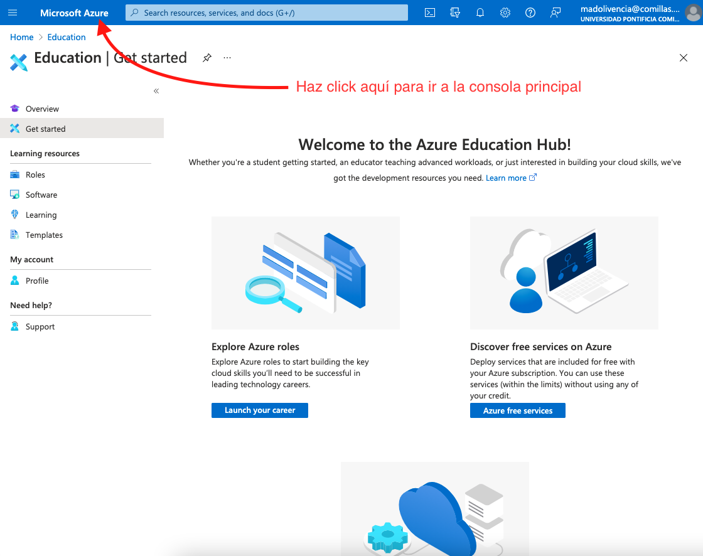

Tras hacer click en la barra de navegación en "Microsoft Azure" llegamos a la consola principal:


Para comprobar que tenemos activa nuestra subscripción como estudiantes, solo tenemos que hacer click en el icono de **Subscriptions** que aparece bajo la sección **Navigate**, y veremos:


Si lo que queremos es directamente comprobar cuantos créditos nos quedan disponibles, podemos ir directamente al siguiente destino: https://www.microsoftazuresponsorships.com/Balance, lo que nos debería mostrar algo como lo siguiente:


###### Activando GCP

Para la activación de la suscripción de estudiante (que viene con unos créditos gratuitos al igual que en el caso de Azure), necesitamos que el responsable del curso comparta con nosotros el "cupón" correspondiente. Por ejemplo:

* **Cupon**: https://gcp.secure.force.com/GCPEDU?cid=H9TXwbBTs1Bw93tFsHxX%2FLlvIfPrIIfkZVbu3HJ4H4t4azNXOahh180EolN2n1Af/

Cuando hagamos click en susodicho link, nos llevará a una pantalla de autenticación y login:


Aquí tendremos que seleccionar el dominio correcto de nuestro email (como se ve en el desplegable de la imagen) y rellenar los datos correspondientes al Nombre, Apellidos y la dirección de correos.

Una vez terminado el proceso de autenticación, deberíamos llegar a una *landing page* como la siguiente:


Aquí tendremos que marcar la opción de **Acuerdo con los términos de servicios CGP**, no tenemos porqué marcar la casilla de **Email Updates** (de hecho se recomienda no hacerlo para evitar emails comerciales en vuestra bandeja de entrada).

Una vez se confirma el acuerdo, llevará unos segundos, en los cuales GCP está creando un proyecto en blanco para nuestro uso, y finalmente llegaremos a la consola:


Para saber que nuestra cuenta está activada y tenemos correctamente configurada la cuenta de prueba, podemos acceder al siguiente link: https://console.cloud.google.com/billing:


##### 3.4.1 Herramientas de gestión y monitorización

Una vez tenemos una cuenta activa (y asociada a una "cuenta de facturación", en nuestro caso ficticia y garantizada por el proveedor para hacer pruebas), podemos acceder al portal web y comenzar a consumir en modo autónomo los servicios clouds ofertados, bien sean IaaS, PaaS o SaaS, por ejemplo:

* Maquinas Virtuales
* Redes Virtuales
* Servicios de almacenamiento
* Bases de datos autoescalables
* Servicios de Analítica
* Infraestructura BigData, 
* Etc.

Para comenzar a entender las posibilidades que se nos ofrecen, no hay nada mejor que comenzar con un ejemplo. En particular vamos a comenzar con la creación de VMs tanto en Azure como en GCP, aunque posteriormente nos centraremos en el uso de GCP. 

En la siguiente captura vemos un ejemplo de como listar todos los servicios consumibles en Azure: [link](https://portal.azure.com/?Microsoft_Azure_Education_correlationId=66ff2a978b314dfe8df59b8a131f2a5b#allservices)


En el caso de GCP:


###### Máquinas Virtuales

**Azure**

En este primer ejemplo vamos a proceder a la creación de VMs mediante Azure Web Portal. Para ello seguiremos los siguientes pasos:

1. Acceded al portal web: [https://portal.azure.com](https://portal.azure.com/)

2. En el portal verás el icono de VM (o puedes directamente buscar en la barra de búsqueda "virtual machines")

3. Una vez hayas hecho click en el icono de VMs, acabarás accediendo al portal de gestión de máquinas virtuales, donde verás:

   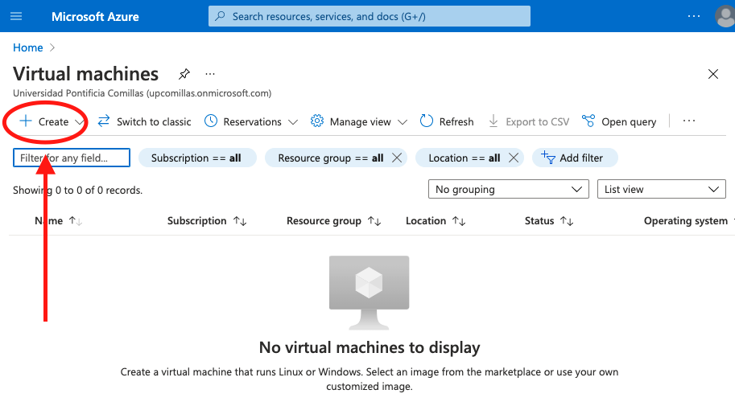

4. Tras pulsar en el botón de crear y seleccionar la creación de una nueva máquina aparecerá:

   

5. Aquí vamos a asegurarnos de detallar toda la configuración de la máquina virtual que queremos crear. En particular:

   * En la sección **Instance Details**:

     

   * En la sección **Administrator Account** introduciremos un nombre de usuario, e.g. ***azureuser***, y un password que recordemos:

     

   * En la sección **Inbound port rules**:

     

     Donde hemos abierto tanto los puertos 80 (HTTP) como 3389 (RDP).

   * Dejamos el resto de la configuración por defecto y hacemos click en el botón **Review + Create** abajo del todo:

     

   * Cuando acabe el proceso, podremos acceder a la VM pulsando en la opción **Go to resource**

     

7. Para conectarse a la VM vamos a proceder mediante RDP (Remote Desktop Protocol). Para ello usaremos Remote Desktop client:

   1. [MacOS](https://apps.apple.com/app/microsoft-remote-desktop/id1295203466?mt=12)
   2. [Windows](https://docs.microsoft.com/en-us/windows-server/remote/remote-desktop-services/clients/windowsdesktop#install-the-client)

   Una vez instalado, podemos copiar al IP pública de la VM (en nuestro caso **20.102.51.69**):

   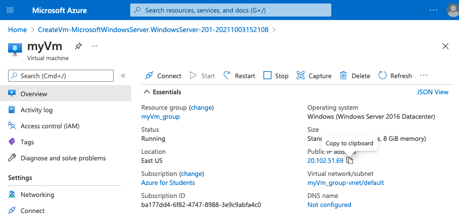

   E introducirla en el RD Client:

   

   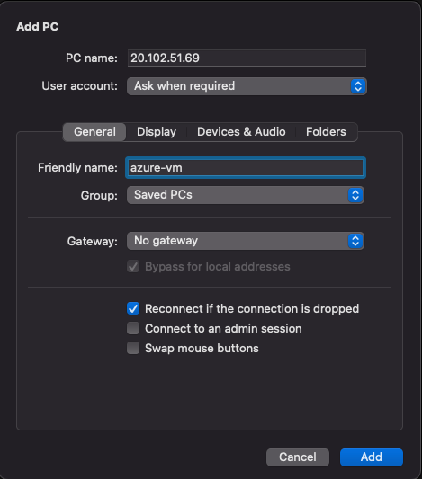

   Esto nos llevará finalmente a la autenticación en la máquina con el usuario y contraseñas que hemos especificado en el momento de su creación. Una vez realizada con éxito la conexión deberíamos ver el escritorio de Windows como si estuviéramos en el ordenador en sí mismo.

8. Para ver la VM en acción, vamos a instalar un web server. Para ello, podemos abrir el la consola **PowerShell** y escribir el siguiente comando:

   ```powershell
   > Install-WindowsFeature -name Web-Server -IncludeManagementTools
   ```

   

   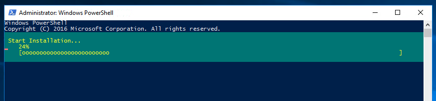

   Y posteriormente podremos cerrar la conexión RDP a la VM.

9. Ahora podemos ir a nuestro explorador web local, y pegar la IP de la VM que hemos usado anteriormente, y veremos algo similar a lo siguiente:

   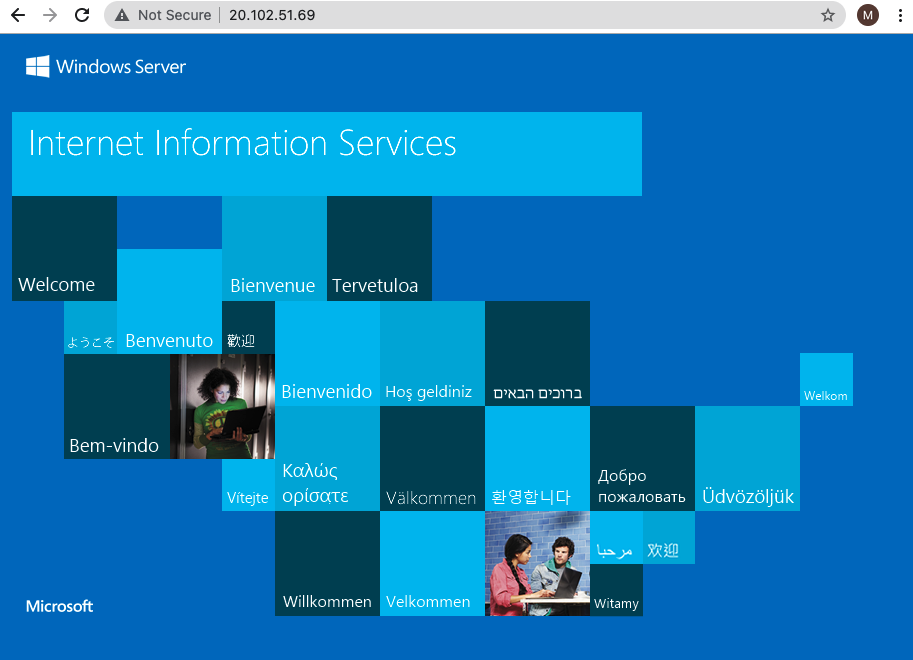

Para terminar el ejemplo, borraremos el **Resource Group** que se ha creado durante el ejercicio, lo cual borrará la máquina virtual etc, lo que se hará siguiendo los pasos:

* Buscamos el portal de grupos de recursos:

  

* Seleccionamos el grupo creado:

  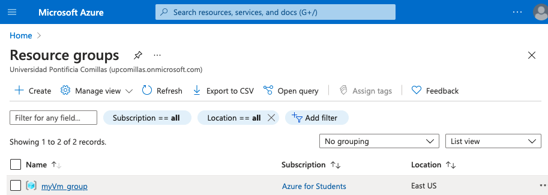

* Seleccionamos el borrado del grupo de recursos:

  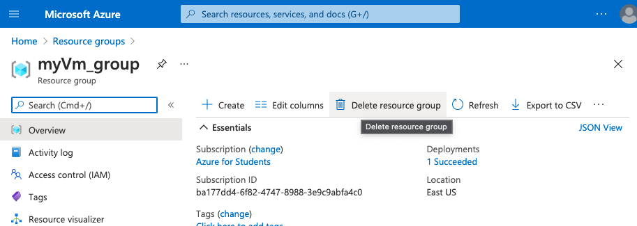

**Google**

Vamos a proceder a repetir el ejemplo anterior pero con la consola (portal web) de GCP. Así:

1. Accedemos al portal GCP: [https://console.cloud.google.com](https://console.cloud.google.com/)

2. Una vez accedemos, podemos buscar en la barra de búsqueda "Virtual Machines":

   

3. Una vez entramos en el portal de gestión de VMs, podemos hacer click rápidamente en el icono **Create Instance**

   

4. Ahora tenemos que proceder con la configuración. Solo cambiaremos lo indicado a continuación:

   * Nombre de la máquina:

     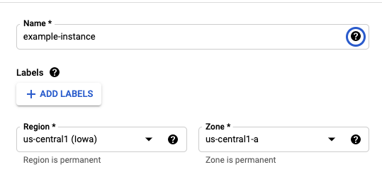

   * Seleccionamos el tipo de máquina por defecto:

     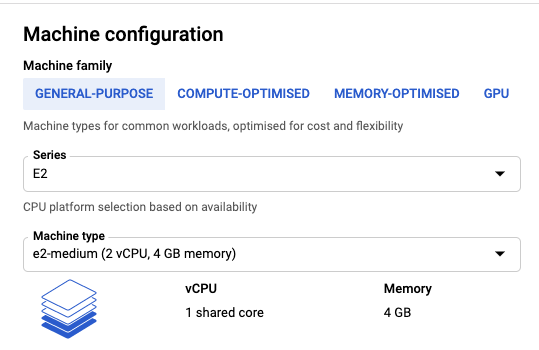

   * A continuación cambiaremos el disco de arranque, de un Linux a Windows Server:

     

     Pulsamos en cambiar y seleccionamos:

     

5. Dejamos el resto de parámetros como vienen por defecto, y creamos la VM, lo cual terminará apareciendo en la consola de la siguiente forma:

   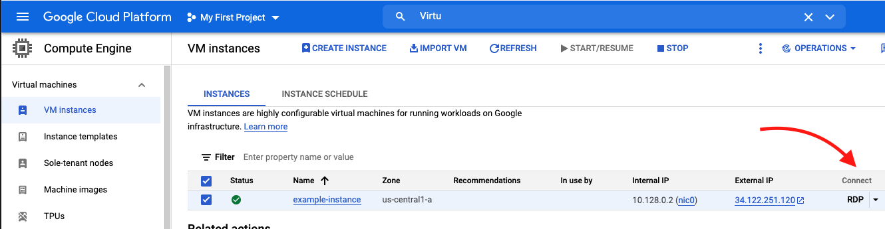

   Tras pulsar en RDP obtendremos el siguiente mensaje:

   

6. Para poder conectarnos via RDP necesitamos configurar un usuario y password. Para ello, tenemos que hacer click sobre la instancia creada (example-instance), y accederemos a su configuración:

   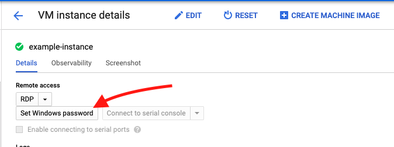

   Tras pulsar el botón para generar un password, tendremos que confirmar el nombre de usuario, y esto finalmente nos devolverá un password seguro:

   

   El cual debemos guardar, junto con la IP de la VM para acceder a ella desde RD Client.

7. Abrimos al igual que en el caso de Azure Remote Desktop Client, y procedemos a la configuración, introduciendo la IP pública de la VM, el usuario y password.

8. Podemos repetir el paso 8 del despliegue en Azure, ya que la instalación del web server en Windows es independiente, y finalmente comprobar vía Browser que nuestra máquina tiene el servidor Web activo.

9. Por último, procedemos al borrado de la instancia:

   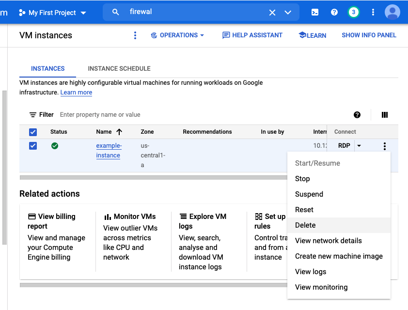

A partir de este ejemplo nos centraremos en el uso de la plataforma GCP.

###### Monitorización de servicios

La monitorización no solo de la infraestructura, sino también de todos los demás servicios ofertados por el proveedor, tiene que ser algo transparente para el usuario Cloud. En el caso de Google, esto se consigue con una centralización de la monitorización mediante el servicio **Monitoring**:  https://console.cloud.google.com/monitoring

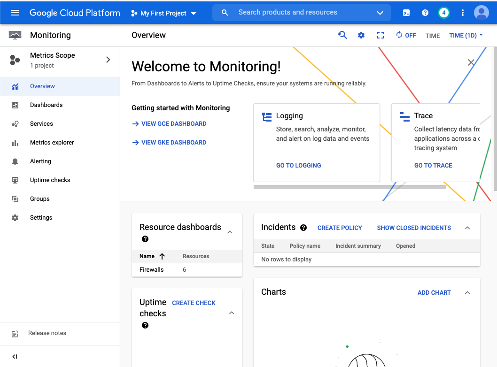

Una de las ventajas de este sistema de seguimiento es la sencillez con la que podemos ver en tiempo real el estado de todos los servicios contratados hasta el momento, tanto su uptime, como su tráfico, logs y errores:

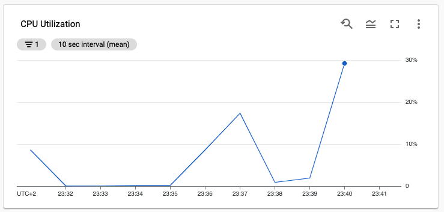


###### Facturación

En cuanto al seguimiento de costes, Google centraliza este servicio en: https://console.cloud.google.com/billing/


No solo nos permite el seguimiento diario, además de tener un pronóstico diario, del gasto acumulado en el tiempo, sino que también nos permite genera reports automatizados con el objetivo de automatizar tareas dentro de la empresa, como puede ser la consolidación e informe de gastos de manera automática al correspondiente departamento de Finanzas.

###### Almacenamiento

El almacenamiento juega un papel clave en el mundo Cloud, y por ello vamos a emplear tiempo práctico en la gestión de **Buckets**, así como de bases de datos **CloudSQL**, y de tablas masivas de datos en **BigQuery**.

* Storage: https://console.cloud.google.com/storage/

  

* CloudSQL: https://console.cloud.google.com/sql/

  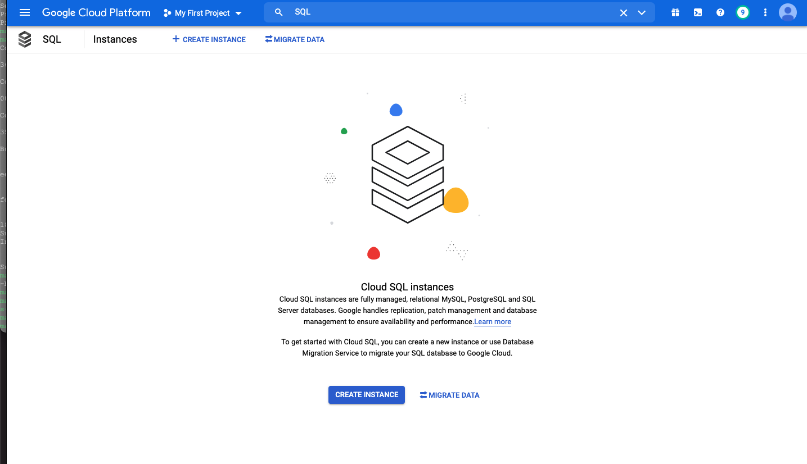

* BigQuery: https://console.cloud.google.com/bigquery/

  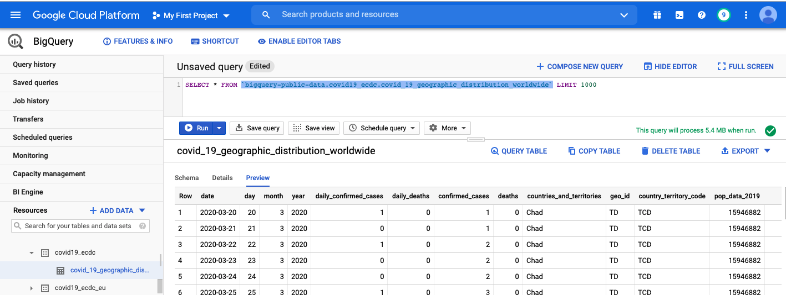

Entre muchas otras opciones ofertadas.

###### Networking

La creación de un correcto ecosistema de redes y subredes será crucial a la hora de escalar nuestra infraestructura cloud, al igual que ocurre en la realidad física. La gestión gráfica de las redes virtuales se encuentra en **VPC Network**: https://console.cloud.google.com/networking/

En esta consola podemos gestionar las redes existentes (por defecto siempre tendremos una red **default** que es la que se utilizará en todos nuestros servicios, a no ser que se indique lo contrario), crearlas y destruirlas, así como configurar reglas de cortafuegos, reservar IP públicas, configurar enrutamientos, crear routers virtuales, etc.

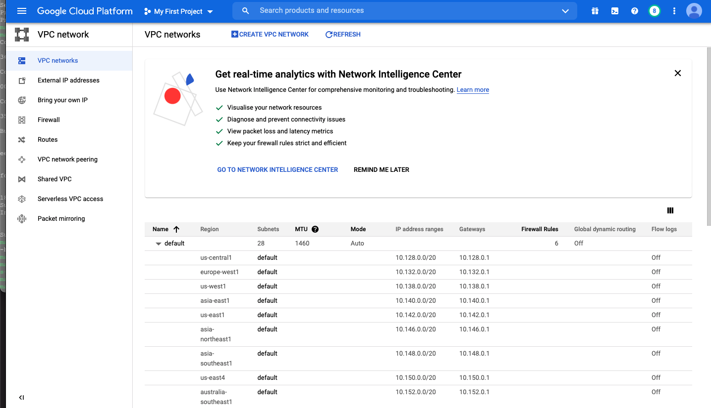

###### Integración continua

La monitorización y gestión de la integración continua y los despliegues en la plataforma es algo que no puede faltar en ningún proveedor de Cloud. En el caso de GCP este servicio se centraliza a través de **Google Cloud Build**: https://console.cloud.google.com/cloud-build/

Este gestor de CI/CD cloud nos servirá para orquestar nuestros despliegues en la nube, el cual se conectará al servicio de gestión de repositorios de código **Source Repositories**: https://source.cloud.google.com/onboarding

###### Web Apps y Serverless Functions

Uno de los servicios más consumidos en las Cloud públicas y privadas son las plataformas auto-gestionadas para el despliegue de WebApps y microservicios. Y en particular, cada vez más se apuesta por las llamadas **Serverless Functions**, o Function as a Service, que permiten flexibilizar aún más si cabe la infraestructura, dado que solo existen efímeramente mientras ejecutan su función, y posteriormente son desechadas.

En el contexto de GCP, tenemos los siguientes servicios (y sus herramientas de gestión):

* Cloud Functions: https://console.cloud.google.com/functions/
* Cloud Run: https://console.cloud.google.com/run
* App Engine: https://console.cloud.google.com/appengine

Estos servicios serán estudiados exhaustivamente con ejemplos prácticos en lo que sigue, debido su importancia actual y lo central de su papel hacia la creación y gestión de arquitecturas flexibles.

###### IAM, Roles y Service Accounts

La seguridad es un pilar central en toda Nube, y la gestión de ella, así como de la jerarquía de roles de los diferentes servicios y usuarios de la nube es central en la administración de una plataforma cloud. En el contexto de GCP, esta gestión se hace desde **IAM Admin**: https://console.cloud.google.com/iam-admin/iam

Cualquier identidad que realice una solicitud a cualquier recurso Cloud debe tener los permisos necesarios para utilizar ese recurso. Para conceder susodichos permisos, primero se tiene que otorgar un **rol** específico al usuario, grupo o cuenta de servicio. ¿Y qué es un rol?

Existen tres tipos de roles en GCP:

- **Básico**, que puede ser Owner, Editor y Viewer (i.e., Admin, Editor y Visitante)
- **Predefinido**, los cuales dan un permiso más granular para garantizar acceso solo a un tipo específico de servicio, y son creados y gestionados por Google Cloud.
- **Personalizados**, que se pueden diseñar por el administrador de la Cloud para agregar ciertos permisos que sean de uso común y no estén agregados conjuntamente en ningún tipo predefinido

En este [link](https://cloud.google.com/iam/docs/understanding-roles) se pueden consultar los diferentes tipos de permisos que contienen los distintos tipos de roles definidos por Google (básicos y predefinidos)
