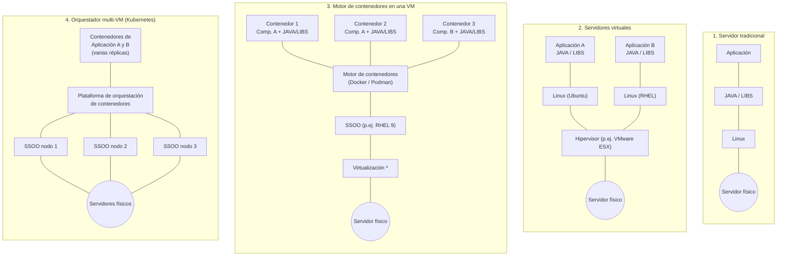

# 3.0 Virtualización de cómputo

Antes de entrar en la nube propiamente dicha, conviene tener clara la escalera que va
desde un servidor físico dedicado hasta la orquestación de contenedores, y qué cambia
en cada escalón (recursos, aislamiento, tiempo de arranque, portabilidad...):

*Las capas de virtualización pueden estar sobre una máquina virtual o directamente sobre una instancia física.*

| Característica                   | Máquina Física                      | Virtualización (Máquina Virtual)          | Contenedores (Docker)         | Kubernetes                                 |
|----------------------------------|-------------------------------------|------------------------------------------|------------------------------------------|--------------------------------------------|
| **Definición**                   | Hardware físico en el que se ejecuta un sistema operativo. | Emulación de un hardware completo para ejecutar múltiples sistemas operativos sobre un mismo hardware físico. | Aislamiento de aplicaciones y sus dependencias en procesos ligeros sobre el mismo SO. | Orquestación y gestión de contenedores en clústeres distribuidos. |
| **Recurso**                      | 100% de los recursos dedicados al sistema operativo. | Requiere un hipervisor para que los sistemas operativos interactuen directamente con el kernel (como VMware ESX). | Se ejecuta en el mismo kernel del SO anfitrión, compartiendo recursos de manera más eficiente. | Coordina y gestiona múltiples contenedores y nodos en un clúster. |
| **Uso de recursos**              | Utiliza todos los recursos del hardware. | Requiere más recursos debido a la sobrecarga del hipervisor y SO guest. | Menor sobrecarga porque los contenedores comparten el mismo SO. | Depende de los contenedores gestionados, optimizando recursos en un clúster. |
| **Aislamiento**                  | No hay aislamiento, es un sistema operativo dedicado. | Aislamiento total de cada máquina virtual a nivel de hardware y SO. | Aislamiento de contenedor: a nivel de proceso y sistema de archivos. | Aislamiento de contenedor |
| **Tiempo de arranque**           | Lento, depende del hardware y SO.    | Relativamente lento, ya que cada máquina virtual necesita iniciar un SO completo. | Muy rápido, los contenedores se inician en segundos. | Coordina y programa el arranque de contenedores en diferentes nodos de manera rápida. |
| **Portabilidad**                 | No portátil, ligado al hardware físico. | Portabilidad limitada, ya que cada máquina virtual depende de la configuración del hipervisor. | Alta portabilidad, los contenedores se pueden mover entre sistemas con Docker o contenedores compatibles. | Extremadamente portátil en entornos de clústeres distribuidos en diferentes infraestructuras. |
| **Complejidad de gestión**       | MUY ALTA, requiere mantenimiento físico, del sistema operativo, backup/redundacia. | MODERADA, requiere gestionar tanto el hardware como el hipervisor y cada VM, pero aprovechas las ventajas de las VMs. | MODERADA-BAJA (curva aprendizaje alta): requiere gestionar el sistema operativo y el motor de contenedores, así como conocer la tecnología de contenerización | BAJA (curva aprendizaje más alta): requiere saber de contenedores y de kubernetes |
| **Escalabilidad**                | Limitada al hardware disponible.     | Moderada, cada VM tiene su propio SO y recursos asignados. | Alta, permite ejecutar múltiples contenedores en un solo SO de forma eficiente. | Muy alta, permite escalar automáticamente los contenedores en función de la carga entre varias máquinas |
| **Usos comunes**                 | Servidores dedicados, aplicaciones críticas. | Consolidación de servidores | Microservicios, aplicaciones en la nube, CI/CD. | Microservicios, aplicaciones en la nube, CI/CD. |
| **Ejemplos de tecnología**       | Cualquier servidor físico (Dell, HP, etc.). | VMware | Docker, Podman | Kubernetes - OpenShift, Rancher, Kubernetes Vanilla |
