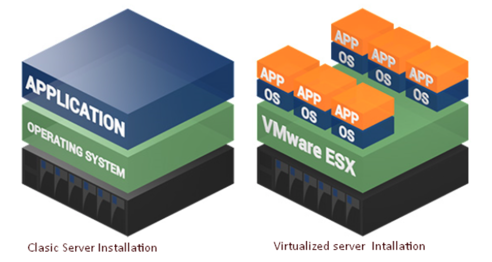
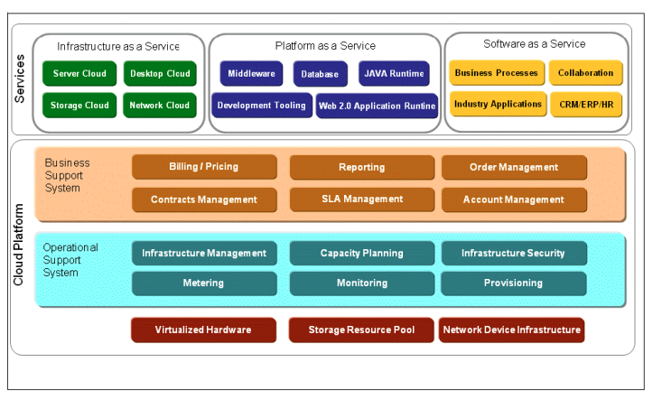
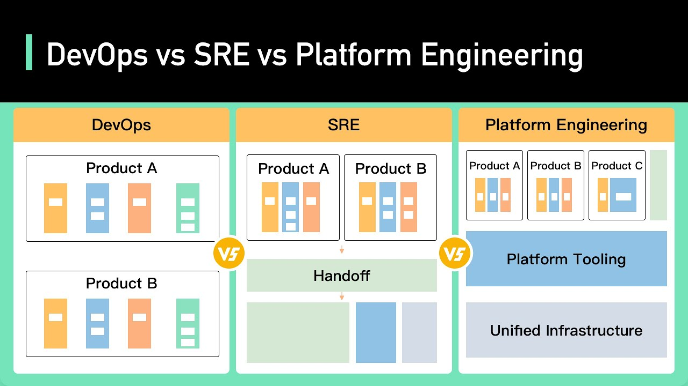

# 3. Cloud Computing

### 3.1 De la virtualización a la nube

* A modo resumen, la virtualización es una capa de abstracción sobre Hardware físico que nos permite dividir dichos recursos físicos (e.g., procesador, memoria o almacenamiento) en múltiples unidades ***virtuales*** con las que se pueden operar como si fuera Hardware independiente. 

* Por ejemplo, esto nos permite generar en un solo ordenador varias ***máquinas virtuales*** (VMs del inglés *virtual machines*) que se comportan como ordenadores completamente independientes con una realidad física.

  

* Hemos visto que los tipos de virtualización más populares son:

  * Virtualización de procesamiento (Server Virtualisation)
  * Virtualización de almacenamiento (Storage Virtualisation)
  * Virtualización de redes (Network Virtualisation)
  * Virtualización de sistemas operativos (Containerisation)

* ¿Qué es la nube (*cloud*) entonces, y qué tiene que ver con todo esto? En pocas palabras, la virtualización es la tecnología facilitadora, y la nube es el entorno donde se extraen, agrupan y comparten recursos. Así pues, la nube se suele definir como:

  > *Un conjunto de software y servicios que permiten al desarrollador centrarse en el proyecto de desarrollo en lugar de en la infraestructura necesaria*
  >
  > J.J. Geewax, Google Cloud Platform in Action

* Pero, la nube no es simplemente virtualización. La nube conlleva la posibilidad de acceder a los recursos virtuales creados con la virtualización a través de redes privadas o públicas. Esta posibilidad conlleva, evidentemente, la necesidad de un conjunto de software y servicios que permiten su funcionamiento y gestión por parte de tanto el proveedor (*cloud provider*) como el usuario (*cloud consumer*). Este ecosistema de software y servicios suele seguir la siguiente estructura por capas:

  

* Como se puede intuir del punto anterior, en el mundo cloud se pueden identificar ciertos "roles" característicos que son universales, como son por ejemplo:

  * Proveedor Cloud (Cloud Provider):
    * La compañía/organización que provee la infraestructura tecnológica cloud
    * El proveedor cloud es responsable del mantenimiento de la infraestructura así como del cumplimiento con los acuerdos de disponibilidad (SLA, del inglés *Service-Level Agreement*) con el consumidor 
  * Equipo Arquitectura/Equipo Desarrollado Cloud (Cloud Architect / Dev Teams): 
    * Es la compañía/organización/persona que firma un acuerdo con el cloud provider para usar los servicios IT ofertados por el proveedor.
    * El departamento de arquitectura es el encargado de la realización de un primer proyecto llamado Landing Zone. Es el proyecto que sienta las bases para empezar a trabajar en la empresa con el nuevo proveedor cloud. Esto abarca: jerarquía de recursos, nomenclatura, redes, seguridad, automatización, organización interna, monitorización y alertado, integrandose con los sistemas ya existentes.
    * Por lo general, el desarrollador cloud usará los servicios IT del proveedor cloud correspondiente.
  * Operación/Administrador Cloud (Cloud Resource Administrator/Operator):
    * Es la compañía/organización/persona que se encarga de la administración de los servicios basados en la infraestructura cloud (incluyendo los propios servicios cloud ofertados por el proveedor). 
    * Puede ser o no parte de la entidad consumidora, ya que podría tratarse de una compañía externa al consumidor que se ha contratado con el cometido de administrar los servicios creados por el consumidor en la infraestructura cloud
  * Seguridad (Cloud Auditor/Security): 
    * Es una compañía/organización independiente (normalmente acreditada) que lleva a cabo revisiones regulares en relación a controles de seguridad, privacidad y continuidad de negocio.
    * El objetivo principal de este rol es el de generar un informe exhaustivo e independiente sobre el entorno cloud que ayude a identificar vulnerabilidades y puntos débiles, que habrán de ser subsanados en un plazo determinado, para fortalecer la relación de confianza entre el consumidor y el proveedor cloud.
  * Finanzas:
    * Es el departamento encargado de controlar el gasto en cloud. Este departamento suele haber gente de los equipos de Operación Cloud que conocen los detalles de la facturación para ser capaces de justificar el gasto en las distintas partidas.
    * La evolución es el concepto de FINOPS: es una práctica que se centra en la gestión eficiente de los costos en la nube y en entornos de tecnología de la información en general. Su objetivo principal es ayudar a las empresas a optimizar sus gastos en la nube.

* Normalmente, todo proveedor cloud ofrece una interfaz gráfica muy accesible y agradable para el usuario, así como interfaces programáticas (APIs) que permiten la automatización de tareas repetitivas.

### Equipos de trabajo

DevOps, SRE (Site Reliability Engineering) y Platform Engineering son roles y prácticas relacionados en el mundo de la tecnología y la ingeniería de software, pero tienen enfoques y responsabilidades ligeramente diferentes. Aquí hay una breve descripción de cada uno y las diferencias clave:

#### DevOps (Desarrollo y Operaciones):

*Enfoque*: DevOps es una filosofía cultural y un conjunto de prácticas que busca la colaboración estrecha entre los equipos de desarrollo y operaciones para automatizar y acelerar la entrega de software.

*Responsabilidades*: Los equipos de DevOps se centran en automatizar el ciclo de vida del software, desde la codificación y la integración hasta la implementación y la monitorización. También trabajan en la gestión de la configuración y la infraestructura como código (IaC).

*Objetivo*: La principal meta de DevOps es reducir el tiempo entre la escritura de código y la puesta en producción, mejorando la calidad y la estabilidad de las aplicaciones.

#### SRE (Site Reliability Engineering):

*Enfoque*: SRE es una disciplina que se enfoca en garantizar la confiabilidad y la disponibilidad de los sistemas y servicios. Fue desarrollada por Google y se centra en la automatización y la gestión de la confiabilidad.

*Responsabilidades*: Los SREs se concentran en la automatización de tareas operativas, el establecimiento de SLAs (Service Level Agreements) y la implementación de medidas proactivas para evitar interrupciones.

*Objetivo*: El principal objetivo de SRE es garantizar que los sistemas sean altamente confiables y estén disponibles, reduciendo al mínimo el tiempo de inactividad no planificado.

#### Platform Engineer (Ingeniero de Plataforma):

*Enfoque*: Los Platform Engineers se centran en construir y mantener las plataformas tecnológicas que permiten a los equipos de desarrollo implementar y ejecutar sus aplicaciones de manera eficiente y segura.

*Responsabilidades*: Esto implica la gestión de la infraestructura subyacente, la creación de herramientas y servicios para la automatización de implementaciones, la seguridad, la escalabilidad y la eficiencia operativa.

*Objetivo*: Los Platform Engineers buscan proporcionar a los equipos de desarrollo una plataforma sólida y confiable en la que puedan implementar sus aplicaciones y servicios de manera efectiva y rápida.

En resumen, mientras que DevOps se enfoca en la colaboración y la automatización en todo el ciclo de vida del software, SRE se centra en la confiabilidad y la disponibilidad de los sistemas, y los Platform Engineers se dedican a crear y mantener las plataformas tecnológicas que permiten que las aplicaciones se ejecuten de manera eficiente y segura. Estos roles a menudo trabajan juntos para garantizar el éxito de las operaciones de TI en una organización.

  
  
### Características del Cloud

* Las características diferenciadas de la nube son:

  * Escalabilidad y servicios bajo demanda (*Scalability and services on-demand*)
    * Una de las características principales y más definitorias de la nube es la capacidad ofrecida al consumidor cloud de disponer de recursos y modificar sus especificaciones (escalarlos) bajo demanda. El escalado puede ocurrir tanto en datacenters de una misma zona, así como en datacenters de distintas zonas y regiones
  * Interfaz centrada en el usuario (*User-centric interface*)
    * El uso de la nube es independiente de la localización del consumidor, y se puede acceder fácilmente a través de alguna red (pública o privada) mediante interfaces estándares, como son los servicios web, o exploradores de Internet
  * Elasticidad (*Elasticity*)
    * Capacidad de escalar automáticamente y de manera transparente los servicios cloud según se requiera, o acorde a ciertos parámetros establecidos bien por el consumidor o bien por el proveedor  
  * Calidad de los servicios garantizada: Resiliencia (*Guaranteed Quality of Services [QoS]: Resiliency*)
    * La resiliencia se basa en la distribución redundante de los servicios en multiples localizaciones físicas, lo cual permite garantizar los recursos cloud ofertados gracias a esta forma de respaldo automático
  * Cobro por uso (*Pay-as-you-go* [*PAYG*])
    * La nube no requiere una inversión en recursos de manera anticipada. Todo lo contrario, la nube permite a los consumidores pagar solo por lo que están usando, tanto en procesamiento como en almacenamiento. Esto es posible gracias a que el proveedor cloud tiene un sistema de monitorización/control del uso de los recursos cloud por parte de sus clientes, el cual es totalmente transparente al consumidor, lo cual incrementa la relación de confianza entre ambos.
