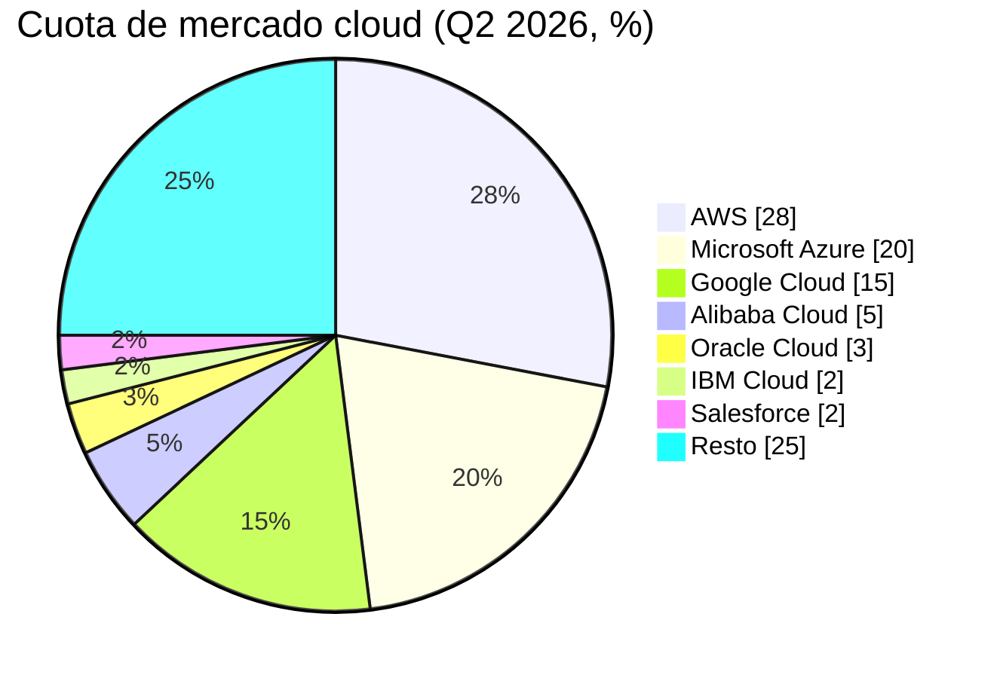

# 3.3 Plataformas cloud

## Plataformas

Una plataforma cloud, también conocido como *modelo de despliegue cloud* (**cloud delivery model**), representa una combinación especifica de recursos IT que oferta el proveedor cloud. Los modelos más comunes, y que por tanto se han establecido como estándares en la industria, son los siguientes:

* Intraestructura-como-Servicio (*Infrastructure-as-a-Service [**IaaS**]*):
  * Básicamente la infraestructura se alquila, y el usuario accede a ella con una API o un panel de gestión. El usuario gestiona el sistema operativo, las aplicaciones y el middleware, mientras que los proveedores se encargan de los sistemas de hardware, las redes, los discos duros, el almacenamiento de datos y los servidores. 
  * El proveedor es también responsable de prevenir las interrupciones, hacer reparaciones y solucionar los problemas de hardware.
  * El objetivo principal del IaaS es el de dar al usuario un control absoluto sobre la gestión y configuración de la infraestructura cloud, i.e. una gestión sencilla del aprovisionamiento, escalabilidad y seguridad de los recursos
  * Dada la libertad de control que ofrece el IaaS, éste también conlleva un alto conocimiento y responsabilidad por parte del usuario. Es por ello que el IaaS suele ser consumido por usuarios que requieren un alto control el ecosistema que van a crear en la nube 
* Plataforma-como-Servicio (*Platform-as-a-Service [**PaaS**]*):
  * El proveedor de servicios cloud proporciona y gestiona el hardware y una plataforma de software de aplicaciones
  * El usuario es el que maneja las aplicaciones que se ejecutan en la plataforma y los datos en los que se basa la aplicación 
  * Una PaaS ofrece a los usuarios un elemento importante de [DevOps](https://www.redhat.com/es/topics/devops): una plataforma en la nube compartida para desarrollar y gestionar aplicaciones sin tener que diseñar ni mantener la infraestructura generalmente asociada con el proceso, lo cual resulta especialmente útil para los desarrolladores y los programadores
* Software-como-Servicio (*Software-as-a-Service [**SaaS**]*):
  * Ofrece a sus usuarios una aplicación de software que gestiona el proveedor cloud
  * Por lo general, las aplicaciones SaaS son aplicaciones web o aplicaciones móviles a las que los usuarios pueden acceder a través de un explorador web
  * Las actualizaciones de software, las correcciones de fallos y otros mantenimientos generales del software están a cargo del proveedor. El usuario simplemente utiliza la aplicación, a través del navegador, de una aplicación cliente o de una API
  * El SaaS también elimina la necesidad de instalar localmente una aplicación, lo cual da lugar a mejores métodos de acceso grupal o en equipo al sistema de software

Aunque estas son los modelos frecuentes, existen otros que veremos más adelante con **CaaS** y **FaaS**

A continuación se muestra una tabla donde se compara la gestión del usuario en los diferentes modelos de plataforma cloud (en negro lo que gestiona el cliente, en azul lo que gestiona el proveedor):

| | On-Premises | IaaS | PaaS | SaaS |
|---|---|---|---|---|
| Applications | Cliente | Cliente | Cliente | Proveedor |
| Data | Cliente | Cliente | Cliente | Proveedor |
| Runtime | Cliente | Cliente | Proveedor | Proveedor |
| Middleware | Cliente | Cliente | Proveedor | Proveedor |
| O/S | Cliente | Cliente | Proveedor | Proveedor |
| Virtualization | Cliente | Proveedor | Proveedor | Proveedor |
| Servers | Cliente | Proveedor | Proveedor | Proveedor |
| Storage | Cliente | Proveedor | Proveedor | Proveedor |
| Networking | Cliente | Proveedor | Proveedor | Proveedor |

## Proveedores cloud

Los principales proveedores Cloud se pueden clasificar por el tipo de plataforma ofertada.

### Cuota de mercado de infraestructura cloud (IaaS + PaaS)

Según Synergy Research Group, en el **segundo trimestre de 2026** el gasto mundial en
servicios de infraestructura cloud (IaaS, PaaS y nube privada alojada) fue de unos
**143.000 millones de dólares en un solo trimestre**, un **43% más** que un año antes (el
mayor crecimiento en ocho años, impulsado sobre todo por la IA). Los tres grandes
concentran casi dos tercios del mercado:

| **Proveedor** | **Cuota Q2 2026** | **Cuota Q2 2025** | **Tendencia** |
|---|---|---|---|
| Amazon Web Services (AWS) | 28% | 30% | ⬇️ Sigue líder, pero pierde cuota |
| Microsoft Azure | 20% | 20% | ➡️ Estable |
| Google Cloud | 15% | 13% | ⬆️ El que más crece de los tres |
| Alibaba Cloud | ~5% | — | Líder en China |
| Oracle Cloud | ~3% | — | ⬆️ Creciendo por la demanda de IA |
| IBM Cloud | ~2% | — | |
| Salesforce | ~2% | — | |
| Resto de proveedores | ~25% | — | |

```mermaid
pie showData
    title Cuota de mercado cloud (Q2 2026, %)
    "AWS" : 28
    "Microsoft Azure" : 20
    "Google Cloud" : 15
    "Alibaba Cloud" : 5
    "Oracle Cloud" : 3
    "IBM Cloud" : 2
    "Salesforce" : 2
    "Resto" : 25
```

Algunas lecturas de estos datos:

* AWS, Azure y Google suman el **63%** del mercado: es un mercado muy concentrado.
* Que AWS pierda cuota no significa que venda menos: el mercado crece tan deprisa que
  todos crecen en dinero, pero Google y Microsoft crecen más rápido.
* Fuera de los tres grandes, cada proveedor tiene un nicho claro: Alibaba en China,
  Oracle en clientes de sus bases de datos y aplicaciones, IBM en entornos híbridos y
  grandes empresas.

> Fuente: Synergy Research Group, informe del segundo trimestre de 2026. Las cuotas
> cambian cada trimestre, así que tómalas como una foto del momento.

### Principales proveedores IaaS

  * Amazon Web Services: AWS
  * Microsoft Azure
  * Google Cloud Platform: GCP
  * IBM Cloud
  * Oracle Cloud

| **Proveedor** | **Aspecto más destacado (positivo)** | **Limitación principal (negativo)** | **Coste medio estimado por vCPU (x86, On-Demand)** |
|----------------|--------------------------------------|--------------------------------------|------------------------------------------|
| **Amazon Web Services (AWS)** | Se caracteriza por ofrecer el catálogo más amplio y maduro de servicios en la nube, abarcando desde infraestructura hasta herramientas avanzadas de inteligencia artificial y análisis de datos. | Su elevada adopción global puede generar una percepción de atención poco personalizada, dado el volumen masivo de clientes que gestiona. | ≈ **0,050 USD por vCPU-hora** (m7i.xlarge, 4 vCPU / 16 GB, ≈ 0,20 USD/h en EE. UU.). |
| **Microsoft Azure** | Presenta una integración sobresaliente con entornos empresariales basados en Windows y Active Directory, al tiempo que ofrece soporte sólido para migraciones hacia Linux y otros sistemas abiertos. | Requiere un nivel de especialización técnica relativamente superior respecto a otros proveedores, especialmente en la configuración y gestión de servicios avanzados. | ≈ **0,048 USD por vCPU-hora** (D4s v5, 4 vCPU / 16 GB, ≈ 0,19 USD/h en EE. UU.). |
| **Google Compute Engine (GCP)** | Destaca por su énfasis en el rendimiento, la eficiencia del coste y la alta disponibilidad, beneficiándose de la infraestructura global de Google y su experiencia en escalabilidad. | Su oferta de infraestructura como servicio (IaaS) es menos extensa que la de AWS. Para entornos híbridos o locales tiene soluciones (GKE Enterprise, antes Anthos, y Google Distributed Cloud), pero están menos extendidas que las de Azure (Azure Arc, Azure Local) o AWS (Outposts). | ≈ **0,049 USD por vCPU-hora** (n2-standard-4, 4 vCPU / 16 GB, ≈ 0,19 USD/h en EE. UU.; ≈ 0,053 en `europe-west1`). Las series E2 bajan a ≈ 0,034. |
| **IBM Cloud** | Ofrece una amplia gama de servicios empresariales y un fuerte enfoque en soluciones híbridas y locales, lo que lo convierte en una opción atractiva para organizaciones con infraestructura preexistente. | Su red de centros de datos es más limitada, y sus precios y acuerdos de nivel de servicio (SLA) resultan menos competitivos frente a los principales líderes del mercado. | ≈ **0,045–0,050 USD por vCPU-hora** (bx2-4x16, 4 vCPU / 16 GB, ≈ 0,18–0,20 USD/h según región). |
| **Oracle Cloud** | Representa una opción óptima para organizaciones que utilizan bases de datos y aplicaciones Oracle, proporcionando una integración nativa y precios competitivos en el segmento de computación. | A pesar de sus avances, su ecosistema y su escala global siguen siendo menores que los de AWS, Azure o Google Cloud. | ≈ **0,023 USD por vCPU-hora** (E5.Flex: 0,03 USD por OCPU-hora + 0,002 USD por GB-hora; 1 OCPU = 2 vCPU). El más barato con diferencia, y mismo precio en todas las regiones. |

Precios orientativos (2026) de máquinas de propósito general x86, bajo demanda y con 4 GB de RAM por vCPU; en Oracle, 1 OCPU = 2 vCPU.

Entre AWS, Azure y GCP la diferencia es mínima: lo que más cambia la factura son los descuentos por compromiso, las máquinas *spot*, la región y el tráfico de salida.

### Principales proveedores PaaS
#### Bases de datos

La elección de un servicio gestionado de bases de datos en la nube depende de varios factores, incluyendo el tipo de base de datos que necesitas, tus requisitos de rendimiento, escalabilidad, presupuesto y preferencias técnicas. 

#### Amazon RDS (Relational Database Service)
- Tipo de base de datos: MySQL, PostgreSQL, Oracle, SQL Server, etc.
- Ventajas: Escalabilidad automática, copias de seguridad automatizadas, múltiples opciones de motor de base de datos.
- Desventajas: Puede ser costoso a medida que se escalan los recursos comparado con otros rivales.

#### Google Cloud SQL
- Tipo de base de datos: MySQL, PostgreSQL, SQL Server.
- Ventajas: Integración con otros servicios de Google Cloud, escalabilidad, réplicas de lectura, copias de seguridad automáticas.
- Desventajas: Puede ser costoso, menos opciones de motor de base de datos en comparación con AWS.

#### Microsoft Azure SQL Database
Tipo de base de datos: SQL Server principalmente, aunque también da bases de datos básicas.
Ventajas: Integración con servicios de Azure, escalabilidad, seguridad avanzada, copias de seguridad automáticas.
Desventajas: Enfoque en SQL Server, puede ser costoso.

#### Google Firebase Realtime Database / Firestore:
Tipo de base de datos: NoSQL (Firestore), JSON (Realtime Database).
Ventajas: Escalabilidad en tiempo real, sincronización en tiempo real, fácil integración con aplicaciones móviles y web.
Desventajas: Limitaciones en consultas complejas.

#### MongoDB Atlas:
Tipo de base de datos: MongoDB (NoSQL).
Ventajas: Gestión fácil de MongoDB, escalabilidad global, seguridad avanzada, copias de seguridad automáticas.
Desventajas: Puede ser costoso a medida que se escalan los recursos.

#### Tipo de base de datos: Oracle. (la única que ofrece este servicio sin limitaciones)
Ventajas: Automatización, alto rendimiento, seguridad avanzada, capacidad de recuperación.
Desventajas: Puede ser costoso.

### Plataformas Kubernetes

La gestión de clústeres de Kubernetes en la nube es esencial para simplificar la administración de contenedores y aprovechar al máximo esta tecnología. La elección de una nube u otra, se debería hacer en base a coste, madurez y acuerdo con el proveedor cloud:

* Amazon Elastic Kubernetes Service (EKS) y Google Kubernetes Engine (GKE): son los líderes y los principales contribuidores al proyecto kubernetes.

Existen otros como Microsoft Azure Kubernetes Service (AKS), IBM Cloud Kubernetes Service (IKS), Alibaba, Rancher, Oracle que también ofrecen servicios de kubernetes gestionados.
  

### Plataformas de desarrollo (en desuso)

Fueron los primeros PaaS de cada nube: el desarrollador sube su código (Java, Python,
Node.js, PHP...) y la plataforma se encarga de los servidores, el balanceo y el
autoescalado.

  * AWS: Elastic Beanstalk (AWS EB)
    * Uno de los PaaS más extendidos en la industria, cuyo propósito es el despliegue sencillo y autoescalable de web apps (en cualquiera de los lenguajes principales para ello). Sigue soportado, pero sin apenas novedades. Su sucesor, **AWS App Runner**, dejó de aceptar clientes nuevos en abril de 2026, y AWS dirige ahora los despliegues sencillos hacia **Amazon ECS Express Mode** (contenedores) y **AWS Lambda** (funciones).
  * Google: Google App Engine (GAE)
    * Similar a Elastic Beanstalk de AWS, Google App Engine tiene el propósito de hacer el despliegue de aplicaciones web lo más sencillo posible para el desarrollador. Sigue disponible, pero la propia Google recomienda **Cloud Run** para las aplicaciones nuevas y ofrece herramientas para migrar de App Engine a Cloud Run.
  * Microsoft Azure: Azure App Service
    * Es el que mejor se mantiene: sigue siendo muy usado para webs y APIs, y admite tanto código como contenedores. Aun así, para aplicaciones nuevas basadas en contenedores Azure promueve **Azure Container Apps**.
  * Salesforce: Heroku
    * El PaaS que popularizó el modelo (`git push heroku main` y la aplicación queda desplegada). En febrero de 2026 Salesforce lo pasó a modo de **mantenimiento** (*sustaining engineering*): sin nuevas funcionalidades y sin nuevos contratos empresariales.

**¿Por qué están en desuso?** Estos PaaS imponen su propio entorno de ejecución
(versiones de lenguaje concretas, formas de desplegar propias de cada proveedor) y
autoescalan de forma relativamente lenta, sin bajar a cero cuando no hay tráfico. Han
sido sustituidos por dos modelos que veremos más adelante:

* **CaaS** (*Container as a Service*): se despliega un **contenedor**, así que la
  aplicación puede llevar cualquier lenguaje, versión o dependencia y es portable entre
  nubes. Ejemplos: Google Cloud Run, Azure Container Apps, Amazon ECS (Fargate) y,
  para casos más complejos, Kubernetes gestionado (GKE, EKS, AKS).
* **FaaS** (*Function as a Service*): se despliegan **funciones** que se ejecutan en
  respuesta a eventos y se pagan solo por el tiempo que se ejecutan. Ejemplos: AWS
  Lambda, Google Cloud Run functions (antes Cloud Functions), Azure Functions.

Ambos modelos escalan a cero (no pagas si no hay peticiones) y se tratan en el tema de
[Serverless](./03-06-Serverless.md).

La idea de "subo mi código y se despliega solo" sigue viva en plataformas orientadas
al desarrollador como **Vercel**, **Netlify**, **Render**, **Railway** o **Fly.io**,
muy usadas para aplicaciones web y *frontends*, que por debajo funcionan con
contenedores o funciones.

### Principales proveedores cloud de SaaS

  * Salesforce: es una plataforma líder de CRM (Customer Relationship management). Ayuda a las empresas a gestionar interacciones con los clientes, automatizar procesos de ventas, marketing y atención al cliente. También permite la personalización y programación de aplicaciones a través de su plataforma (con su propio lenguaje, Apex) y su *marketplace* de aplicaciones AppExchange.

  * Microsoft: sus principales productos son Microsoft 365, Dynamics 365 y Azure AD (nuevo Microsoft Entra ID)

  * SAP: software de gestión empresarial (ERP), cada vez más ofrecido como servicio (SAP S/4HANA Cloud, SuccessFactors)

  * Oracle: aplicaciones empresariales como servicio (Oracle Fusion Cloud ERP, NetSuite)

  * Google: Google Workspace, Google Analytics y Google Ads

#### Cuota de mercado SaaS

El mercado SaaS está mucho **más repartido** que el de infraestructura: los cinco
mayores proveedores apenas suman un tercio del mercado, frente al 63% que acaparan los
tres grandes en infraestructura. Cada uno domina su nicho (ofimática, CRM, ERP...):

| **Proveedor** | **Cuota SaaS (2024, aprox.)** | **Productos principales** |
|---|---|---|
| Microsoft | ~11% | Microsoft 365, Dynamics 365, Entra ID |
| Salesforce | ~10% | CRM (Sales Cloud, Service Cloud), Slack |
| SAP | ~5% | ERP (S/4HANA Cloud), SuccessFactors |
| Oracle | ~4% | Fusion Cloud ERP, NetSuite |
| Google | ~3,5% | Google Workspace |
| Resto | ~66% | Adobe, ServiceNow, Workday, Zoom, Atlassian... |

En segmentos concretos la concentración es mucho mayor: por ejemplo, en **CRM**
Salesforce tiene en torno al **20%** del mercado, unas cinco veces más que Microsoft u
Oracle (≈ 4% cada uno).
