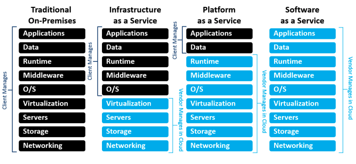

# 3. Cloud Computing

### 3.3 Plataformas cloud

#### Plataformas

Una plataforma cloud, también conocido como *modelo de despliegue cloud* (**cloud delivery model**), representa una combinación especifica de recursos IT que oferta el proveedor cloud. Los modelos más comunes, y que por tanto se han establecido como estándares en la industria, son los siguientes:

* Intraestructura-como-Servicio (*Infrastructure-as-a-Service [**IaaS**]*):
  * Básicamente la infraestructura se alquila, y el usuario accede a ella con una API o un panel de gestión. El usuario gestiona el sistema operativo, las aplicaciones y el middleware, mientras que los proveedores se encargan de los sistemas de hardware, las redes, los discos duros, el almacenamiento de datos y los servidores. 
  * El proveedor es también responsable de prevenir las interrupciones, hacer reparaciones y solucionar los problemas de hardware.
  * El objetivo principal del IaaS es el de dar al usuario un control absoluto sobre la gestión y configuración de la infraestructura cloud, i.e. una gestión sencilla del aprovisionamiento, escalabilidad y seguridad de los recursos
  * Dada la libertad de control que ofrece el IaaS, éste también conlleva un alto conocimiento y responsabilidad por parte del usuario. Es por ello que el IaaS suele ser consumido por usuarios que requieren un alto control el ecosistema que van a crear en la nube 
* Plataforma-como-Servicio (*Platform-as-a-Service [**PaaS**]*):
  * El proveedor de servicios cloud proporciona y gestiona el hardware y una plataforma de software de aplicaciones
  * El usuario es el que maneja las aplicaciones que se ejecutan en la plataforma y los datos en los que se basa la aplicación 
  * Una PaaS ofrece a los usuarios un elemento importante de [DevOps](https://www.redhat.com/es/topics/devops): una plataforma en la nube compartida para desarrollar y gestionar aplicaciones sin tener que diseñar ni mantener la infraestructura generalmente asociada con el proceso, lo cual resulta especialmente útil para los desarrolladores y los programadores
* Software-como-Servicio (*Software-as-a-Service [**SaaS**]*):
  * Ofrece a sus usuarios una aplicación de software que gestiona el proveedor cloud
  * Por lo general, las aplicaciones SaaS son aplicaciones web o aplicaciones móviles a las que los usuarios pueden acceder a través de un explorador web
  * Las actualizaciones de software, las correcciones de fallos y otros mantenimientos generales del software están a cargo del usuario, y se conectan a las aplicaciones de la nube a través de un panel o una API
  * El SaaS también elimina la necesidad de instalar localmente una aplicación, lo cual da lugar a mejores métodos de acceso grupal o en equipo al sistema de software

Aunque estas son los modelos frecuentes, existen otros que veremos más adelante con **CaaS** y **FaaS**

A continuación se muestra una imagen donde se compara la gestión del usuario en los diferentes modelos de plataforma cloud: 

# Proveedores

Los principales proveedores Cloud se pueden clasificar por el tipo de plataforma ofertada:

## Principales proveedores IaaS:

  * Amazon Web Services: AWS
  * Microsoft Azure
  * Google Cloud Platform: GCP
  * IBM Cloud
  * Oracle Cloud

  | Provider                  | Biggest positive                                             | Biggest negative                                            | Lowest starting price |
  | :------------------------ | :----------------------------------------------------------- | :---------------------------------------------------------- | :-------------------- |
  | **Amazon Web Services**   | Most comprehensive collection of services                    | Its popularity could leave you feeling like a number        | $0.0058/hour          |
  | **Microsoft Azure**       | Best support for legacy Windows but also for Linux migrations | Need more platform expertise than other providers           | $0.005/hour           |
  | **Google Compute Engine** | Emphasis on performance, availability and cost               | IaaS is lacking compared to others, no on-premises support. | $0.0475/hour          |
  | **IBM Cloud**             | Massive library of IBM services; comprehensive on-premises support | Limited regions, pricing, and SLAs.                         | Free                  |
  | **Oracle Cloud**          | Your best bet to move your on-prem Oracle environment to the cloud | Oracle doesn’t have the same scale as bigger players        | $0.0638/hour          |

## Principales proveedores PaaS
### Bases de datos

La elección de un servicio gestionado de bases de datos en la nube depende de varios factores, incluyendo el tipo de base de datos que necesitas, tus requisitos de rendimiento, escalabilidad, presupuesto y preferencias técnicas. 

#### Amazon RDS (Relational Database Service)
- Tipo de base de datos: MySQL, PostgreSQL, Oracle, SQL Server, etc.
- Ventajas: Escalabilidad automática, copias de seguridad automatizadas, múltiples opciones de motor de base de datos.
- Desventajas: Puede ser costoso a medida que se escalan los recursos comparado con otros rivales.

#### Google Cloud SQL
- Tipo de base de datos: MySQL, PostgreSQL, SQL Server.
- Ventajas: Integración con otros servicios de Google Cloud, escalabilidad, réplicas de lectura, copias de seguridad automáticas.
- Desventajas: Puede ser costoso, menos opciones de motor de base de datos en comparación con AWS.

#### Microsoft Azure SQL Database
Tipo de base de datos: SQL Server principalmente, aunque también da bases de datos básicas.
Ventajas: Integración con servicios de Azure, escalabilidad, seguridad avanzada, copias de seguridad automáticas.
Desventajas: Enfoque en SQL Server, puede ser costoso.

#### Google Firebase Realtime Database / Firestore:
Tipo de base de datos: NoSQL (Firestore), JSON (Realtime Database).
Ventajas: Escalabilidad en tiempo real, sincronización en tiempo real, fácil integración con aplicaciones móviles y web.
Desventajas: Limitaciones en consultas complejas.

#### MongoDB Atlas:
Tipo de base de datos: MongoDB (NoSQL).
Ventajas: Gestión fácil de MongoDB, escalabilidad global, seguridad avanzada, copias de seguridad automáticas.
Desventajas: Puede ser costoso a medida que se escalan los recursos.

#### Tipo de base de datos: Oracle. (la única que ofrece este servicio sin limitaciones)
Ventajas: Automatización, alto rendimiento, seguridad avanzada, capacidad de recuperación.
Desventajas: Puede ser costoso.

### Plataformas Kubernetes

La gestión de clústeres de Kubernetes en la nube es esencial para simplificar la administración de contenedores y aprovechar al máximo esta tecnología. La elección de una nube u otra, se debería hacer en base a coste, madurez y acuerdo con el proveedor cloud:

* Amazon Elastic Kubernetes Service (EKS) y Google Kubernetes Engine (GKE): son los líderes y los principales contribuidores al proyecto kubernetes.

Existen otros como Microsoft Azure Kubernetes Service (AKS), IBM Cloud Kubernetes Service (IKS), Alibaba, Rancher, Oracle que también ofrecen servicios de kubernetes gestionados.
  

### Plataformas de desarrollo (en desuso)

  * AWS - El más usado: Elastic Beanstalk (AWS EB)
    * Uno de los PaaS más extendidos en la industria, cuyo propósito es el despliegue sencillo y autoescalable de web apps (en cualquiera de los lenguajes principales para ello)
  * Google - El más usado: Google App Engine (GAE)
    * Similar Elastic Beanstalk de AWS, Google App Engine tiene el propósito de hacer el despliegue de aplicaciones web lo más sencillo posible para el desarrollador. GAE viene con un beneficio añadido y es la posibilidad de añadir capas de seguridad a modo add-ons, algo que conllevaría una gestión muy costosa en cuanto a tiempo se refiere
  * Microsoft Azure - El más usado: Azure App Service
    * Azure ofrece PaaS similares a los de sus competidores, AWS y GCP, desde servicios de almacenamiento, a despliegue de web apps (Azure App Service)

## Principales proveedores cloud de SaaS:

  * Salesforce: es una plataforma líder de CRM (Customer Relationship management). Ayuda a las empresas a gestionar interacciones con los clientes, automatizar procesos de ventas, marketing y atención al cliente. También permite la personalización y programación de aplicaciones a través de su plataforma y su ecosistema/lenguaje programación AppExchange.
    
  * Microsoft: sus principales productos son Microsoft 365 y Azure AD (nuevo Microsoft Entra Id) 
    
  * Google: Google Workspace, Google Analytics y Google Ads
