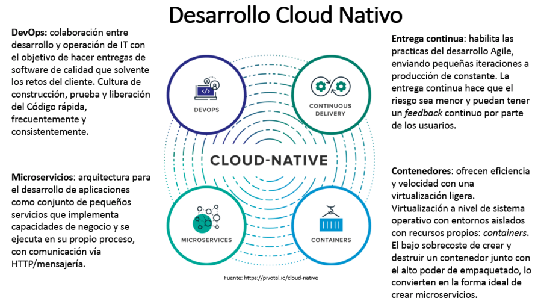
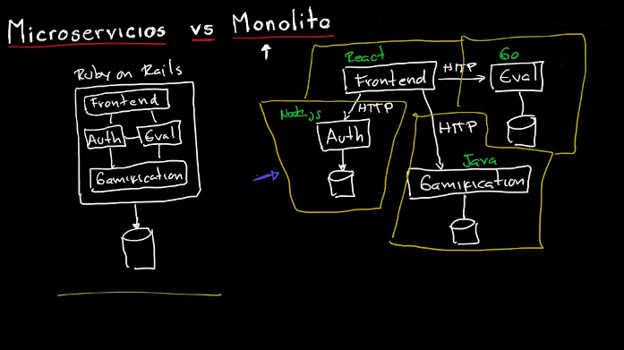

# 3. Cloud Computing

### 3.4 Diseño y despliegue de aplicaciones nativas Cloud

Ahora que tenemos un buen conocimiento de lo que nos oferta una nube (bien sea pública o privada), vamos a proceder con un salto gradual desde el desarrollo local (típicamente monolítico) hasta el desarrollo nativo en nube (*cloud native*) en el que se aprovecharán todo el potencial ofertado por el *cloud computing*.

#### Aplicaciones nativas Cloud (Cloud native applications): Introducción

El concepto del desarrollo de **aplicaciones nativas cloud** hace referencia a un paradigma de desarrollo de software que utiliza el entorno cloud para crear y desplegar aplicaciones en infraestructuras dinámicas y flexibles, como es el caso de la nube. 

Este paradigma de desarrollo suele ir acompañado del uso de las siguientes tecnologías:

* Plataformas cloud
* Metodologías ágiles ([Agile software development](https://en.wikipedia.org/wiki/Agile_software_development))
* Contenerización y [microservicios](https://en.wikipedia.org/wiki/Microservices)
* Orquestación de contenedores ([Docker Compose](https://docs.docker.com/compose/) y [Kubernetes](https://en.wikipedia.org/wiki/Kubernetes) [k8s])
* Funciones (FaaS) y plataformas *serverless* ([Serverless computing](https://en.wikipedia.org/wiki/Serverless_computing))
* Integración continua y Entrega continua ([Continuos Integration and Continuos Delivery](https://en.wikipedia.org/wiki/CI/CD) [CI/CD])

### Ventajas DEVOPS
- Adecuado para time-to-market ajustado. 
- En caso de startups o equipos específicos en grandes empresas, DEVOPS significa que quien desarrolla opera.
- Para grandes empresas que se suele buscar perfiles DEVOPS específicos que trabajen conjuntamente con desarrollares y operaciones evitando que múltiples equipos se encarguen de las mismas tareas.
- Mayor número de subidas e iteraciones.
- Software a la larga tiende a tener buena calidad y seguro, ya que se automatizan test, test de seguridad, pruebas de rendimiento.
- Se define unos estandares de como se construye y despliega.

### Ventajas CICD
- Cambios de código más pequeños
- Mayor frecuencia de subidas y mayor velocidad de subidas
- Más fiabilidad de las pruebas mediante pruebas automatizadas
- Aumentar la transparencia y la responsabilidad del equipo.
- NO SE REALIZAN ACCIONES MANUALES

### Ventajas Contenerización y microservicios

Uno de las características fundamentales que diferencia una aplicación nativa cloud de una aplicación tradicional es precisamente la contenerización y su infraestructura de microservicios.

De la contenerización ya hemos hablado extendidamente en el capítulo anterior cuando tratamos la virtualización de sistemas operativos, tanto de ventajas como desventajas. Sin embargo, es bueno que subrayemos la importancia de dicha tecnología en lo que a la **reproducibilidad** se refiere. El contenerizar una aplicación con todas las dependencias requeridas ha revolucionado por completo el paradigma del desarrollo en servidores. Previamente a la contenerización, la estabilización de entornos de desarrollo podía llegar a ser algo bastante tedioso, incluso convertirse en un problema a la hora del poder desarrollar, llegando en los casos más extremos a  convertirse en un factor de entorpecimiento a la hora de llevar a producción nuevos desarrollos, por no ser compatibles estos con las dependencias instaladas en el entorno productivo, sobre todo en proyectos de larga envergadura. La contenerización ataca una de las caras de este problema y es el aislamiento de dependencias de una aplicación, lo cual hace posible que su desarrollo sea completamente reproducible en cualquier entorno de trabajo, bien sea testing, desarrollo o productivo.

La arquitectura basada en microservicios constituye otro cambio de paradigma en el desarrollo de software, y consiste en construir una aplicación como un conjunto de pequeños [servicios](https://es.wikipedia.org/wiki/Servicio_(arquitectura_de_sistemas)), los cuales se ejecutan en su propio [proceso](https://es.wikipedia.org/wiki/Proceso_(informática)) y se comunican con mecanismos ligeros (normalmente una [API](https://es.wikipedia.org/wiki/Interfaz_de_programación_de_aplicaciones) de [recursos HTTP](https://es.wikipedia.org/wiki/Hypertext_Transfer_Protocol)). Cada "micro"-servicio se encarga de implementar una funcionalidad completa de negocio, de manera independiente y completamente autónoma. Así, cada micro-servicio puede ser desplegado de forma independiente y puede estar programado en distintos lenguajes y usar diferentes tecnologías de almacenamiento de datos. Esta filosofía de desarrollo evidentemente rompe con la filosofía tradicional monolítica, orientada a poyectos, que no a funcionalidades. La filosofía monolítica conlleva una serie de restricciones bastante importantes a la hora del desarrollo, como es por ejemplo el hecho de forzar un único lenguaje de programación o compatibilidad de librerías para todo un proyecto, lo cuál se convierte en algo más y más complicado a medida que un proyecto crece en complejidad (lo cuál es natural en la vida real). Por contra, los microservicios proponen como solución que cada funcionalidad de un proyecto ha de ser identificada y aislada como un proceso/servicio independiente, atendiendo al principio de única responsabilidad (*single-responsibility principle*). 

Esto ayuda de antemano a desacoplar las diferentes unidades de un proyecto, lo que a su vez es más beneficioso a la hora de renovar, refactorizar o reinventar partes del mismo, sin tener que atender a más preocupación que la interfaz programática de comunicación (API).

| Ventajas                                                     | Inconvenientes                                        |
| ------------------------------------------------------------ | ----------------------------------------------------- |
| Incrementa la eficiencia: divide la funcionalidad, mejora la escalabilidad | Latencia de red                                       |
| Facilita las actualizaciones                                 | Complejidad del diseño                                |
| Mejora la estabilidad                                        | ¿Qué es un microservicio? Tamaño, funcionalidad, etc. |
| Desacoplado de recursos físicos                              | Estandarización de interfaces                         |
| Multi-idioma/plataforma/…                                    |                                                       |
| Fácil de construir/probar/desplegar                          |                                                       |

 A continuación se muestra una figura en la que se comparan de manera esquemática las arquitecturas tradicionales *versus* las arquitecturas orientadas a microservicios.
 

## Los 12 factores

“Twelve-factor app” es una metodología para el desarrollo de aplicaciones nativas en la nube cuyas características esenciales son: 

- Formatos declarativos para la automatización de la configuración
- Máxima portabilidad entre los diferentes entornos de ejecución
- Despliegue en la nube, por lo que se obviará la necesidad de servidores y administración de sistemas
- Minimizan las diferencias entre los entornos de desarrollo y producción
- Posibilidad de escalado

Los 12 factores son: 

1. **Codebase**: Un código base sobre el que hacer el control de versiones y múltiples despliegues. 
2. **Dependencies**: Declarar y aislar explícitamente las dependencias mediante un manifiesto. Nunca dependerá de las librerías ya instaladas en el sistema por defecto
3. **Config**: Guardar la configuración en el entorno que pueda variar entre despliegues (producción o desarrollo, por ejemplo)
4. **Backing services**: Tratar a los “backing services” como recursos conectables
5. **Build, release, run**: Separar completamente la etapa de construcción de la etapa de ejecución
6. **Processes**: Ejecutar la aplicación como uno o más procesos sin estado. Los procesos deben ser stateless y share-nothing. Cualquier información que necesite persistencia se debe almacenar en un backing service con estado (e.g., una base de datos). 
7. **Port binding**: En entornos locales un servicio como un servidor web inicia en un puerto para todas las apps. En 12-factor apps, una capa de enrutamiento se encargará de gestionar los puertos de cada servicio
8. **Concurrency**: Escalar mediante el modelo de procesos
9. **Disposability**: Hacer el sistema más robusto intentando conseguir inicios rápidos y finalizaciones seguras. Las 12- factor apps deberán ser plenamente desechables en cualquier momento. 
10. **Dev/prod parity**: Mantener desarrollo, preproducción y producción tan parecidos como sea posible 
11. **Logs**: Tratar los historiales como una transmisión de eventos. 
12. **Admin processes**: Ejecutar las tareas de gestión/administración como procesos que solo se ejecutan una vez. 

“[Twelvefactor](https://12factor.net/)” recomienda lenguajes que proporcionan una consola del tipo REPL, ya que facilitan las tareas relacionadas con la ejecución de scripts

## Orquestación de contenedores: Kubernetes

Si prestamos suficiente atención a los 2 últimos labs, veremos que lo que realmente hemos hecho es preparar dos microservicios (cada uno con una responsabilidad única y bien definida, ver [*Single Responsibility Principle*](https://en.wikipedia.org/wiki/Single-responsibility_principle)) que posteriormente hemos desplegado en GCP. Cuando llegamos a este punto en el capítulo de virtualización vimos que ***en local*** podíamos "orquestar" (gestionar de manera conjunta y organizada un conjunto de) contenedores mediante el uso de [Docker Compose](https://docs.docker.com/compose/). Para ello se levantaban dos máquinas corriendo en cada una de ellas un contenedor. 

Aquí el problema está en lo poco eficiente que es levantar una máquina por cada contenedor, y como gestionar la escalabilidad de los distintos contenedores en caso de saturación.

Para este problema de orquestación de contenedores y arquitectura asociada existen principalmente dos soluciones: `docker swarm` y `kubernetes engine`. Aunque ambos dos proponen una solución a un mismo problema, existen pequeñas diferencias que hacen que Kubernetes haya sido el más usado en la industria. Muy resumidamente:

- [Docker swarm](https://docs.docker.com/engine/swarm/): es una herramienta de orquestación de contenedores, la cual nos permite llegar a la solución deseada de lanzar imágenes en diferentes máquinas (hosts)
- 
- [Kubernetes](https://kubernetes.io/): es una herramienta de orquestación de contenedores, que como en el caso de docker swarm nos permite el lanzamiento de imágenes en diferentes hosts, pero su *focus* principal ha sido la automatización y habilidad de adaptarse a escenarios de alta demanda. 

Así pues, se puede decir que la mayor diferencia entre Docker swarm y Kubernetes es la facilidad de uso. Nada ilustra mejor esto que un ejemplo sobre cómo cada uno maneja las redes. Cuando se crea un clúster de contenedores con Docker swarm, esos contenedores generalmente están disponibles en nuestra red porque ha dirigido un puerto externo a un puerto interno desde el comando `docker`. En otras palabras, no tenemos que configurar una capa de red separada dentro de los archivos YAML. Sin embargo, con Kubernetes, debemos configurar una capa de red adicional que es la que usa la virtualización de los contenedores. 

Así pues, Docker Swarm es mucho más sencillo en términos de uso y exploración, pero Kubernetes es mucho más escalable. Entonces, ¿cuando deberíamos usar uno u otro?

* **Docker Swarm**: Cuando queremos implementar un cluster de contenedores (en varios hosts) para una aplicación simple y escalable. Aunque cada día está más en deshuso. Si queremos correr pocas cargas (pocos contenedores), lo mejor es ir a servicios gestionados de contenedores como Amazon Fargate o Cloud Run de Google.

* **Kubernetes**: Cuando queremos administrar una aplicación de microservicios contenerizados, escalables y automatizados.

Es por esto mismo por lo que los principales proveedores de cloud ofertan directamente Kubernetes. En el caso de Google, Kubernetes se oferta parte de los servicios que podemos usar en la modalidad "pay as you go" y se denomina [**Google Kubernetes Engine**](https://cloud.google.com/kubernetes-engine/docs/quickstart) (GKE).

K8s conlleva una curva de aprendizaje importante, pero debido a uso uso cada vez mayor en este curso daremos un mini-curso con algunos conceptos básicos y necesarios para introducir esta herramienta de increíble alcance, de la que se podría dar un curso completo para su total entendimiento. 

