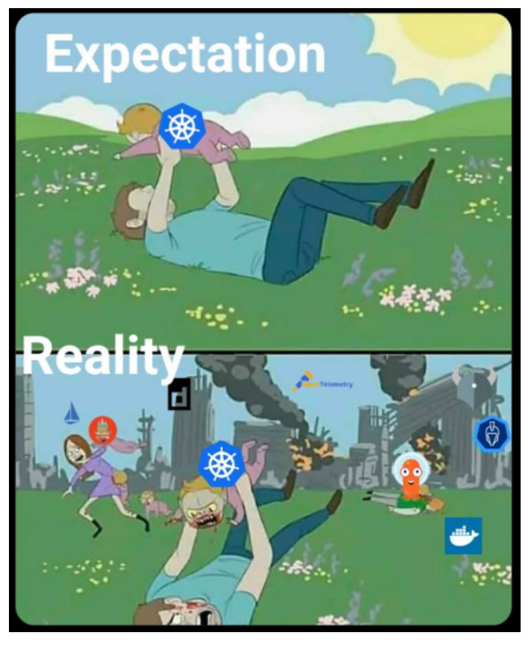
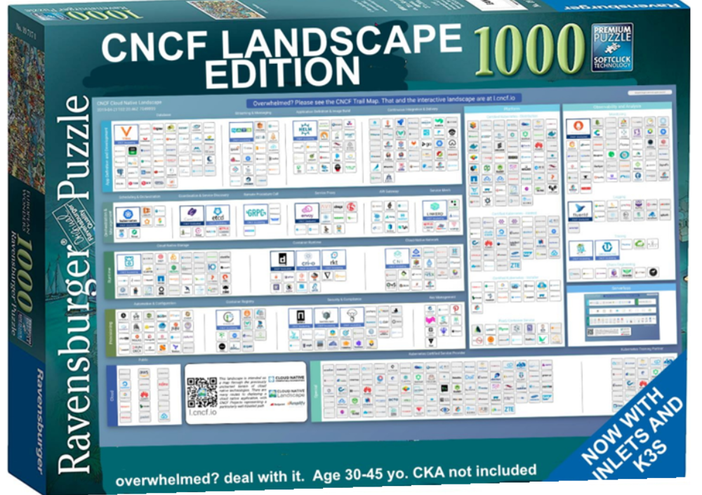

# 3.5.0 Introducción a Kubernetes

## ¿Qué es Kubernetes?

Una solución de orquestación de contenedores.

- **Κυβερνήτης** ("Kubernḗtēs") significa en griego "timonel" o "capitán". También se
  suele abreviar como **K8s** (la "8" sustituye a las ocho letras entre la "K" y la "s").
- Nace en 2014 en Google, basado en sus sistemas internos de orquestación **Borg** y
  **Omega**. Google libera una tercera plataforma completamente *open source* y la dona
  a la **CNCF** (Cloud Native Computing Foundation).
- Se libera una versión mayor cada pocos meses, y es hoy el proyecto con más
  contribuidores de todo el ecosistema *cloud native*, con empresas como Google, Red Hat
  o Microsoft entre los principales contribuidores.

## ¿Pero y qué es un contenedor?

Empaqueta el código y las dependencias de una aplicación.

- Este empaquetamiento se llama **imagen**, y se almacena en unos servidores que se
  llaman **registry**.
- La tecnología más conocida para construir estas imágenes es **Docker**, a partir de
  un fichero de definición (`Dockerfile`) como los que ya hemos usado en labs
  anteriores.

## ¿Cómo reduce recursos?

Como ya vimos en la [comparativa de virtualización](03-00-Virtualizacion-computo.md),
cada escalón (servidor físico → máquina virtual → motor de contenedores → orquestador
de contenedores) comparte más capas del sistema entre las distintas aplicaciones, lo
que reduce la sobrecarga de cada una de ellas a costa de aislarlas algo menos.

## ¿Qué aporta la contenerización?

El centro pasa a ser la **aplicación**, frente a la infraestructura:

1. Permite trocear la aplicación en piezas independientes (microservicios).
2. Portabilidad entre entornos y proveedores.
3. Consistencia entre entornos (desarrollo, *staging*, producción).
4. Aislamiento entre aplicaciones.
5. Despliegue rápido y escalabilidad.
6. Eficiencia en el uso de recursos.

## ¿Y por qué es importante Kubernetes?

- Es agnóstico respecto a la infraestructura sobre la que se ejecuta (puedes moverte
  entre proveedores cloud, o incluso on-premise).
- Tiene una comunidad y un ecosistema de herramientas muy activos.
- Cuenta con una adopción empresarial muy amplia.
- Se ha consolidado como la "plataforma de plataformas": la base sobre la que se
  construyen muchos servicios gestionados de los distintos proveedores cloud.

## ¿Es todo tan bonito?

Como suele pasar con cualquier tecnología con una curva de aprendizaje pronunciada, la
expectativa (una plataforma que gestiona todo de forma automática y transparente) y la
realidad (una configuración, mantenimiento y depuración que requieren bastante trabajo,
sobre todo al principio) no siempre coinciden. El ecosistema que rodea a Kubernetes
(la llamada *CNCF landscape*) es además enorme, con cientos de proyectos y
herramientas complementarias: no hace falta conocerlas todas, pero es bueno saber que
existen y que iremos viendo solo una pequeña parte en este curso.

En las siguientes secciones ([3.5 Kubernetes](03-05-K8S.md)) entraremos en el detalle
de los conceptos y piezas principales que forman un clúster de Kubernetes.
