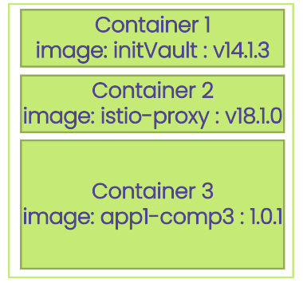
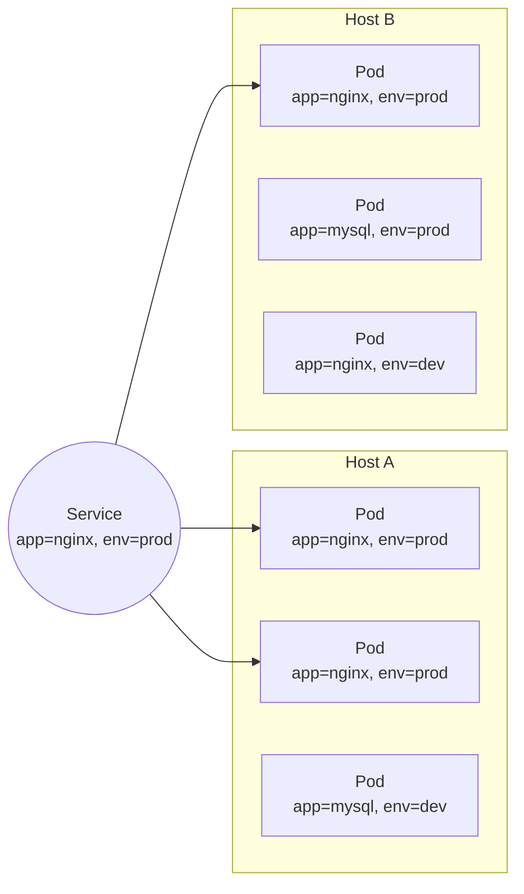
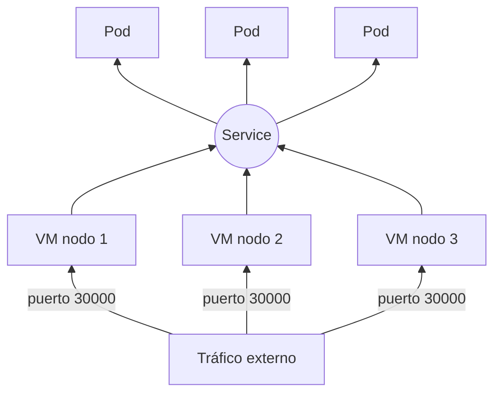

# 3.5 Kubernetes

## Conceptos clave
### Namespace
- Agrupación de elementos en un mismo espacio. Principalmente Pods y Service, pero pueden existir otro tipo de objetos/recursos.
- Permiten trocear el cluster y tener los elementos ordenados.

```yaml
apiVersion: v1
kind: Namespace
metadata:
  name: prod
  labels:
    app: MyBigWebApp
```

```shell
$ kubectl get ns --show-labels
NAME          STATUS   AGE   LABELS
default       Active   11h   <none>
kube-public   Active   11h   <none>
kube-system   Active   11h   <none>
prod          Active   6s    app=MyBigWebApp
```

### PODS

- Unidad atómica o "unidad de trabajo" más pequeña de Kubernetes.
- Los pods están formados por uno o MÁS contenedores que comparten volúmenes y configuración.
- SON EFÍMEROS

```yaml
apiVersion: v1
kind: Pod
metadata:
  name: pod-example
spec:
  containers:
  - name: nginx
    image: nginx:stable-alpine
    ports:
    - containerPort: 80
```

Un pod puede llevar más de un contenedor. Un caso muy habitual es el patrón *sidecar*:
además del contenedor principal de la aplicación, se añade otro contenedor auxiliar
que le da alguna capacidad extra (por ejemplo, un proxy de red como el que usa un
*service mesh* como Istio, o una inicialización de secretos):



- Dentro de la especificación del contenedor dentro del yaml, este puede llevar más campos.
    - name: nombre del contenedor
    - image: la imagen del contenedor
    - ports: puertos a exponer, a los que se les puede asociar un nombre
    - env: array de variables de entorno a enchufar a nuestro contenedor

```yaml
# Container
name: nginx
image: nginx:stable-alpine
ports:
  - containerPort: 80
    name: http
    protocol: TCP
env:
  - name: MYVAR
    value: isAwesome
```

- Adicionalmente se introducen estos campos para gestionar los recursos:
    - request: reserva  de CPU y memoria realizada en el nodo donde corre
    - limit: limite que puede consumir del nodo si en este queda espacio no reservado por otros pods a través del request.

```yaml
apiVersion: v1
kind: Pod
metadata:
  name: frontend
spec:
  containers:
  - name: db
    image: mysql:8.0
    resources:
      requests:
        memory: "64Mi"
        cpu: "250m"
      limits:
        memory: "128Mi"
        cpu: "500m"
```

- Y estos campos para gestionar la salud del contenedor (no son lo mismo, aunque se
  confunden a menudo):
    - **readinessProbe**: comprueba si el contenedor está listo para recibir tráfico.
      Mientras no pase la prueba, Kubernetes lo saca de los `Service` a los que
      pertenece (no le llegan peticiones), pero **no lo reinicia**.
    - **livenessProbe**: es la prueba de vida. Si el contenedor no la supera, Kubernetes
      lo reinicia para intentar solucionar el problema. Esto es lo que se conoce como
      *self-healing*.
    - **startupProbe** (no la vemos en detalle, pero es bueno saber que existe): pensada
      para contenedores con arranque lento; mientras no pase, desactiva las otras dos
      probes, evitando que Kubernetes mate un contenedor que simplemente tarda en
      arrancar.

```yaml
apiVersion: v1
kind: Pod
metadata:
  labels:
    test: liveness
  name: liveness-readiness-http
spec:
  containers:
  - name: liveness-readiness-http
    image: registry.k8s.io/liveness-readiness-http
    livenessProbe:
      httpGet:
        path: /healthz
        port: 8080
      initialDelaySeconds: 5
      periodSeconds: 10
      timeoutSeconds: 4
      failureThreshold: 5
    readinessProbe:
      httpGet:
        path: /healthz
        port: 8080
      initialDelaySeconds: 100
      periodSeconds: 10
      timeoutSeconds: 4
      failureThreshold: 2
```


## Comunicación de los contenedores y PODS
#### De contenedor a contenedor
Los contenedores de un pod comparten una IP. Permite la comunicación intrapod a través de localhost.

#### Pod-to-Pod
Asignación de una IP única a través del service y Nombre DNS.
`<servicio>.<namespace>.svc.cluster.local`
```
#Ejemplo: pod llamado data, en namespace test
data.test.svc.cluster.local
```


### Services
- Método unificado de acceso a las cargas de trabajo expuestas por los Pods.
- No es un recurso efímero.
- Se pueden definir como:
    - IP estática del clúster (clusterIP), donde kubernetes le da un nombre DNS estático asociado también al namespace
    - Mismo puerto abierto en todos los nodos (NodePort)
    - Crea un balanceador dedicado para recibir y enviar el tráfico a los pods (LoadBalancer)

Un mismo Service puede repartir tráfico entre pods de varios hosts distintos, siempre
que compartan las mismas `labels` que su `selector`:


```mermaid
flowchart LR
    S(("Service<br/>app=nginx, env=prod"))
    subgraph A["Host A"]
      A1["Pod<br/>app=nginx, env=prod"]
      A2["Pod<br/>app=nginx, env=prod"]
      A3["Pod<br/>app=mysql, env=dev"]
    end
    subgraph B["Host B"]
      B1["Pod<br/>app=nginx, env=prod"]
      B2["Pod<br/>app=mysql, env=prod"]
      B3["Pod<br/>app=nginx, env=dev"]
    end
    S --> A1
    S --> A2
    S --> B1
```

#### ClusterIP ejemplo
Es el por defecto, y la forma de enviar tráfico a los pods es usando el "selector" y definiendo el tag que tienen tus pods que quieres reenviar

```yaml
apiVersion: v1
kind: Service
metadata:
  name: example-prod
spec:
  selector:
    app: nginx
    env: prod
  ports:
  - protocol: TCP
    port: 80
    targetPort: 80
```

#### LoadBalancer ejemplo
Extiende en realidad de un "service" de tipo NodePort. Está integrado con nuestro proveedor cloud para poder hacer esta asignación externa.

```yaml
apiVersion: v1
kind: Service
metadata:
  name: example-prod
spec:
  type: LoadBalancer
  selector:
    app: nginx
    env: prod
  ports:
  - protocol: TCP
    port: 80
    targetPort: 80
```

Permite de una forma cómoda exponer servicios fuera de nuestro cluster y usar los balanceadores del proveedor Cloud. En el siguiente esquema se abre un puerto en todos los nodos (el puerto 30000), y es el balanceador quien intentará enviar el tráfico a todos los nodos, aunque el health check hará que sólo termine enviando a los nodos donde haya pods corriendo:


```mermaid
flowchart BT
    T["Tráfico externo"] -->|puerto 30000| VM1["VM nodo 1"]
    T -->|puerto 30000| VM2["VM nodo 2"]
    T -->|puerto 30000| VM3["VM nodo 3"]
    VM1 --> SV(("Service"))
    VM2 --> SV
    VM3 --> SV
    SV --> P1["Pod"]
    SV --> P2["Pod"]
    SV --> P3["Pod"]
```


## Tipos de cargas de trabajo

### Replicaset
- Método principal de gestión de réplicas de pods y su ciclo de vida.
- Incluye su programación, escalado y eliminación.
- Su trabajo es sencillo: garantizar que siempre se está ejecutando el número de pods deseado.

`ReplicaSet → Pod`

- Usa el campo `replicas` para desplegar el número deseado de pods.
- En la práctica, casi nunca se crea un `ReplicaSet` directamente: se gestiona a través
  de un `Deployment`, que es quien realmente usarás para desplegar aplicaciones.

```yaml
apiVersion: apps/v1
kind: ReplicaSet
metadata:
  name: rs-example
spec:
  replicas: 3
  selector:
    matchLabels:
      app: nginx
      env: prod
  template:
    <pod template>
```


### Deployment
- Forma de gestionar los Pods mediante ReplicaSets.
- Proporcionar la funcionalidad de reversión y el control de las actualizaciones.
- Cada iteración crea una versión que se asigna tanto al ReplicaSet como a los siguientes Pods.

`Deployment → ReplicaSet → Pod`

```yaml
apiVersion: apps/v1
kind: Deployment
metadata:
  name: nginx-deployment
  labels:
    app: nginx
spec:
  replicas: 3
  selector:
    matchLabels:
      app: nginx
  template:
    metadata:
      labels:
        app: nginx
    spec:
      containers:
      - name: nginx
        image: nginx:stable-alpine
        ports:
        - containerPort: 80
```


### Otras cargas de trabajo también indispensables aunque no entremos en detalle:
- Daemonset: permite desplegar el mismo pod en todos los nodos
- StatefulSet: diseñado para pods que tiene que tener un estado (aplicaciones stateful). Son aplicaciones que cada pod tiene que tener una identidad única y en caso de caida tiene que volver a llamarse igual.
- Jobs: contenedor que no tiene healthchecks porque muere una vez ejecutado. K8S no intenta volver a ejecutarlo si finaliza correctamente.
- CronJobs: lanzamiento planificado de jobs en el cluster

_Tampoco vemos en detalle los mecanismos de despliegue de un `Deployment` (los *rolling updates* que evitan pérdida de servicio al actualizar la imagen)._

## Visión general de la arquitectura

* **Cluster**: Cuando "desplegamos" con k8s, lo que estamos creando/obteniendo es un cluster. Un cluster no es más que un conjunto de VMs (nodos) que ejecutan aplicaciones contenerizadas. Todo cluster tiene al menos un nodo.

* **Node**: Como hemos comentado, un nodo es una instancia de una VM donde se sirven los contenedores de nuestras aplicaciones
* **Pod**: Un pod es una abstracción de k8s que representa un conjunto de contenedores que son servidos en un nodo
* **Control plane**: Se refiere a la capa de orquestación que expone la API e interfaces para definir, desplegar, y gestionar el ciclo de vida de los contenedores. En un entorno productivo, el **control plane** suele estar corriendo en varios nodos, lo que garantiza el servicio en caso de fallos.

Como resumen visual:


## Componentes del Control plane

#### kube-apiserver
- Proporciona un interfaz REST para interaccionar con el control-plane.
- Tanto las aplicaciones como los usuarios que desean modificar componentes de kubernetes, lo hacen a través del kube-apiserver.

#### etcd
- `etcd` actúa como base de datos distribuida en varios nodos del clúster.
- Almacena los objetos e información de configuración de forma clave-valor.

#### kube-controller-manager
Supervisa el estado del clúster a través del apiserver y dirige el clúster hacia el estado deseado.
Existen controladores de:
- Nodos: para parar/reiniciar/crear nuevos nodos en caso de problemas
- Replicación: para asegurar que los pods se encuentran con las réplicas correctas
- Configuración de los objetos: que se encuentren desplegados los objetos deseados del cluster, como servicios, volumenes, configuración....

#### kube-scheduler
- Componente que observa los pods recién creados que no tienen un nodo asignado, seleccionando un nodo para que se ejecuten.
- Los factores que se tienen en cuenta para las decisiones de scheduling son los requisitos de recursos individuales y colectivos, las restricciones de hardware/software, las especificaciones de
afinidad y antiafinidad o la localización de los volumenes.

#### cloud-controller-manager
Integrado con el controller, es el componente que desencadena las acciones contra el proveedor cloud, creando/destruyendo nodos, balanceadores o volumenes de datos.

Si queréis seguir estudiando (no entra en el contenido del curso), siguientes puntos serían (y siguen siendo conceptos básicos):
- Gestión de configmaps, secrets en nuestros contenedores
- Gestión de volumenes persistentes, no persistentes: storageclasses, PV, PVCs
- Gestión de plantillas de aplicaciones: kustomize y helm
- Servidor de métricas y monitorización de PODS.
- Horizontal Pod Autoscaling (lo vemos en la [práctica de autoescalado](https://github.com/AgustinICAI/asr-cloud-26/tree/main/08-k8s-Entrega/08-k8s-scaling))
- GitOps: desplegar de forma declarativa desde Git en vez de con `kubectl apply` manual (lo vemos con ArgoCD en la entrega de autoescalado)
- Service mesh: gestión avanzada de tráfico entre servicios, p.ej. *canary releases* (lo vemos con Istio en la misma entrega)
