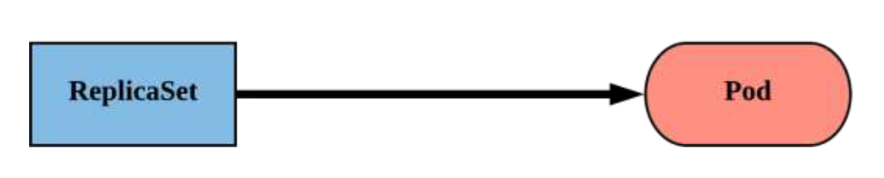

# Kubernetes (K8S)

## ¿De dónde viene?
En griego significa "piloto" o "timonel de un barco"

  

- Un sistema de orquestación de contenedores productivo en Google, basado en Borg y Omega,  que han demostrado funcionar en Google durante más de 15 años.
- Google genera miles de millones de contenedores por semana con estos sistemas.
- Creado por tres empleados de Google inicialmente durante el verano de 2014; creció exponencialmente y se convirtió en el primer proyecto en ser donado al CNCF.
- Lanzó la primera versión de producción v1.0.1 en julio de 2015. Ha lanzado continuamente una nueva versión minor cada tres meses y major cada 6 meses aprox. Ahora acaba de ser liberada la 1.25

## ¿Qué es?
- Desvincula la infraestructura y la aplicación
    - Todos los servicios de Kubernetes se autobalancea la carga que reciben.
    - Los contenedores pueden ampliarse y reducirse dinámicamente sus réplicas.
    - Tiene sistemas de self-healing (autoreparación)
    - Están diseñado para que nuevas versiones de las aplicaciones que corren en los contenedores se desplieguen sin pérdida de servicio.

- Kubernetes siempre intenta dejar el cluster en el estado deseado

    - Yo: "Quiero que 3 instancias sanas de redis estén siempre funcionando".
    - Kubernetes: "Bien, me aseguraré de que siempre haya 3 instancias en funcionamiento".
    - Kubernetes: "Oh, mira, uno ha muerto. Voy a intentar girar uno nuevo".

## Conceptos clave
### Namespace
- Agrupación de elementos en un mismo espacio. Principalmente Pods y Service, pero pueden existir otro tipo de objetos/recursos.
- Permiten trocear el cluster y tener los elementos ordenados.


### PODS

- Unidad atómica o "unidad de trabajo" más pequeña de Kubernetes.
- Los pods están formados por uno o MÁS contenedores que comparten volúmenes y configuración.
- SON EFÍMEROS


- Dentro de la especificación del contenedor dentro del yaml, este puede llevar más campos.
    - name: nombre del contenedor
    - image: la imagen del contenedor
    - ports: puertos a exponer, a los que se les puede asociar un nombre
    - env: array de variables de entorno a enchufar a nuestro contenedor


- Adicionalmente se introducen estos campos para gestionar los recursos:
    - request: reserva  de CPU y memoria realizada en el nodo donde corre
    - limit: limite que puede consumir del nodo si en este queda espacio no reservado por otros pods a través del request.


- Y estos campos para gestionar el self-healing o la salud del contenedor:
    - readinessProbe: es lo que usa kubernetes que el pod se encuentra bien arrancado. Una vez que está arrancado, k8s le empieza a mandar peticiones
    - livenessProbe: es la prueba de vida que realiza Kubernetes al contenedor. Si este no se encuentra vivo, se reiniciará para intentar solucionar los problemas.


## Comunicación de los contenedores y PODS
#### De contenedor a contenedor
Los contenedores de un pod comparten una IP. Permite la comunicación intrapod a través de localhost.

#### Pod-to-Pod
Asignación de una IP única a través del service y Nombre DNS.
<**service name**>.<**namespace**>.svc.cluster.local
```
#Ejemplo: pod llamado data, en namespace test
data.test.svc.cluster.local
```


### Services
- Método unificado de acceso las cargas de trabajo expuestas de Pods.
- No es un recurso efímero.
- Se pueden definir como:
    - IP estática del clúster (clusterIP), donde kubernetes le da un nombre DNS estático asociado también al namespace
    - Mismo puerto abierto en todos los nodos (NodePort)
    - Crea un balanceador dedicado para recibir y enviar el tráfico a los pods (LoadBalancer)

      

#### CLusterIP ejemplo
Es el por defecto, y la forma de enviar tráfico a los pods es usando el "selector" y definiendo el tag que tienen tus pods que quieres reenviar


#### LoadBalancer ejemplo
Extiende en realidad de un "service" de tipo NodePort. Está integrado con nuestro proveedor cloud para poder hacer esta asignación externa


## Tipos de cargas de trabajo

### Replicaset
- Método principal de gestión de réplicas de pods y su ciclo de vida.
- Incluye su programación, escalado y eliminación.
- Su trabajo es sencillo: Garantizar siempre la número de vainas se están ejecutando.
  

- Usa el campo replicas para desplegar el numero deseado de pods


### Deployment
- Forma de gestionar los Pods mediante ReplicaSets.
- Proporcionar la funcionalidad de reversión y el control de las actualizaciones.
- Cada iteración crea una versión que se asigna tanto al ReplicaSet como a los siguientes Pods.
  


### Otras cargas de trabajo también indispensables aunque no entremos en detalle:
- Daemonset: permite desplegar el mismo pod en todos los nodos
- StatefulSet: diseñado para pods que tiene que tener un estado, y por tanto no pueden tener más contenedores corriendo que los definidos
- Jobs: contenedor que no tiene healthchecks porque muere una vez ejecutado. K8S no intenta volver a ejecutarlo si finaliza correctamente.
- CronJobs: lanzamiento planificado de jobs en el cluster

### Tampoco vemos los mecanismos de despliegue de los contenedores usando deployment y los rolling updates para que no haya pérdida de servicio.

## Visión general de la arquitectura

* **Cluster**: Cuando "desplegamos" con k8s, lo que estamos creando/obteniendo es un cluster. Un cluster no es más que un conjunto de VMs (nodos) que ejecutan aplicaciones contenerizadas. Todo cluster tiene al menos un nodo.

* **Node**: Como hemos comentado, un nodo es una instancia de una VM donde se sirven los contenedores de nuestras aplicaciones
* **Pod**: Un pod es una abstracción de k8s que representa un conjunto de contenedores que son servidos en un nodo
* **Control plane**: Se refiere a la capa de orquestación que expone la API e interfaces para definir, desplegar, y gestionar el ciclo de vida de los contenedores. En un entorno productivo, el **control plane** suele estar corriendo en varios nodos, lo que garantiza el servicio en caso de fallos.

Como resumen visual:


## Componentes del Control plane

#### kube-apiserver
- Proporciona un interfaz REST para interaccionar con el control-plane.
- Tanto las aplicaciones como los usuarios que desean modificar componentes de kubernetes, lo hacen a través del kube-apiserver.

#### etcd
- etcd actúa como base de datos distribuida en varios nodos del clúster.
- Almacena los objetos e información de configuración de forma clave-valor.

  

#### kube-controller-manager
Supervisa el estado del clúster a través del apiserver y dirige el clúster hacia el estado deseado.
Existen controladores de:
- Nodos: para parar/reiniciar/crear nuevos nodos en caso de problemas
- Replicación: para asegurar que los pods se encuentran con las réplicas correctas
- Configuración de los objetos: que se encuentren desplegados los objetos deseados del cluster, como servicios, volumenes, configuración....

#### kube-scheduler
- Componente que observa los pods recién creados que no tienen un nodo asignado, seleccionando un nodo para que se ejecuten.
- Los factores que se tienen en cuenta para las decisiones de scheduling son los requisitos de recursos individuales y colectivos, las restricciones de hardware/software, las especificaciones de
afinidad y antiafinidad o la localización de los volumenes.

#### cloud-controller-manager
Integrado con el controller, es el componente que desencadena las acciones contra el proveedor cloud, creando/destruyendo nodos, balanceadores o volumenes de datos.


Si queréis seguir estudiando (no entra en el contenido del curso), siguientes puntos serían (y siguen siendo conceptos básicos):
- Gestión de configmaps, secrets en nuestros contenedores
- Gestión de volumenes persistentes, no persistentes: storageclasses, PV, PVCs
- Gestión de plantillas de aplicaciones: kustomize y helm
- Servidor de métricas y monitorización de PODS.
- Horizontal Pod Autoscaling