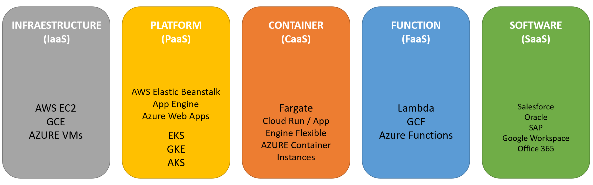

### Otros PaaS: Google App Engine (GAE)

GAE nos brinda la oportunidad de las bondades de K8s, tales como el autoescalado, sin que tengamos que ser nosotros los que nos preocupemos por gestionar el cluster. Así, GAE se puede entender como un cluster de K8s gestionado automáticamente por Google. Es por ello por lo que todos nuestros esfuerzos se pueden centrar única y exclusivamente en el desarrollo del software (app), dejando la gestión del cluster a Google (sin más que especificar algunas propiedades del cluster para controlar costes, como pueden ser el máximo numero de instancias, etc.)

Podemos entender GAE como el servicio ideal donde desplegar nuestros micro-servicios, los cuales conjuntamente constituyen un ecosistema interconectado, sobre el que podremos ir construyendo capas superiores de abstracción con el fin de acabar con el desarrollo monolítico. 

Una vez tengamos una versión inicial de nuestro aplicativo (app), podremos servirlo inmediatamente en uno de los dos entornos proporcionados por GAE:

* **Standard**: En caso que nuestro aplicativo esté escrito en uno de los siguientes lenguajes y versiones:

  * Python, Java, Node.js, PHP, Ruby, GO

  Podremos disfrutar de un entorno "standard", de manera que GAE se encargará de contenerizar nuestro código y desplegarlo en instancias a muy bajo coste. 

* **Flexible**: En el caso que nuestro aplicativo esté contenerizado, y queramos lanzarlo como contenedor porque depende de librerías no estándares, o está escrito en un lenguaje no listado, o tiene unas necesidades computacionales algo más exigentes que las ofertadas en el entorno standard. El entorno de despliegue flexible nos permite una mayor personalización en términos de recursos, lo cual puede ser muy conveniente.

Para un mayor entendimiento de la diferencia entre ambos modelos, podemos ver la [documentación oficial](https://cloud.google.com/appengine/docs/the-appengine-environments).

### Aplicaciones Serverless: El espíritu cloud native

Finalmente, incluso deshaciéndonos de la responsabilidad de mantener el cluster de K8s mediante el uso de GAE, tenemos una limitación y es que seguimos teniendo que mantener un mínimo de 1 instancia (nodo) funcionando 24/7. Sin embargo, nuestro objetivo último siempre ha sido el llegar a una arquitectura que sea lo más dinámica posible, con la idea en mente de escalar hasta cero instancias si fuera posible, de manera que solo pagásemos realmente por aquello que usamos. Y este es precisamente el objetivo de las dos últimos servicios de hosting de aplicativos que vamos a ver, que son:

* Cloud Functions
* Cloud Run

Ambos dos se centran en el concepto de escalar a cero, es decir, de deshacernos del concepto de "servidor" (*serverless*) mediante la gestión activa y automática de infraestructura y plataforma de Google. Como veremos ambos están íntimamente relacionados entre sí, y su diferencia tiene que ver con los environments standard y flexible de GAE.

Este paradigma de desarrollo se conoce como **Funtions as a Service** (FaaS), dado que el objetivo principal es la programación de una funcionalidad (que en última instancia se entiende que se ejecutará en reacción a un evento dado). El esquema IaaS, PaaS y SaaS que vimos anteriormente queda ampliado del siguiente modo:

De modo que en una arquitectura FaaS (serverless) lo único de lo que tenemos que hacernos cargo es de la gestión de los datos procesados o generados por la "función".

Las ventajas principales son:

* No tendrás que aprovisionar, administrar ni actualizar servidores
* Escala automáticamente según la carga. Se paga por el tiempo de procesamiento de la función
* Funciones integradas de supervisión, registro y depuración 
* Seguridad integrada a nivel de funciones y por función que se basa en el principio de privilegio mínimo
* Capacidades de red clave para situaciones híbridas y de múltiples nubes

### Functions as a Service (FaaS): Google Cloud Functions

Cloud functions nos brinda la oportunidad única de ir directamente de código a aplicativo serverless sin necesidad de contenerización.

