# 3. Cloud Computing

### 3.1 De la virtualización a la nube

* En el capítulo anterior se han presentado las "tecnologías facilitadoras" que hacen posible proporcionar, y por tanto consumir, infraestructura tecnológica mediante código. 

* Esta abstracción de la infraestructura tecnológica como código ha conllevado una revolución en la gestión y utilización efectiva del Hardware en los últimos 20 años.

* A modo resumen, la virtualización es una capa de abstracción sobre Hardware físico que nos permite dividir dichos recursos físicos (e.g., procesador, memoria o almacenamiento) en múltiples unidades ***virtuales*** con las que se pueden operar como si fuera Hardware independiente. 

* Por ejemplo, esto nos permite generar en un solo ordenador varias ***máquinas virtuales*** (VMs del inglés *virtual machines*) que se comportan como ordenadores completamente independientes con una realidad física.

  

* Hemos visto que los tipos de virtualización más populares son:

  * Virtualización de procesamiento (Server Virtualisation)
  * Virtualización de almacenamiento (Storage Virtualisation)
  * Virtualización de redes (Network Virtualisation)
  * Virtualización de sistemas operativos (Containerisation)

* ¿Qué es la nube (*cloud*) entonces, y qué tiene que ver con todo esto? En pocas palabras, la virtualización es la tecnología facilitadora, y la nube es el entorno donde se extraen, agrupan y comparten recursos. Así pues, la nube se suele definir como:

  > *Un conjunto de software y servicios que permiten al desarrollador centrarse en el proyecto de desarrollo en lugar de en la infraestructura necesaria*
  >
  > J.J. Geewax, Google Cloud Platform in Action

* Pero, la nube no es simplemente virtualización. La nube conlleva la posibilidad de acceder a los recursos virtuales creados con la virtualización a través de redes privadas o públicas. Esta posibilidad conlleva, evidentemente, la necesidad de un conjunto de software y servicios que permiten su funcionamiento y gestión por parte de tanto el proveedor (*cloud provider*) como el usuario (*cloud consumer*). Este ecosistema de software y servicios suele seguir la siguiente estructura por capas:

  

* Como se puede intuir del punto anterior, en el mundo cloud se pueden identificar ciertos "roles" característicos que son universales, como son por ejemplo:

  * Proveedor Cloud (Cloud Provider):
    * La compañía/organización que provee la infraestructura tecnológica cloud
    * El proveedor cloud es responsable del mantenimiento de la infraestructura así como del cumplimiento con los acuerdos de disponibilidad (SLA, del inglés *Service-Level Agreement*) con el consumidor 
  * Usuario Cloud (Cloud Consumer): 
    * Es la compañía/organización/persona que firma un acuerdo con el cloud provider para usar los servicios IT ofertados por el proveedor. 
    * Por lo general, el usuario cloud usará los servicios IT del proveedor cloud correspondiente a través de un conjunto de softwares intermediarios (del proveedor) generalmente conocido como *cloud service consumer* (CSC)
  * Administrador Cloud (Cloud Resource Administrator):
    * Es la compañía/organización/persona que se encarga de la administración de los servicios basados en la infraestructura cloud (incluyendo los propios servicios cloud ofertados por el proveedor). 
    * Puede ser o no parte de la entidad consumidora, ya que podría tratarse de una compañía externa al consumidor que se ha contratado con el cometido de administrar los servicios creados por el consumidor en la infraestructura cloud
  * Auditor Cloud (Cloud Auditor): 
    * Es una compañía/organización independiente (normalmente acreditada) que lleva a cabo revisiones regulares en relación a controles de seguridad, privacidad y continuidad de negocio.
    * El objetivo principal de este rol es el de generar un informe exhaustivo e independiente sobre el entorno cloud que ayude a identificar vulnerabilidades y puntos débiles, que habrán de ser subsanados en un plazo determinado, para fortalecer la relación de confianza entre el consumidor y el proveedor cloud.    

* Normalmente, todo proveedor cloud ofrece una interfaz gráfica muy accesible y agradable para el usuario, así como interfaces programáticas (APIs) que permiten la automatización de tareas repetitivas

* Ejemplo de la interfaz gráfica de usuario (portal web) de un proveedor cloud 

  * Microsoft Azure:

    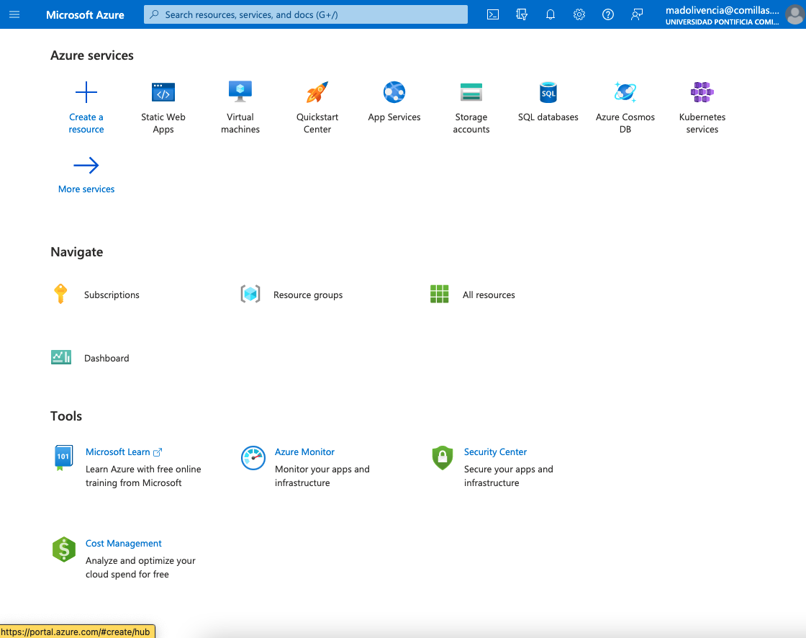

  * Google Cloud Platform: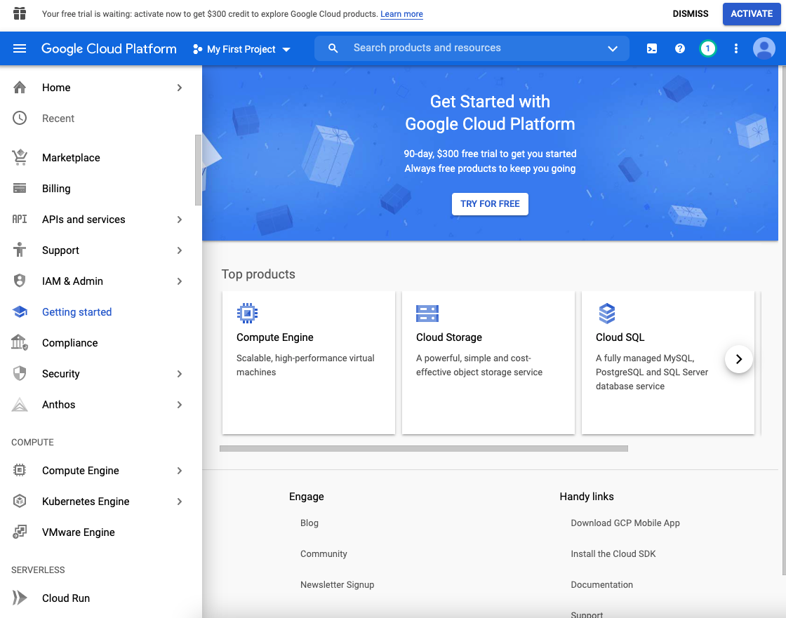

* Un ejemplo de interfaz programática ofertada por un proveedor cloud

  * Azure CLI:

    ```shell
    $ az group create --name example-resource-group --location eastus
    $ az vm create \
        --resource-group example-resource-group \
        --name example-instance \
        --image UbuntuLTS \
        --admin-username azureuser \
        --generate-ssh-keys \
        --public-ip-sku Standard
    ```

    Esta simple línea de código nos permite crear una VM con la última versión de **Ubuntu LTS**, especificando que el usuario **azureuser** será root-user, dentro de la región **eastus**, i.e. East US.

  * Google SDK:

    ```shell
    $ gcloud compute instances create example-instance \
    				--image-family=rhel-8 \
    				--image-project=rhel-cloud \
    				--zone=us-central1-a
    ```

    Esta simple línea de código nos permite crear una VM con **Red Hat Enterprise Linux 8**, en la región **US** (Estados Unidos) y zona **Central1-a**, que corresponde a: Council Bluffs, Iowa, North America.

* Las características diferenciadas de la nube son:

  * Escalabilidad y servicios bajo demanda (*Scalability and services on-demand*)
    * Una de las características principales y más definitorias de la nube es la capacidad ofrecida al consumidor cloud de disponer de recursos y modificar sus especificaciones (escalarlos) bajo demanda. El escalado puede ocurrir tanto en datacenters de una misma zona, así como en datacenters de distintas zonas y regiones
  * Interfaz centrada en el usuario (*User-centric interface*)
    * El uso de la nube es independiente de la localización del consumidor, y se puede acceder fácilmente a través de alguna red (pública o privada) mediante interfaces estándares, como son los servicios web, o exploradores de Internet
  * Elasticidad (*Elasticity*)
    * Capacidad de escalar automáticamente y de manera transparente los servicios cloud según se requiera, o acorde a ciertos parámetros establecidos bien por el consumidor o bien por el proveedor  
  * Calidad de los servicios garantizada: Resiliencia (*Guaranteed Quality of Services [QoS]: Resiliency*)
    * La resiliencia se basa en la distribución redundante de los servicios en multiples localizaciones físicas, lo cual permite garantizar los recursos cloud ofertados gracias a esta forma de respaldo automático
  * Cobro por uso (*Pay-as-you-go* [*PAYG*])
    * La nube no requiere una inversión en recursos de manera anticipada. Todo lo contrario, la nube permite a los consumidores pagar solo por lo que están usando, tanto en procesamiento como en almacenamiento. Esto es posible gracias a que el proveedor cloud tiene un sistema de monitorización/control del uso de los recursos cloud por parte de sus clientes, el cual es totalmente transparente al consumidor, lo cual incrementa la relación de confianza entre ambos.

### 3.2 Tipos de nubes

Existen tres tipos principales de "nube" (cloud computing):

* Nuble pública
* Nube privada
* Nube híbrida

Aunque en ocasiones se incluye también la combinación de todas ellas (**multi-cloud**) como una cuarta variante, la realidad es que es una combinación de las anteriores, por lo que nosotros no haremos susodicha distinción.

En la ***nube pública*** los recursos ofertados por el proveedor externo son gestionados a través de Internet vía aplicaciones o servicios Web. Las nubes públicas son gestionadas por organizaciones externas al consumidor. En este caso, los consumidores no tienen exclusividad de uso de los servidores, almacenamiento y redes del proveedor. Es decir, aplicaciones de diferentes consumidores podrán convivir en un mismo servidor con el fin de optimizar su uso (por parte del proveedor).

En la ***nube privada*** los recursos son de exclusivo uso de un cliente, y son operadas y gestionadas en redes privadas. En éstas, el consumidor tiene total control sobre los datos, la seguridad y la calidad del servicio. Las nubes privadas pueden crearse tanto por el propio departamento de IT de una compañía, como por un proveedor cloud externo.

En la ***nube* *híbrida*** se combinan ambos mundos, parte de la nube será pública, y parte de ella será privada. Este tipo de nube introduce un factor de complejidad adicional, el de la determinación sobre qué ha de ser enviado a la nube pública y qué a la privada. A pesar de ello, este modelo parece ser el más conveniente en organizaciones con una tradición monolítica que busca reducir la deuda tecnológica mediante la migración gradual a la nube pública.

Por último, cabe mencionar el paradigma ***multicloud***. El término [multicloud](https://www.redhat.com/es/topics/cloud-computing/what-is-multicloud) se refiere a un enfoque de nube compuesto por al menos dos servicios de nube, que proporcionan por lo menos dos proveedores de nube pública o privada. Todas las nubes híbridas son multiclouds, pero no todas las multiclouds son híbridas. Las multiclouds se vuelven híbridas cuando se conectan varias nubes con algún tipo de [integración](https://www.redhat.com/es/topics/integration/what-is-integration) u organización.

A modo de resumen:

| Nubes Públicas                                               | Nubes Privadas                                               |
| ------------------------------------------------------------ | ------------------------------------------------------------ |
| Infraestructura compartida a la que todo el mundo puede acceder | Infraestructura propiedad y accedida por un cliente          |
| Proporciona niveles de HW y virtualización, propiedad del proveedor, compartidos por todos los clientes | Proporciona niveles de HW y virtualización, propiedad del cliente y para su propio uso |
| Recursos “infinitamente” elásticos                           | Recursos elásticos finitos                                   |
| Conectada a la Internet pública                              | Puede o no estar conectada a la Internet pública.            |

### 3.3 Plataformas cloud

#### Plataformas

Una plataforma cloud, también conocido como *modelo de despliegue cloud* (**cloud delivery model**), representa una combinación especifica de recursos IT que oferta el proveedor cloud. Los modelos más comunes, y que por tanto se han establecido como estándares en la industria, son los siguientes:

* Intraestructura-como-Servicio (*Infrastructure-as-a-Service [**IaaS**]*):
  * Básicamente la infraestructura se alquila, y el usuario accede a ella con una API o un panel de gestión. El usuario gestiona el sistema operativo, las aplicaciones y el middleware, mientras que los proveedores se encargan de los sistemas de hardware, las redes, los discos duros, el almacenamiento de datos y los servidores. 
  * El proveedor es también responsable de prevenir las interrupciones, hacer reparaciones y solucionar los problemas de hardware.
  * El objetivo principal del IaaS es el de dar al usuario un control absoluto sobre la gestión y configuración de la infraestructura cloud, i.e. una gestión sencilla del aprovisionamiento, escalabilidad y seguridad de los recursos
  * Dada la libertad de control que ofrece el IaaS, éste también conlleva un alto conocimiento y responsabilidad por parte del usuario. Es por ello que el IaaS suele ser consumido por usuarios que requieren un alto control el ecosistema que van a crear en la nube 
* Plataforma-como-Servicio (*Platform-as-a-Service [**PaaS**]*):
  * El proveedor de servicios cloud proporciona y gestiona el hardware y una plataforma de software de aplicaciones
  * El usuario es el que maneja las aplicaciones que se ejecutan en la plataforma y los datos en los que se basa la aplicación 
  * Una PaaS ofrece a los usuarios un elemento importante de [DevOps](https://www.redhat.com/es/topics/devops): una plataforma en la nube compartida para desarrollar y gestionar aplicaciones sin tener que diseñar ni mantener la infraestructura generalmente asociada con el proceso, lo cual resulta especialmente útil para los desarrolladores y los programadores
* Software-como-Servicio (*Software-as-a-Service [**SaaS**]*):
  * Ofrece a sus usuarios una aplicación de software que gestiona el proveedor cloud
  * Por lo general, las aplicaciones SaaS son aplicaciones web o aplicaciones móviles a las que los usuarios pueden acceder a través de un explorador web
  * Las actualizaciones de software, las correcciones de fallos y otros mantenimientos generales del software están a cargo del usuario, y se conectan a las aplicaciones de la nube a través de un panel o una API
  * El SaaS también elimina la necesidad de instalar localmente una aplicación, lo cual da lugar a mejores métodos de acceso grupal o en equipo al sistema de software

A continuación se muestra una imagen donde se compara la gestión del usuario en los diferentes modelos de plataforma cloud: 

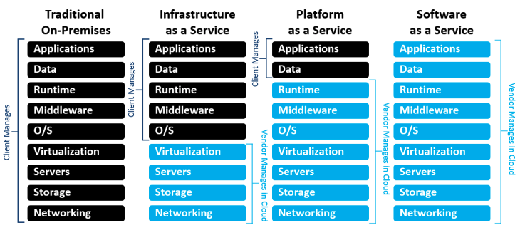

#### Proveedores

Los principales proveedores Cloud se pueden clasificar por el tipo de plataforma ofertada:

* Principales proveedores IaaS:

  * Amazon Web Services: AWS
  * Microsoft Azure
  * Google Cloud Platform: GCP
  * IBM Cloud
  * Rackspace
  * Oracle Cloud
  * CenturyLink Cloud

  | Provider                  | Biggest positive                                             | Biggest negative                                            | Lowest starting price |
  | :------------------------ | :----------------------------------------------------------- | :---------------------------------------------------------- | :-------------------- |
  | **Amazon Web Services**   | Most comprehensive collection of services                    | Its popularity could leave you feeling like a number        | $0.0058/hour          |
  | **Microsoft Azure**       | Best support for legacy Windows but also for Linux migrations | Need more platform expertise than other providers           | $0.005/hour           |
  | **Google Compute Engine** | Emphasis on performance, availability and cost               | IaaS is lacking compared to others, no on-premises support. | $0.0475/hour          |
  | **IBM Cloud**             | Massive library of IBM services; comprehensive on-premises support | Limited regions, pricing, and SLAs.                         | Free                  |
  | **Rackspace**             | Leaders in managed cloud services, flexible pricing          | Pricing models can be confusing and costs can add up fast.  | $0.032/hour           |
  | **Oracle Cloud**          | Your best bet to move your on-prem Oracle environment to the cloud | Oracle doesn’t have the same scale as bigger players        | $0.0638/hour          |
  | **Verizon Enterprise**    | Good for mid-sized businesses, emphasis on connectivity, managed hosting and security | Limited storage, service is only for Verizon customers      | $48/month             |
  | **CenturyLink Cloud**     | Good connectivity to the cloud, ideal for SMBs               | Has trouble scaling to large enterprises or high traffic.   | $18.24/month          |
  | **CloudSigma**            | European based, designed for cloud server hosting            | User interface isn’t considered very friendly.              | $14/month             |
  | **VMware vCloud Air**     | Good cloud and VM management and disaster recovery support   | Some limited features, interface needs work.                | $0.034 /GB/hr         |

* Principales proveedores PaaS

  * AWS - El más usado: Elastic Beanstalk (AWS EB)
    * Uno de los PaaS más extendidos en la industria, cuyo propósito es el despliegue sencillo y autoescalable de web apps (en cualquiera de los lenguajes principales para ello)
  * Google - El más usado: Google App Engine (GAE)
    * Similar Elastic Beanstalk de AWS, Google App Engine tiene el propósito de hacer el despliegue de aplicaciones web lo más sencillo posible para el desarrollador. GAE viene con un beneficio añadido y es la posibilidad de añadir capas de seguridad a modo add-ons, algo que conllevaría una gestión muy costosa en cuanto a tiempo se refiere
  * Salesforce
    * EL propósito de Salesforce aPaaS es nuevamente el de proporcionar al usuario cloud la posibilidad de desarrollar applicationes integradles en Salesforce de una forma muy sencilla, sin preocuparse de todos los detalles de la gestión de la infraestructura virtualizada
  * Microsoft Azure - El más usado: Azure App Service
    * Azure ofrece PaaS similares a los de sus competidores, AWS y GCP, desde servicios de almacenamiento, a despliegue de web apps (Azure App Service)

* Principales proveedores cloud de SaaS:

  * Salesforce
  * Microsoft
  * Google

### 3.4 Administración y operación de una plataforma cloud

##### 3.4.0. Activación de cuenta en Google y Azure

Antes de comenzar con la gestión y operación de una plataforma cloud vamos a ver como activar nuestra cuenta en GCP y Azure, para así tener nuestro *free trial*. 

###### Activando Azure

Empezaremos con Microsoft Azure. En este caso, lo único que tenemos que hacer es solicitar nuestros créditos gratuitos para estudiantes en el siguiente [link](https://azure.microsoft.com/es-es/free/students/), y proceder con la autenticación mediante la cuenta de estudiante de la universidad:

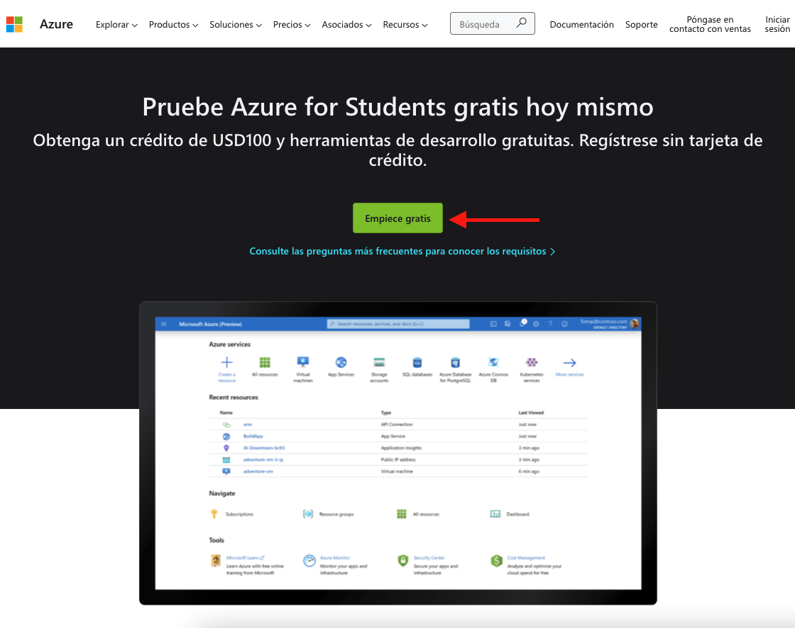

Al terminar todo el proceso de autenticación y verificación, se llega a la siguiente *landing page*:


Tras hacer click en la barra de navegación en "Microsoft Azure" llegamos a la consola principal:


Para comprobar que tenemos activa nuestra subscripción como estudiantes, solo tenemos que hacer click en el icono de **Subscriptions** que aparece bajo la sección **Navigate**, y veremos:

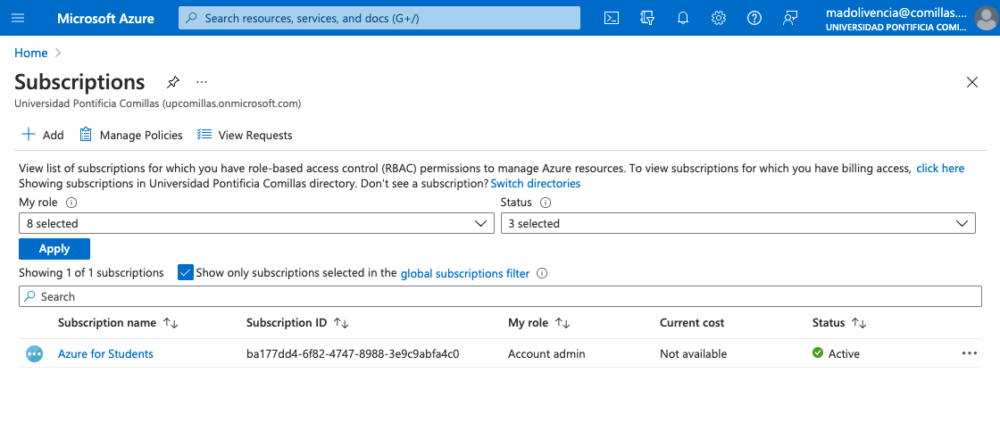

Si lo que queremos es directamente comprobar cuantos créditos nos quedan disponibles, podemos ir directamente al siguiente destino: https://www.microsoftazuresponsorships.com/Balance, lo que nos debería mostrar algo como lo siguiente:

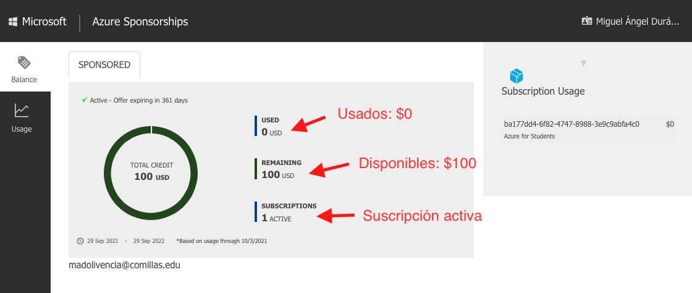

###### Activando GCP

Para la activación de la suscripción de estudiante (que viene con unos créditos gratuitos al igual que en el caso de Azure), necesitamos que el responsable del curso comparta con nosotros el "cupón" correspondiente. Por ejemplo:

* **Cupon**: https://gcp.secure.force.com/GCPEDU?cid=%2FrqcaEQRHLBXr%2Fr%2FtQZMwF5rCW1dCP547iCU%2B02F1BdDbU4XjBJ9rMKf%2BRR%2Fq95M/

Cuando hagamos click en susodicho link, nos llevará a una pantalla de autenticación y login:

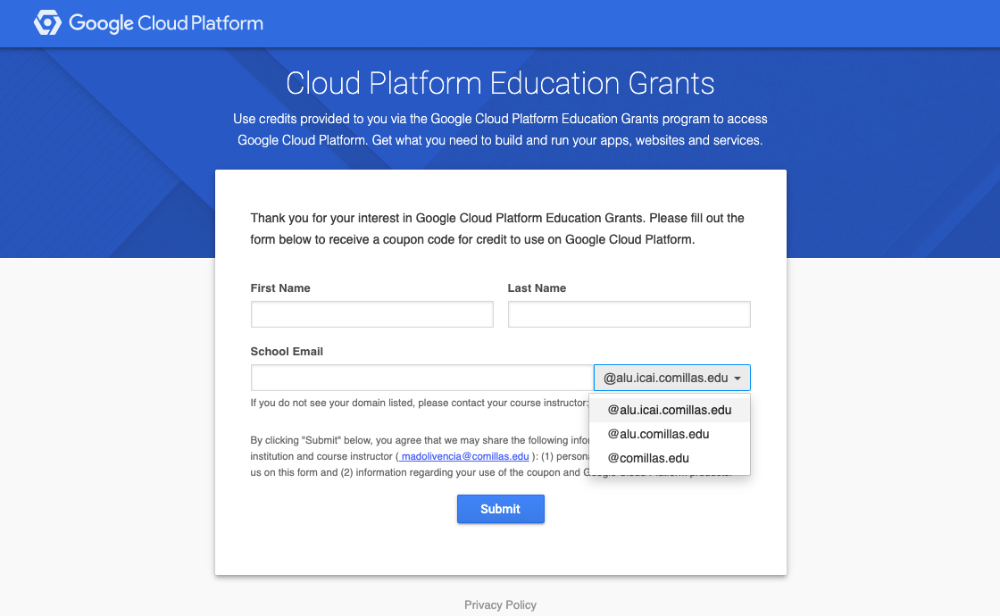

Aquí tendremos que seleccionar el dominio correcto de nuestro email (como se ve en el desplegable de la imagen) y rellenar los datos correspondientes al Nombre, Apellidos y la dirección de correos.

Una vez terminado el proceso de autenticación, deberíamos llegar a una *landing page* como la siguiente:

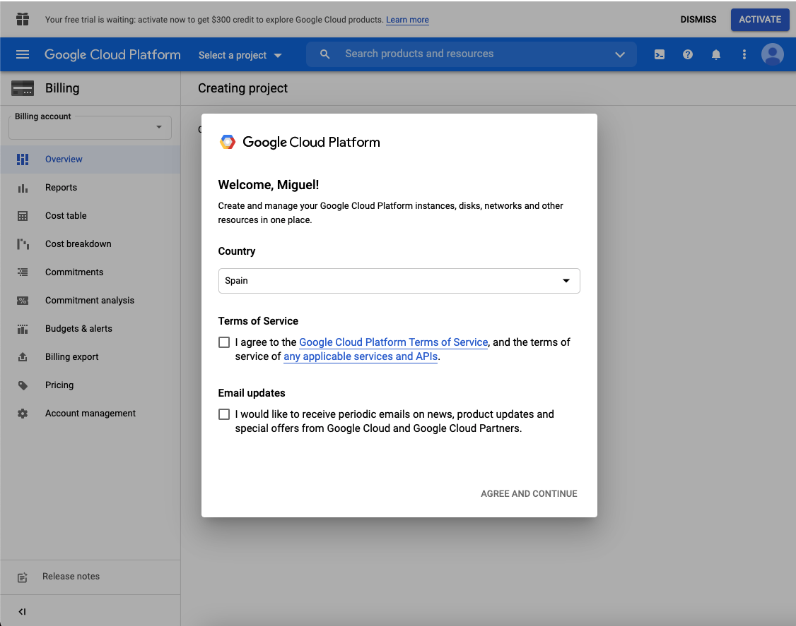

Aquí tendremos que marcar la opción de **Acuerdo con los términos de servicios CGP**, no tenemos porqué marcar la casilla de **Email Updates** (de hecho se recomienda no hacerlo para evitar emails comerciales en vuestra bandeja de entrada).

Una vez se confirma el acuerdo, llevará unos segundos, en los cuales GCP está creando un proyecto en blanco para nuestro uso, y finalmente llegaremos a la consola:


Para saber que nuestra cuenta está activada y tenemos correctamente configurada la cuenta de prueba, podemos acceder al siguiente link: https://console.cloud.google.com/billing:

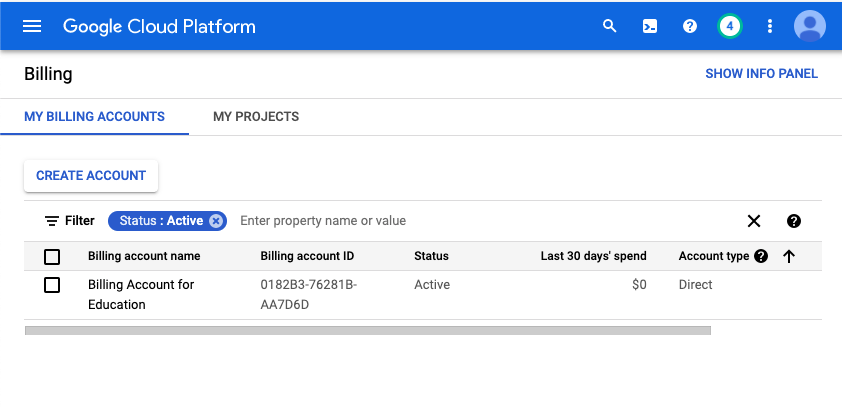

##### 3.4.1 Herramientas de gestión y monitorización

Una vez tenemos una cuenta activa (y asociada a una "cuenta de facturación", en nuestro caso ficticia y garantizada por el proveedor para hacer pruebas), podemos acceder al portal web y comenzar a consumir en modo autónomo los servicios clouds ofertados, bien sean IaaS, PaaS o SaaS, por ejemplo:

* Maquinas Virtuales
* Redes Virtuales
* Servicios de almacenamiento
* Bases de datos autoescalables
* Servicios de Analítica
* Infraestructura BigData, 
* Etc.

Para comenzar a entender las posibilidades que se nos ofrecen, no hay nada mejor que comenzar con un ejemplo. En particular vamos a comenzar con la creación de VMs tanto en Azure como en GCP, aunque posteriormente nos centraremos en el uso de GCP. 

En la siguiente captura vemos un ejemplo de como listar todos los servicios consumibles en Azure: [link](https://portal.azure.com/?Microsoft_Azure_Education_correlationId=66ff2a978b314dfe8df59b8a131f2a5b#allservices)

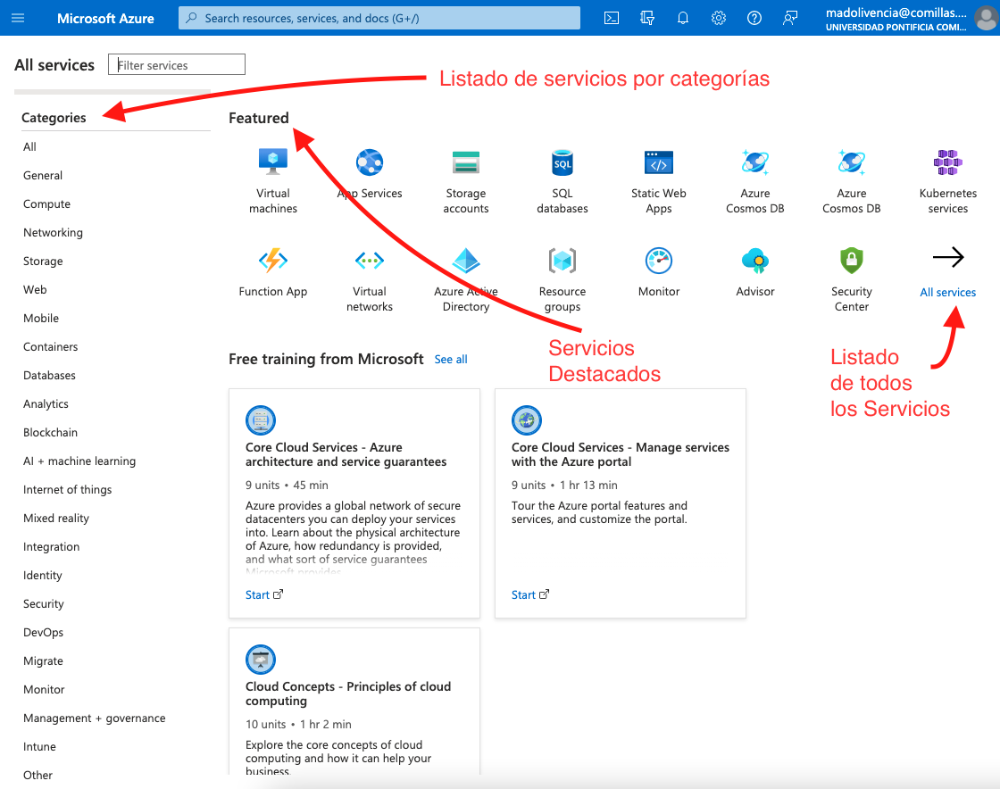

En el caso de GCP:

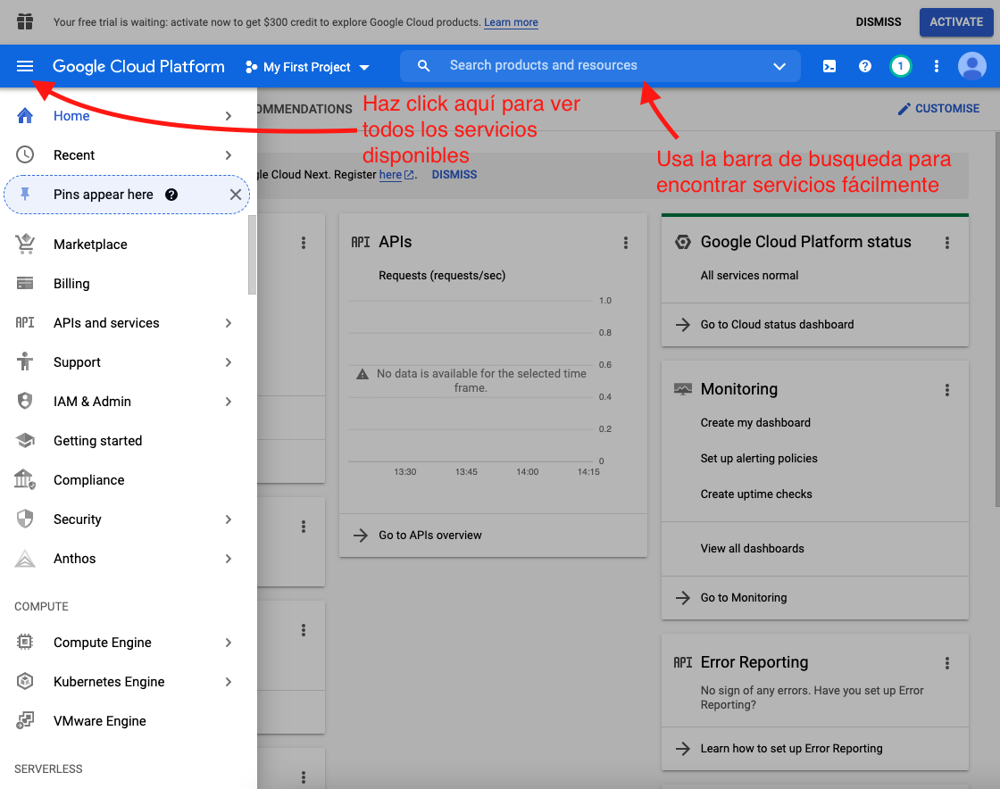


###### Máquinas Virtuales

**Azure**

En este primer ejemplo vamos a proceder a la creación de VMs mediante Azure Web Portal. Para ello seguiremos los siguientes pasos:

1. Acceded al portal web: [https://portal.azure.com](https://portal.azure.com/)

2. En el portal verás el icono de VM (o puedes directamente buscar en la barra de búsqueda "virtual machines")

3. Una vez hayas hecho click en el icono de VMs, acabarás accediendo al portal de gestión de máquinas virtuales, donde verás:

   

4. Tras pulsar en el botón de crear y seleccionar la creación de una nueva máquina aparecerá:

   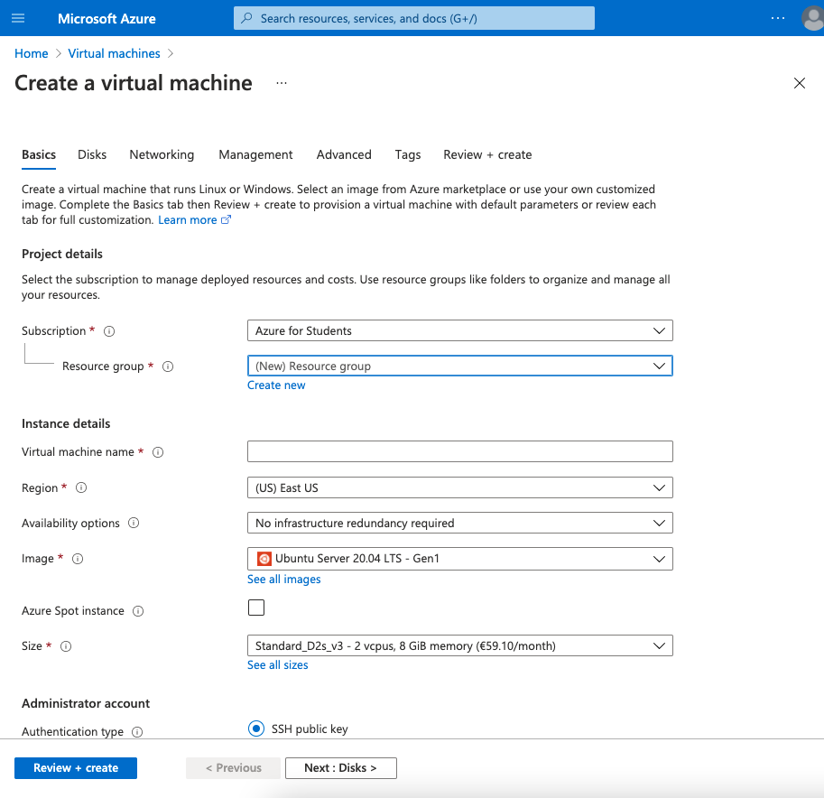

5. Aquí vamos a asegurarnos de detallar toda la configuración de la máquina virtual que queremos crear. En particular:

   * En la sección **Instance Details**:

     

   * En la sección **Administrator Account** introduciremos un nombre de usuario, e.g. ***azureuser***, y un password que recordemos:

     

   * En la sección **Inbound port rules**:

     

     Donde hemos abierto tanto los puertos 80 (HTTP) como 3389 (RDP).

   * Dejamos el resto de la configuración por defecto y hacemos click en el botón **Review + Create** abajo del todo:

     

   * Cuando acabe el proceso, podremos acceder a la VM pulsando en la opción **Go to resource**

     

7. Para conectarse a la VM vamos a proceder mediante RDP (Remote Desktop Protocol). Para ello usaremos Remote Desktop client:

   1. [MacOS](https://apps.apple.com/app/microsoft-remote-desktop/id1295203466?mt=12)
   2. [Windows](https://docs.microsoft.com/en-us/windows-server/remote/remote-desktop-services/clients/windowsdesktop#install-the-client)

   Una vez instalado, podemos copiar al IP pública de la VM (en nuestro caso **20.102.51.69**):

   

   E introducirla en el RD Client:

   

   

   Esto nos llevará finalmente a la autenticación en la máquina con el usuario y contraseñas que hemos especificado en el momento de su creación. Una vez realizada con éxito la conexión deberíamos ver el escritorio de Windows como si estuviéramos en el ordenador en sí mismo.

8. Para ver la VM en acción, vamos a instalar un web server. Para ello, podemos abrir el la consola **PowerShell** y escribir el siguiente comando:

   ```powershell
   > Install-WindowsFeature -name Web-Server -IncludeManagementTools
   ```

   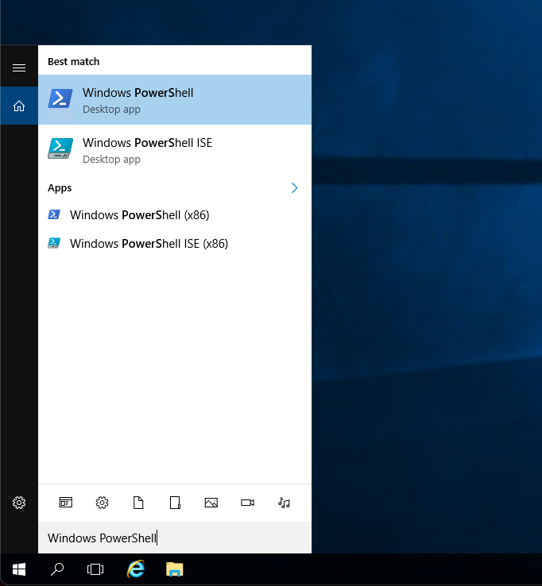

   

   Y posteriormente podremos cerrar la conexión RDP a la VM.

9. Ahora podemos ir a nuestro explorador web local, y pegar la IP de la VM que hemos usado anteriormente, y veremos algo similar a lo siguiente:

   

Para terminar el ejemplo, borraremos el **Resource Group** que se ha creado durante el ejercicio, lo cual borrará la máquina virtual etc, lo que se hará siguiendo los pasos:

* Buscamos el portal de grupos de recursos:

  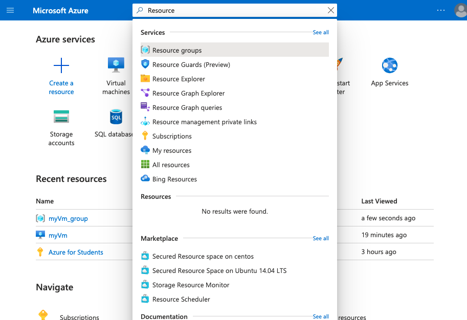

* Seleccionamos el grupo creado:

  

* Seleccionamos el borrado del grupo de recursos:

  

**Google**

Vamos a proceder a repetir el ejemplo anterior pero con la consola (portal web) de GCP. Así:

1. Accedemos al portal GCP: [https://console.cloud.google.com](https://console.cloud.google.com/)

2. Una vez accedemos, podemos buscar en la barra de búsqueda "Virtual Machines":

   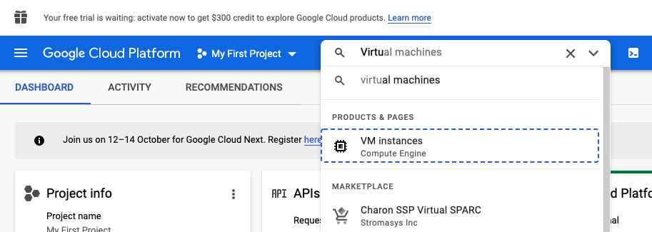

3. Una vez entramos en el portal de gestión de VMs, podemos hacer click rápidamente en el icono **Create Instance**

   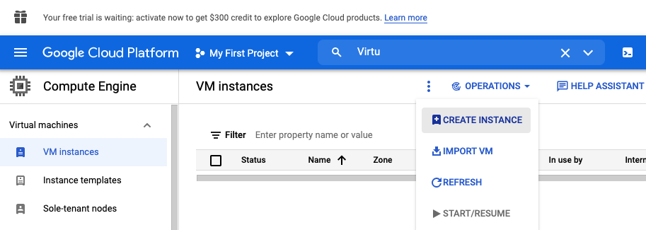

4. Ahora tenemos que proceder con la configuración. Solo cambiaremos lo indicado a continuación:

   * Nombre de la máquina:

     

   * Seleccionamos el tipo de máquina por defecto:

     

   * A continuación cambiaremos el disco de arranque, de un Linux a Windows Server:

     

     Pulsamos en cambiar y seleccionamos:

     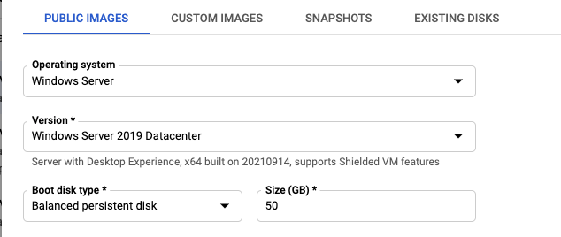

5. Dejamos el resto de parámetros como vienen por defecto, y creamos la VM, lo cual terminará apareciendo en la consola de la siguiente forma:

   

   Tras pulsar en RDP obtendremos el siguiente mensaje:

   

6. Para poder conectarnos via RDP necesitamos configurar un usuario y password. Para ello, tenemos que hacer click sobre la instancia creada (example-instance), y accederemos a su configuración:

   

   Tras pulsar el botón para generar un password, tendremos que confirmar el nombre de usuario, y esto finalmente nos devolverá un password seguro:

   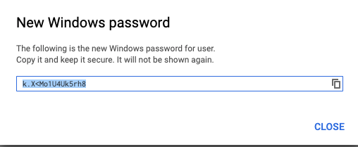

   El cual debemos guardar, junto con la IP de la VM para acceder a ella desde RD Client.

7. Abrimos al igual que en el caso de Azure Remote Desktop Client, y procedemos a la configuración, introduciendo la IP pública de la VM, el usuario y password.

8. Podemos repetir el paso 8 del despliegue en Azure, ya que la instalación del web server en Windows es independiente, y finalmente comprobar vía Browser que nuestra máquina tiene el servidor Web activo.

9. Por último, procedemos al borrado de la instancia:

   

A partir de este ejemplo nos centraremos en el uso de la plataforma GCP.

###### Monitorización de servicios

La monitorización no solo de la infraestructura, sino también de todos los demás servicios ofertados por el proveedor, tiene que ser algo transparente para el usuario Cloud. En el caso de Google, esto se consigue con una centralización de la monitorización mediante el servicio **Monitoring**:  https://console.cloud.google.com/monitoring


Una de las ventajas de este sistema de seguimiento es la sencillez con la que podemos ver en tiempo real el estado de todos los servicios contratados hasta el momento, tanto su uptime, como su tráfico, logs y errores:


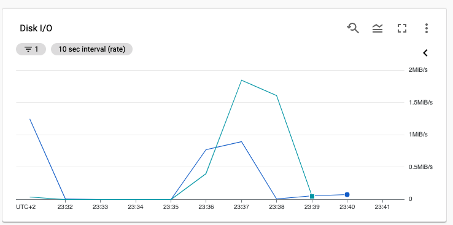

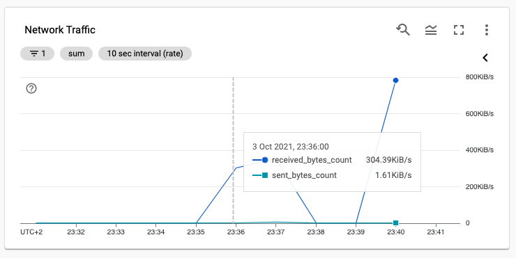

###### Facturación

En cuanto al seguimiento de costes, Google centraliza este servicio en: https://console.cloud.google.com/billing/

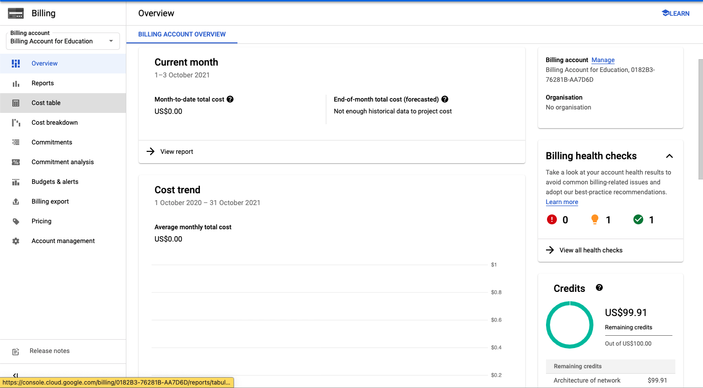

No solo nos permite el seguimiento diario, además de tener un pronóstico diario, del gasto acumulado en el tiempo, sino que también nos permite genera reports automatizados con el objetivo de automatizar tareas dentro de la empresa, como puede ser la consolidación e informe de gastos de manera automática al correspondiente departamento de Finanzas.

###### Almacenamiento

El almacenamiento juega un papel clave en el mundo Cloud, y por ello vamos a emplear tiempo práctico en la gestión de **Buckets**, así como de bases de datos **CloudSQL**, y de tablas masivas de datos en **BigQuery**.

* Storage: https://console.cloud.google.com/storage/

  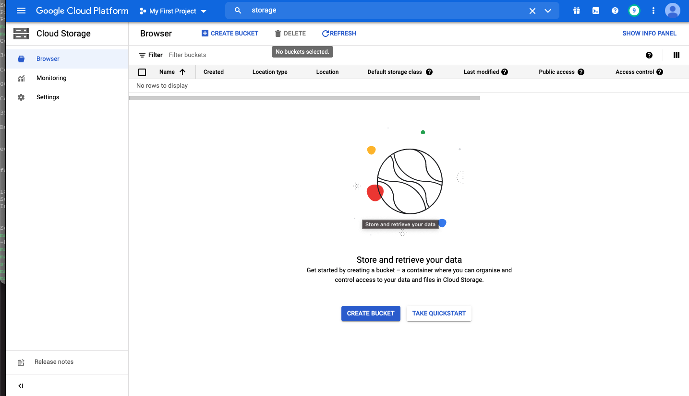

* CloudSQL: https://console.cloud.google.com/sql/

  

* BigQuery: https://console.cloud.google.com/bigquery/

  

Entre muchas otras opciones ofertadas.

###### Networking

La creación de un correcto ecosistema de redes y subredes será crucial a la hora de escalar nuestra infraestructura cloud, al igual que ocurre en la realidad física. La gestión gráfica de las redes virtuales se encuentra en **VPC Network**: https://console.cloud.google.com/networking/

En esta consola podemos gestionar las redes existentes (por defecto siempre tendremos una red **default** que es la que se utilizará en todos nuestros servicios, a no ser que se indique lo contrario), crearlas y destruirlas, así como configurar reglas de cortafuegos, reservar IP públicas, configurar enrutamientos, crear routers virtuales, etc.


###### Integración continua

La monitorización y gestión de la integración continua y los despliegues en la plataforma es algo que no puede faltar en ningún proveedor de Cloud. En el caso de GCP este servicio se centraliza a través de **Google Cloud Build**: https://console.cloud.google.com/cloud-build/

Este gestor de CI/CD cloud nos servirá para orquestar nuestros despliegues en la nube, el cual se conectará al servicio de gestión de repositorios de código **Source Repositories**: https://source.cloud.google.com/onboarding

###### Web Apps y Serverless Functions

Uno de los servicios más consumidos en las Cloud públicas y privadas son las plataformas auto-gestionadas para el despliegue de WebApps y microservicios. Y en particular, cada vez más se apuesta por las llamadas **Serverless Functions**, o Function as a Service, que permiten flexibilizar aún más si cabe la infraestructura, dado que solo existen efímeramente mientras ejecutan su función, y posteriormente son desechadas.

En el contexto de GCP, tenemos los siguientes servicios (y sus herramientas de gestión):

* Cloud Functions: https://console.cloud.google.com/functions/
* Cloud Run: https://console.cloud.google.com/run
* App Engine: https://console.cloud.google.com/appengine

Estos servicios serán estudiados exhaustivamente con ejemplos prácticos en lo que sigue, debido su importancia actual y lo central de su papel hacia la creación y gestión de arquitecturas flexibles.

###### IAM, Roles y Service Accounts

La seguridad es un pilar central en toda Nube, y la gestión de ella, así como de la jerarquía de roles de los diferentes servicios y usuarios de la nube es central en la administración de una plataforma cloud. En el contexto de GCP, esta gestión se hace desde **IAM Admin**: https://console.cloud.google.com/iam-admin/iam

Cualquier identidad que realice una solicitud a cualquier recurso Cloud debe tener los permisos necesarios para utilizar ese recurso. Para conceder susodichos permisos, primero se tiene que otorgar un **rol** específico al usuario, grupo o cuenta de servicio. ¿Y qué es un rol?

Existen tres tipos de roles en GCP:

- **Básico**, que puede ser Owner, Editor y Viewer (i.e., Admin, Editor y Visitante)
- **Predefinido**, los cuales dan un permiso más granular para garantizar acceso solo a un tipo específico de servicio, y son creados y gestionados por Google Cloud.
- **Personalizados**, que se pueden diseñar por el administrador de la Cloud para agregar ciertos permisos que sean de uso común y no estén agregados conjuntamente en ningún tipo predefinido

En este [link](https://cloud.google.com/iam/docs/understanding-roles) se pueden consultar los diferentes tipos de permisos que contienen los distintos tipos de roles definidos por Google (básicos y predefinidos)

### 3.5 Diseño y despliegue de aplicaciones nativas Cloud

Ahora que tenemos un buen conocimiento de lo que nos oferta una nube (bien sea pública o privada), vamos a proceder con un salto gradual desde el desarrollo local (típicamente monolítico) hasta el desarrollo nativo en nube (*cloud native*) en el que se aprovecharán todo el potencial ofertado por el *cloud computing*.

#### Aplicaciones nativas Cloud (Cloud native applications): Introducción

El concepto del desarrollo de **aplicaciones nativas cloud** hace referencia a un paradigma de desarrollo de software que utiliza el entorno cloud para crear y desplegar aplicaciones en infraestructuras dinámicas y flexibles, como es el caso de la nube. 

Este paradigma de desarrollo suele ir acompañado del uso de las siguientes tecnologías:

* Plataformas cloud
* Metodologías ágiles ([Agile software development](https://en.wikipedia.org/wiki/Agile_software_development))
* Contenerización y [microservicios](https://en.wikipedia.org/wiki/Microservices)
* Orquestación de contenedores ([Docker Compose](https://docs.docker.com/compose/) y [Kubernetes](https://en.wikipedia.org/wiki/Kubernetes) [k8s])
* Funciones (FaaS) y plataformas *serverless* ([Serverless computing](https://en.wikipedia.org/wiki/Serverless_computing))
* Integración continua y Entrega continua ([Continuos Integration and Continuos Delivery](https://en.wikipedia.org/wiki/CI/CD) [CI/CD])


#### Contenerización y microservicios

Uno de las características fundamentales que diferencia una aplicación nativa cloud de una aplicación tradicional es precisamente la contenerización y su infraestructura de microservicios.

De la contenerización ya hemos hablado extendidamente en el capítulo anterior cuando tratamos la virtualización de sistemas operativos, tanto de ventajas como desventajas. Sin embargo, es bueno que subrayemos la importancia de dicha tecnología en lo que a la **reproducibilidad** se refiere. El contenerizar una aplicación con todas las dependencias requeridas ha revolucionado por completo el paradigma del desarrollo en servidores. Previamente a la contenerización, la estabilización de entornos de desarrollo podía llegar a ser algo bastante tedioso, incluso convertirse en un problema a la hora del poder desarrollar, llegando en los casos más extremos a  convertirse en un factor de entorpecimiento a la hora de llevar a producción nuevos desarrollos, por no ser compatibles estos con las dependencias instaladas en el entorno productivo, sobre todo en proyectos de larga envergadura. La contenerización ataca una de las caras de este problema y es el aislamiento de dependencias de una aplicación, lo cual hace posible que su desarrollo sea completamente reproducible en cualquier entorno de trabajo, bien sea testing, desarrollo o productivo.

La arquitectura basada en microservicios constituye otro cambio de paradigma en el desarrollo de software, y consiste en construir una aplicación como un conjunto de pequeños [servicios](https://es.wikipedia.org/wiki/Servicio_(arquitectura_de_sistemas)), los cuales se ejecutan en su propio [proceso](https://es.wikipedia.org/wiki/Proceso_(informática)) y se comunican con mecanismos ligeros (normalmente una [API](https://es.wikipedia.org/wiki/Interfaz_de_programación_de_aplicaciones) de [recursos HTTP](https://es.wikipedia.org/wiki/Hypertext_Transfer_Protocol)). Cada "micro"-servicio se encarga de implementar una funcionalidad completa de negocio, de manera independiente y completamente autónoma. Así, cada micro-servicio puede ser desplegado de forma independiente y puede estar programado en distintos lenguajes y usar diferentes tecnologías de almacenamiento de datos. Esta filosofía de desarrollo evidentemente rompe con la filosofía tradicional monolítica, orientada a poyectos, que no a funcionalidades. La filosofía monolítica conlleva una serie de restricciones bastante importantes a la hora del desarrollo, como es por ejemplo el hecho de forzar un único lenguaje de programación o compatibilidad de librerías para todo un proyecto, lo cuál se convierte en algo más y más complicado a medida que un proyecto crece en complejidad (lo cuál es natural en la vida real). Por contra, los microservicios proponen como solución que cada funcionalidad de un proyecto ha de ser identificada y aislada como un proceso/servicio independiente, atendiendo al principio de única responsabilidad (*single-responsibility principle*). Esto ayuda de antemano a desacoplar las diferentes unidades de un proyecto, lo que a su vez es más beneficioso a la hora de renovar, refactorizar o reinventar partes del mismo, sin tener que atender a más preocupación que la interfaz programática de comunicación (API).

|                           Ventajas                           |                    Inconvenientes                     |
| :----------------------------------------------------------: | :---------------------------------------------------: |
| Incrementa la eficiencia: divide la funcionalidad, mejora la escalabilidad |                    Latencia de red                    |
|                 Facilita las actualizaciones                 |                Complejidad del diseño                 |
|                    Mejora la estabilidad                     | ¿Qué es un microservicio? Tamaño, funcionalidad, etc. |
|               Desacoplado de recursos físicos                |             Estandarización de interfaces             |
|                  Multi-idioma/plataforma/…                   |                                                       |
|             Fácil de construir/probar/desplegar              |                                                       |

 A continuación se muestra una figura en la que se comparan de manera esquemática las arquitecturas tradicionales *versus* las arquitecturas orientadas a microservicios.


#### Orquestación de contenedores: Kubernetes

Si prestamos suficiente atención a nuestro QuickLab (QL) I veremos que lo que realmente hemos hecho es preparar dos microservicios (cada uno con una responsabilidad única y bien definida, ver [*Single Responsibility Principle*](https://en.wikipedia.org/wiki/Single-responsibility_principle)) que posteriormente hemos desplegado en GCP. Cuando llegamos a este punto en el capítulo de virtualización vimos que ***en local*** podíamos "orquestar" (gestionar de manera conjunta y organizada un conjunto de) contenedores mediante el uso de [Docker Compose](https://docs.docker.com/compose/). Para ello se usaba **docker compose engine**, un comando de terminal que en última instancia dependía de un fichero (manifiesto) de configuración que se solía llamar `docker-compose.yaml` donde especificábamos los contenedores a crear/lanzar, sus configuraciones de red/puertos, además de su volúmenes etc. Un ejemplo sencillo era:

```yaml
version: "3.9"
services:
  web:
    build: .
    ports:
      - "5000:5000"
  redis:
    image: "redis:alpine"	
```

Que posteriormente usábamos mediante:

```shell
$ docker-compose up
```

lo cual ponía en marcha una API (que se especificaba en el Dockerfile que construíamos como `web`) que permitía insertar registros en una base de datos [`redis`](https://redis.io/), y que posteriormente podíamos parar con una simple línea de comandos:

```bash
$ docker-compose stop
```

Inmediatamente vimos la conveniencia y eficiencia que `docker-compose` traía a nuestro ecosistema de desarrollo. Pero, también vimos una *pequeña* inconveniencia, que de hecho no es tan pequeña en el caso que nuestro objetivos se el disponer de una arquitectura flexible, dinámica y fácilmente gestionable. Con `docker-compose`  gestionamos contenedores, pero todos los servicios conviven en el mismo host. La pregunta natural entonces es, ¿Cómo podríamos hacer que cada contenedor sea desplegado en un host distinto y de forma que pueda ser autoescalado independiente? 

Para este problema de orquestación de contenedores y arquitectura asociada existen principalmente dos soluciones: `docker swarm` y `kubernetes engine`. Aunque ambos dos proponen una solución a un mismo problema, existen pequeñas diferencias que hacen que Kubernetes haya sido el más usado en la industria. Muy resumidamente:

- [Docker swarm](https://docs.docker.com/engine/swarm/): es una herramienta de orquestación de contenedores, la cual nos permite llegar a la solución deseada de lanzar imágenes en diferentes máquinas (hosts) 
- [Kubernetes](https://kubernetes.io/): es una herramienta de orquestación de contenedores, que como en el caso de docker swarm nos permite el lanzamiento de imágenes en diferentes hosts, pero su *focus* principal ha sido la automatización y habilidad de adaptarse a escenarios de alta demanda 

Así pues, se puede decir que la mayor diferencia entre Docker swarm y Kubernetes es la facilidad de uso. Nada ilustra mejor esto que un ejemplo sobre cómo cada uno maneja las redes. Cuando se crea un clúster de contenedores con Docker swarm, esos contenedores generalmente están disponibles en nuestra red porque ha dirigido un puerto externo a un puerto interno desde el comando `docker`. En otras palabras, no tenemos que configurar una capa de red separada dentro de los archivos YAML. Sin embargo, con Kubernetes, debemos configurar una capa de red (utilizando declaraciones como `hostNetwork: true` dentro del manifiesto correspondiente). Si no agregamos esta capa de red accesible a la `LAN` dentro de los archivos YAML, no podremos acceder a los contenedores desde cualquier lugar que no sea el clúster de Kubernetes. A pesar que puede parecer que esto añade trabajo a la persona encargada, la realidad es que esto también trae con ello un incremento grandísimo de la reproducibilidad del comportamiento, lo que nos puede salvar bastantes horas de debugging.

Así pues, Docker Swarm es mucho más sencillo en términos de uso y exploración, pero Kubernetes es mucho más escalable. Entonces, ¿cuando deberíamos usar uno u otro?

* **Docker Swarm**: Cuando queremos implementar un cluster de contenedores (en varios hosts) para una aplicación simple y escalable
* **Kubernetes**: Cuando queremos administrar una aplicación de microservicios contenerizados, escalables y automatizados.

Es por esto mismo por lo que los principales proveedores de cloud ofertan directamente Kubernetes. En el caso de Google, Kubernetes se oferta parte de los servicios que podemos usar en la modalidad "pay as you go" y se denomina [**Google Kubernetes Engine**](https://cloud.google.com/kubernetes-engine/docs/quickstart) (GKE).

K8s conlleva una curva de aprendizaje, no cabe ninguna duda. Y por ello, no pretendemos dar un (mini-)curso, sino algunos conceptos básicos y necesarios para introducir esta herramienta de increíble alcance de la que se podría dar un curso completo para su total entendimiento. Finalmente veremos, como viene siendo costumbre, un ejemplo práctico con nuestro QL III.

Conceptos necesarios para entender k8s:

* **Cluster**: Cuando "desplegamos" con k8s, lo que estamos creando/obteniendo es un cluster. Un cluster no es más que un conjunto de VMs (nodos) que ejecutan aplicaciones contenerizadas. Todo cluster tiene al menos un nodo.

* **Node**: Como hemos comentado, un nodo es una instancia de una VM donde se sirven los contenedores de nuestras aplicaciones
* **Pod**: Un pod es una abstracción de k8s que representa un conjunto de contenedores que son servidos en un nodo
* **Control plane**: Se refiere a la capa de orquestación que expone la API e interfaces para definir, desplegar, y gestionar el ciclo de vida de los contenedores. En un entorno productivo, el **control plane** suele estar corriendo en varios nodos, lo que garantiza el servicio en caso de fallos.

Como resumen visual:


Para un entendimiento más profundo de los componentes del **control plane**, ver la [documentación oficial](https://kubernetes.io/es/docs/concepts/overview/components/).

#### Kubernetes gestionado: Google App Engine (GAE)

Una vez hayamos experimentado un poco con K8s (e.g. haciendo los QLs III y IV) será cuestión de tiempo que lleguemos a la pregunta: ¿Cómo podría deshacerme de tanta gestión (programática) y centrarme en el desarrollo en el caso que mi objetivo central sea el producto? Si revisamos el material que hemos estudiado hasta ahora, la respuesta a tal pregunta tiene una realidad conocida como **PaaS**. En el contexto de GCP, el servicio que nos permite abstraernos de la gestión de la infraestructura y centrarnos en el desarrollo de Apps es conocido como [Google App Engine](https://cloud.google.com/appengine/docs/standard/python3/an-overview-of-app-engine) (GAE).

GAE nos brinda la oportunidad de las bondades de K8s, tales como el autoescalado, sin que tengamos que ser nosotros los que nos preocupemos por gestionar el cluster. Así, GAE se puede entender como un cluster de K8s gestionado automáticamente por Google. Es por ello por lo que todos nuestros esfuerzos se pueden centrar única y exclusivamente en el desarrollo del software (app), dejando la gestión del cluster a Google (sin más que especificar algunas propiedades del cluster para controlar costes, como pueden ser el máximo numero de instancias, etc.)

Podemos entender GAE como el servicio ideal donde desplegar nuestros micro-servicios, los cuales conjuntamente constituyen un ecosistema interconectado, sobre el que podremos ir construyendo capas superiores de abstracción con el fin de acabar con el desarrollo monolítico. 

Una vez tengamos una versión inicial de nuestro aplicativo (app), podremos servirlo inmediatamente en uno de los dos entornos proporcionados por GAE:

* **Standard**: En caso que nuestro aplicativo esté escrito en uno de los siguientes lenguajes y versiones:

  * Python 2.7, Python 3.7, Python 3.8, Python 3.9
  * Java 8, Java 11
  * Node.js 10, Node.js 12, Node.js 14, Node.js 16 (preview)
  * PHP 5.5, PHP 7.2, PHP 7.3, and PHP 7.4
  * Ruby 2.5, Ruby 2.6, and Ruby 2.7
  * Go 1.11, Go 1.12, Go 1.13, Go 1.14, Go 1.15, and Go 1.16 (preview)

  Podremos disfrutar de un entorno "standard", de manera que GAE se encargará de contenerizar nuestro código y desplegarlo en instancias a muy bajo coste. 

* **Flexible**: En el caso que nuestro aplicativo esté contenerizado, y queramos lanzarlo como contenedor porque depende de librerías no estándares, o está escrito en un lenguaje no listado, o tiene unas necesidades computacionales algo más exigentes que las ofertadas en el entorno standard. El entorno de despliegue flexible nos permite una mayor personalización en términos de recursos, lo cual puede ser muy conveniente.

Para un mayor entendimiento de la diferencia entre ambos modelos, podemos ver la [documentación oficial](https://cloud.google.com/appengine/docs/the-appengine-environments).

#### Aplicaciones Serverless: El espíritu cloud native

Finalmente, incluso deshaciéndonos de la responsabilidad de mantener el cluster de K8s mediante el uso de GAE, tenemos una limitación y es que seguimos teniendo que mantener un mínimo de 1 instancia (nodo) funcionando 24/7. Sin embargo, nuestro objetivo último siempre ha sido el llegar a una arquitectura que sea lo más dinámica posible, con la idea en mente de escalar hasta cero instancias si fuera posible, de manera que solo pagásemos realmente por aquello que usamos. Y este es precisamente el objetivo de las dos últimos servicios de hosting de aplicativos que vamos a ver, que son:

* Cloud Functions
* Cloud Run

Ambos dos se centran en el concepto de escalar a cero, es decir, de deshacernos del concepto de "servidor" (*serverless*) mediante la gestión activa y automática de infraestructura y plataforma de Google. Como veremos ambos están íntimamente relacionados entre sí, y su diferencia tiene que ver con los environments standard y flexible de GAE.

Este paradigma de desarrollo se conoce como **Funtions as a Service** (FaaS), dado que el objetivo principal es la programación de una funcionalidad (que en última instancia se entiende que se ejecutará en reacción a un evento dado). El esquema IaaS, PaaS y SaaS que vimos anteriormente queda ampliado del siguiente modo:


De modo que en una arquitectura FaaS (serverless) lo único de lo que tenemos que hacernos cargo es de la gestión de los datos procesados o generados por la "función".

Las ventajas principales son:

* No tendrás que aprovisionar, administrar ni actualizar servidores
* Escala automáticamente según la carga. Se paga por el tiempo de procesamiento de la función
* Funciones integradas de supervisión, registro y depuración 
* Seguridad integrada a nivel de funciones y por función que se basa en el principio de privilegio mínimo
* Capacidades de red clave para situaciones híbridas y de múltiples nubes

##### Functions as a Service (FaaS): Google Cloud Functions

Cloud functions nos brinda la oportunidad única de ir directamente de código a aplicativo serverless sin necesidad de contenerización.

**Serverless Apps**: **Google Cloud Run**

Cloud run se puede entender como el paso intermedio entre GCF y GAE, i.e., con GCR podremos montar un aplicativo serverless cuando nuestro aplicativo ya esté contenerizado.

#### Los 12 factores

“Twelve-factor app” es una metodología para el desarrollo de aplicaciones nativas en la nube cuyas características esenciales son: 

- Formatos declarativos para la automatización de la configuración
- Máxima portabilidad entre los diferentes entornos de ejecución
- Despliegue en la nube, por lo que se obviará la necesidad de servidores y administración de sistemas
- Minimizan las diferencias entre los entornos de desarrollo y producción
- Posibilidad de escalado

Los 12 factores son: 

1. **Codebase**: Un código base sobre el que hacer el control de versiones y múltiples despliegues. 
2. **Dependencies**: Declarar y aislar explícitamente las dependencias mediante un manifiesto. Nunca dependerá de las librerías ya instaladas en el sistema por defecto
3. **Config**: Guardar la configuración en el entorno que pueda variar entre despliegues (producción o desarrollo, por ejemplo)
4. **Backing services**: Tratar a los “backing services” como recursos conectables
5. **Build, release, run**: Separar completamente la etapa de construcción de la etapa de ejecución
6. **Processes**: Ejecutar la aplicación como uno o más procesos sin estado. Los procesos deben ser stateless y share-nothing. Cualquier información que necesite persistencia se debe almacenar en un backing service con estado (e.g., una base de datos). 
7. **Port binding**: En entornos locales un servicio como un servidor web inicia en un puerto para todas las apps. En 12-factor apps, una capa de enrutamiento se encargará de gestionar los puertos de cada servicio
8. **Concurrency**: Escalar mediante el modelo de procesos
9. **Disposability**: Hacer el sistema más robusto intentando conseguir inicios rápidos y finalizaciones seguras. Las 12- factor apps deberán ser plenamente desechables en cualquier momento. 
10. **Dev/prod parity**: Mantener desarrollo, preproducción y producción tan parecidos como sea posible 
11. **Logs**: Tratar los historiales como una transmisión de eventos. 
12. **Admin processes**: Ejecutar las tareas de gestión/administración como procesos que solo se ejecutan una vez. 

“[Twelvefactor](https://12factor.net/)” recomienda lenguajes que proporcionan una consola del tipo REPL, ya que facilitan las tareas relacionadas con la ejecución de scripts

#### QuickLabs

Para reforzar los conceptos que vamos introduciendo de manera teórica hemos diseñado varios ejemplos en los que iremos trabajando con la nube de Google (GCP). En este momento, tras haber introducido las ventajas e inconvenientes de la contenerización y los microservicios, es interesante que procedamos con los siguientes ejemplos:

##### 💻 QuickLab I: Creación y despliegue de contenedores en GCP

* Creación y despliegue de un microservicio con Flask que nos permite la inserción y borrado de registros mediante una API sencilla en una base de datos *in-memory* (redis). El objetivo de este ejemplo es el de mostrar la estructura típica de una aplicación con varios microservicios, y la gestión de su despliegue de manera programática (pero aún manual) en la nube mediate Google SDK. El código y sumario de este QuickLab pueden encontrarse en este [link]( https://github.com/migduroli/asr-cloud/tree/main/03-flask-redis).   

##### 💻 QuickLab II: SuperMario auto-escalable

* Creación y despliegue de una aplicación dada (como Docker Image) con autoescalado y balanceado de carga. El objetivo es ir un paso más allá del ejemplo anterior, y mostrar lo conveniente que es la contenerización de aplicaciones para su despliegue en una infraestructura autoescalable según la utilización del servicio. Para ello tendremos que crear un grupo de instancias gestionadas que se desplieguen con la imagen de la aplicación en el arranque, y que autoescalen a medida que sea necesario acorde a un umbral de utilización. Para servir la aplicación con una única IP a nuestros poténciales clientes, tendremos que crear un balanceado de carga (con *Cloud Load Balancer*) que hará la el enrutamiento correcto a la VM adecuada. El código y sumario de este QuickLab se puede encontrar en el siguiente: [link](https://github.com/migduroli/asr-cloud/tree/main/04-autoscaling-mario). 

##### 💻 QuickLab III: SuperMario con K8s

* El objetivo es ir un paso más allá del ejemplo anterior, y mostrar lo conveniente que es la utilización de GKE. Para ello tendremos que crear un cluster de K8s en GCP. El código y sumario de este QuickLab se puede encontrar en el siguiente: [link](https://github.com/migduroli/asr-cloud/tree/main/05-k8s-init). 

##### 💻 QuickLab IV: Soluciones y estrategias de autoescalado con K8s

* Este lab es uno de los más técnicos que vamos a tener, precisamente para entender la complejidad de K8s, además de la infinidad de configuraciones posibles existentes (a pesar de tan solo explorar una pequeñísima fracción del todo en este ejemplo). En particular, veremos la posibilidad de escalar horizontal y verticalmente a nivel POD, para posteriormente ver cómo este escalamiento horizontal y vertical se puede realizar a nivel cluster. Este nivel de control de un cluster es necesario cuando trabajemos con proyectos productivos, en los que queremos una máxima estabilidad y resiliencia del servicio, pero al menor coste posible (es decir, con la menor cantidad de infraestructura), y a su vez que la infraestructura se adapte automáticamente a los picos de demanda tan característicos del entorno digital de hoy en día. Como se puede desprender del enunciado del objetivo del lab, el problema es algo bastante complicado. El hecho que GKE nos permita esta gestión de manera automática y nos provea con soluciones para gestionar este automatismo es lo que hace que GKE sea el número uno en la gestión de contenedores en entornos cloud. Sin embargo, también vamos a ver con ello el intenso trabajo que esta configuración, mantenimiento y monitorización requiere. Es por ello por lo que el siguiente paso natural es intentar evitar susodicha gestión a menos que sea absolutamente necesaria. Pensando en ello, todos los proveedores cloud a día de hoy proporcionan soluciones de K8s gestionados. En el caso de Google se tratará de Google App Engine (con el que trabajaremos en el siguiente QL). El código y sumario de este QuickLab se puede encontrar en el siguiente: [link](https://github.com/migduroli/asr-cloud/tree/main/06-k8s-scaling). 

💻 **QuickLab V: App Engine**

* En este lab el objetivo es demostrar la sencillez del despliegue y mantenimiento de una App que se despliega en [Google App Engine](https://cloud.google.com/appengine/docs) (GAE). Para ello, vamos a desplegar un Super Mario auto-escalable, con un simple comando, y sin necesidad de tener que gestionar nosotros el tipo de escalado. GAE nos ofrece automáticamente la posibilidad de un auto-escalado (horizontal) automático, además de una gestión del balanceamiento de carga automático. El código y sumario de este QuickLab se puede encontrar en el siguiente: [link](https://github.com/migduroli/asr-cloud/tree/main/07-gae-example).

💻 **QuickLab VI: Cloud Functions**

* El objetivo de este lab es la demostración de como podemos desplegar de manera sencilla una función en Google Cloud Function. Para este propósito hemos creado una función en Python cuyo "trigger" es una llamada HTTP. El código y sumario de este QuickLab se puede encontrar en el siguiente: [link](https://github.com/migduroli/asr-cloud/tree/main/08-cloud-functions).

💻 **QuickLab VI: Cloud Run**

* Tal y como hemos comentado en clase, existe una segunda opción para desplegar apps serverless, que tiene la conveniencia de aceptar **Docker Images** en lugar de **Functions**. Esta opción en GCP se llama Google Cloud Run. En este lab ponemos de manifiesto la sencillez y conveniencia del uso de GCR (documentación oficial [aquí](https://cloud.google.com/run)). El código y sumario de este QuickLab se puede encontrar en el siguiente: [link](https://github.com/migduroli/asr-cloud/tree/main/09-cloudrun). En este lab se muestran también opciones de gestión programática y de CICD.

### 3.6 Gestión programática del Cloud

Hasta ahora hemos estado trabajando con las herramientas de gestión nativas de la nube de Google Cloud. Para ello, como ha sido costumbre en todos y cada uno de los QLs, hemos usado `gcloud` para la creación y destrucción de recursos, desde `buckets` en Google Cloud Storage, hasta `compute instances`, `firewall rules` o incluso `datasets` y `tables` en Google **BigQuery**. Y esto son muy buenas noticias, porque casi sin darnos cuenta, ya hemos estado haciendo una gestión programática de la nube!

No obstante, a pesar de lo útil que nos ha sido hasta ahora, las soluciones que hemos creado hasta ahora con la conveniencia del uso inmediato de Google SDK no son escalables, dado que han estado muy ligadas a nuestros casos de estudio particulares. Además, cada uno de susodichos scripts viven por separado y no hay (como admin) una forma sencilla de tener una visión general de todos los despliegues existentes siguiendo este método. Por ejemplo, ¿qué ocurriría si en lugar de tener un despliegue diario a GKE tuviéramos cientos o incluso miles de ellos, como puede ser el caso de una compañía tecnológica?. En tal caso, tendríamos que gestionar con scripts manuales cientos de procesos de despliegue en diferentes entornos de desarrollo, y esto evidentemente sería seguramente imposible. No obstante, existen herramientas que nos harán mucho más sencilla la gestión de nuestra infraestructura de una forma programática cumpliendo los 12 factores, y por tanto convirtiendo nuestra infraestructura en código "cloud native". En el mundo GCP tenemos dos opciones:

* Google Cloud [Deployment Manager](https://cloud.google.com/deployment-manager): Es la solución propuesta por Google para la gestión de infraestructura con código, automatizando la creación y la gestión de los recursos cloud. Dicha gestión 
* [Terraform](https://www.terraform.io/): Es una herramienta *open source* para la gestión de infraestructura con código que nos proporciona una línea de comandos independiente del proveedor de nube. 

Aunque vamos a ver un ejemplo de cada uno de estas posibilidades, es cierto que para evitar la dependencia exclusiva del proveedor de Google, muchas empresas han optado por gestionar sus nubes con Terraform, por su independencia y por la posibilidad de abstraernos del proveedor, con las ventajas que ello conlleva en el futuro si tuviéramos que migrar de una nube a otra por ejemplo.

##### Deployment manager

Antes de proceder a un ejemplo, tenemos que asegurarnos que tenemos activada las siguientes APIs en nuestro proyecto:

* Compute Engine API
* Cloud Deploy API

El primer paso para tener un *pipeline* de despliegue y gestión de infraestructura con Cloud Deploy es codificar nuestro manifiesto de configuración, que será tipo YAML. En este archivo de configuración es donde especificaremos todas las variables de configuración de los diferentes recursos de infraestructura que queremos crear. Esto será siempre especificado en una sección del fichero YAML  que se denominará `resources`. Colgando de dicha sección, tendremos tantas sub-secciones como recursos queramos reservar, listados con un guión, y siempre comenzando con su nombre, campo `name`. Un ejemplo básico de un prototipo de YAML sería:

```yaml
resources:
- name: the-first-vm
  type: compute.v1.instance
  properties:
  	...
- name: the-second-vm
  type: compute.v1.instance
  properties:
		...
```

Donde, por ejemplo, estaríamos indicando la creación de dos VMs, cuyas propiedades específicas hemos dejado para el QL correspondiente.

Ahora que ya tenemos una configuración de despliegue, ya podemos crear el susodicho despliegue. Para ello vamos a usar:

```shell
$ gcloud deployment-manager deployments create DEPLOYMENT_NAME \
		--config CONFIGURATION_FILE_NAME.yaml
```

Lo que creará un *deployment* con nombre `DEPLOYMENT_NAME` a partir del fichero `CONFIGURATION_FILE.yaml`.

Aunque a primera vista puede parecer que lo realizado es idéntico a lo ya estudiado y hecho con el uso directo de `gcloud` para cada uno de los recursos, Cloud Deploy permite la creación de templates de despliegues re-utilizables para otros despliegues, eliminando por tanto la especificidad de los scripts ad-hoc. Además, Cloud Deploy es auditable, además de brindarnos la comodidad de tener un portal de monitorización de despliegues. Por ejemplo, tras el despliegue del manifiesto con dos VMs, tendremos en nuestro portal web algo como la siguiente imagen:

 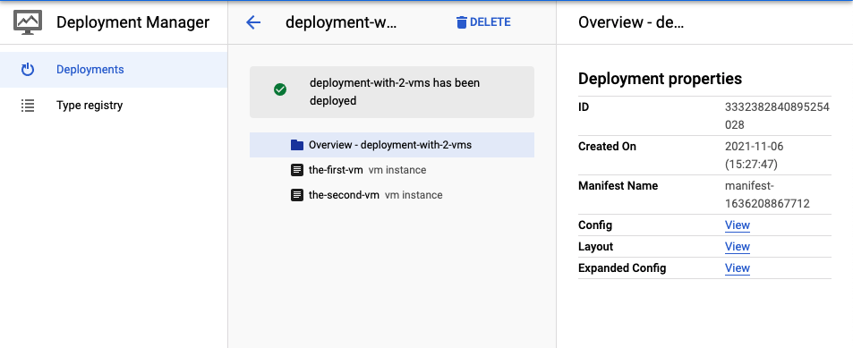

Para un conocimiento más profundo de las múltiples opciones de Deployment Manager, podemos acudir a la documentación oficial aquí.

##### Terraform

Como hemos comentado, Terraform es una herramienta alternativa que ha ganado mucha tracción en los últimos años en el ámbito de la gestión de infraestructura como código versionado. Una ventaja indiscutible de Terraform es que nos brinda la posibilidad de tratar con un lenguaje unificado las diferentes infraestructuras que podemos tener en distintas nubes públicas (y privadas), e.g. en Google Cloud, Microsoft Azure y AWS.

Al igual que en el caso de Deployment Manager, todo lo que necesitamos para la gestión de infraestructura con Terraform es la codificación de la misma en un manifiesto de configuración. Dicho fichero de configuración describirá los diferentes componentes que necesitamos asociar a una aplicación. Además, Terraform no solo es capaz de trabajar con componentes de bajo nivel como pueden ser instancias de VMs, almacenamiento of redes, sino que también trabaja con el despliegue y gestión de componentes de más alto nivel como DNS y servicios SaaS ofertados por los proveedores (una ventaja en comparación con Deployment Manager).

Las principales características de Terraform son las siguientes:

###### Infraestructura como código (IaaS)

Como ya hemos comentado, la infraestructura se describe como código usando una sintaxis de muy alto nivel. Esto permite el versionado de toda la infraestructura de nuestro proyecto, al igual que haríamos con cualquier aplicativo. 

###### Planes de ejecución

Terraform tiene una etapa de planificación en la cual se genera un plan de ejecución. Este plan nos mostrará los diferentes pasos que Terraform seguirá cuando finalmente apliquemos (`apply`) nuestro manifiesto de configuración. Esta característica es muy importante a la hora de evitar sorpresas antes de la ejecución.

###### Grafos de recursos

Terraform generará un grafo de todos los recursos y paraleliza la creación y modificación de cualquier componente que no esté interconectado con otro. El objetivo de ello es la generación y mantenimiento de infraestructura en la forma más eficiente posible. Así, como colateral, los Operadores de nuestra infraestructura tendrán conocimiento en todo momento de la interconexión de los elementos de la misma, lo que nos puede servir para planificar futuras mejoras desde muy temprano.

###### Automatización de cambios

Terraform nos permite la aplicación de cambios complejos a nuestra infraestructura con una mínima interacción humana. Con los planes de ejecución y los grafos de recursos, sabemos exactamente qué es lo que se va a cambiar en cada despliegue y en qué orden, de manera que se minimizan errores humanos debidos a las complejas interdependencias que pueden existir en un proyecto.

Para un conocimiento más detallado de Terraform, sugerimos acudir a la documentación oficial [aquí](https://www.terraform.io/).

###### Tres sencillos pasos

Por último, toda la gestión (una vez programado el fichero de configuración) se hará ejecutando los siguientes tres (dos después de la primera inicialización) pasos:

1. `terraform init`: En este paso se descargará un plugin del proveedor cloud (Google en nuestro caso), y se guardará en un subdirectorio del directorio en el que nos encontremos trabajando. 
2. `terraform plan`: En este paso Terraform realiza un estudio sobre las acciones que serán necesarias dado el fichero de configuración con el que estamos trabajando. Susodicho plan será impreso por pantalla, pero podremos guardarlo en un fichero a nuestro antojo con la opción `-o`. 
3. `terraform apply`: Tras una planificación, solo falta la aplicación de la misma, y es con este comando con el que finalmente se ejecutarán los pasos anteriormente planificados. 

Un ejemplo del resultado de estas acciones sería:

```
An execution plan has been generated and is shown below.
Resource actions are indicated with the following symbols:
  + create
Terraform will perform the following actions:
  # google_compute_instance.default will be created
  + resource "google_compute_instance" "default" {
      + can_ip_forward       = false
      + cpu_platform         = (known after apply)
      + deletion_protection  = false
      + guest_accelerator    = (known after apply)
      + id                   = (known after apply)
      + instance_id          = (known after apply)
      + label_fingerprint    = (known after apply)
      + machine_type         = "n1-standard-1"
      + metadata_fingerprint = (known after apply)
      + name                 = "terraform"
      + project              = "qwiklabs-gcp-42390cc9da8a4c4b"
      + self_link            = (known after apply)
      + tags_fingerprint     = (known after apply)
      + zone                 = "us-central1-a"
      + boot_disk {
          + auto_delete                = true
          + device_name                = (known after apply)
          + disk_encryption_key_sha256 = (known after apply)
          + kms_key_self_link          = (known after apply)
          + source                     = (known after apply)
          + initialize_params {
              + image  = "debian-cloud/debian-9"
              + labels = (known after apply)
              + size   = (known after apply)
              + type   = (known after apply)
            }
        }
      + network_interface {
          + address            = (known after apply)
          + name               = (known after apply)
          + network            = "default"
          + network_ip         = (known after apply)
          + subnetwork         = (known after apply)
          + subnetwork_project = (known after apply)
          + access_config {
              + assigned_nat_ip = (known after apply)
              + nat_ip          = (known after apply)
              + network_tier    = (known after apply)
            }
        }
      + scheduling {
          + automatic_restart   = (known after apply)
          + on_host_maintenance = (known after apply)
          + preemptible         = (known after apply)
          + node_affinities {
              + key      = (known after apply)
              + operator = (known after apply)
              + values   = (known after apply)
            }
        }
    }
Plan: 1 to add, 0 to change, 0 to destroy.
Do you want to perform these actions?
  Terraform will perform the actions described above.
  Only 'yes' will be accepted to approve.
  Enter a value:
```

Si el plan se ha generado correctamente, Terraform se esperará a la confirmación y aprobación por parte del administrador para proceder a su ejecución. De esta forma, si estamos en un entorno productivo y vemos algo **peligroso** en la planificación, podemos parar sin ninguna consecuencia.

Para ver Terraform en acción ir al QL correspondiente de ésta sección. 

💻 **QuickLab VII: Deployment Manager**

* El objetivo de este Lab es el de presentar las posibilidades ofrecidas por [Google Cloud Deployment Manager](https://cloud.google.com/deployment-manager/). En particular, vamos a crear un manifiesto de configuración que enuncia la creación de dos máquinas virtuales. El código y sumario de este QuickLab se puede encontrar en el siguiente: [link](https://github.com/migduroli/asr-cloud/tree/main/11-deployment-manager).

💻 **QuickLab VIII: Terraform**

* El objetivo de este Lab es el de presentar las posibilidades ofrecidas por [Terraform](https://www.terraform.io/). En particular, vamos a crear un fichero de configuración que enuncia la creación de una máquina virtual. El código y sumario de este QuickLab se puede encontrar en el siguiente: [link](https://github.com/migduroli/asr-cloud/tree/main/12-terraform).

### 3.7 Estimación de costes Cloud. Migración.

El término ***migración cloud*** (o *cloud migration*) se refiere al proceso completo mediante el cual una empresa mueve algunas de (o todas) las capacidades de su Data Center (DC) propio a la nube. Normalmente este término se suele usar cuando se refieren a una nube pública, no privada, aunque sería aplicable a cualquier tipo de nube por supuesto.  Pero, ¿cuáles son los principales beneficios de la nube (si es que aún no nos han quedado del todo claros)?

Como hemos comentado anteriormente, algunos de los principales beneficios de usar recursos en la nube pública son:

* **Escalabilidad**: No nos debería quedar ninguna duda en este momento que la nube nos ofrece una capacidad de escalado vertical y horizontal que puede ser explotado muy beneficiosamente para los incrementos de cargas de trabajo de una compañía. Además de la capacidad de escalado tan grande que nos ofrece, la nube suele acompañar esta beneficiosa característica del hecho de hacerlo de una forma muy sencilla (*user friendly*) casi sin ningún esfuerzo. Hemos visto recientemente ejemplos en los que el "casi ningún" se convierte literalmente en "cero" esfuerzos, e.g. las FaaS. 
* **Coste**: Uno de los costes que principalmente impulsaron el uso de la nube fue precisamente el coste. El hecho de que la nube nos oferte la posibilidad de diseñar arquitecturas completamente **serverless**, junto con el modelo de pago que ellas promueven (paga por lo que usas, o **PAYG** del inglés *pay as you go* ), evidentemente da como resultado la posibilidad de reducir costes comparado con una infraestructura tecnológica clásica basada en servidores locales, en las cuales las compañías tenían que tener un gasto inicial y posterior recurrente de adquisición de los servidores físicos, licencias de software, almacenamiento, redes, etc. además de su mantenimiento, actualizaciones y "parcheos" de seguridad continuos. El eliminar este recurrente y estrés de equipos tecnológicos locales, delegando la responsabilidad en el proveedor de la nube, ha resultado en la posibilidad de una mayor inversión en innovación, que a su vez ha repercutido en reducción de costes y aumento de valoración de muchas compañías, que se han reconvertido como tecnológicas.
* **Rendimiento**: Como también hemos experimentado en algunos de nuestros quicklabs, la alta resiliencia ofertada por las nubes líderes, así como su eficiencia en la gestión del tráfico y el escalado, derívale en una mejora del rendimiento de muchos aplicativos (como por ejemplo web oficiales) que finalmente tienen un impacto en la marca. Esto no se debe sólo al escalado, sino a la facilidad de realización de nuestras aplicaciones y websites en regiones mundiales más cercanas al usuario, reduciendo así latencias y minimizando el riesgo de que una caída local afecte al servicio a nivel internacional. 
* **Experiencia digital:** Los usuarios de la nube no están restringidos a una geografía para acceder a los servicios de la misma. Y, aunque muchas compañías han invertido bastante en la extensión de sus redes locales a través de VPNs a nivel mundial para sus trabajadores, hemos visto que la creación y gestión de redes no solo es user-friendly, sino que tienen apalancamiento en sistemas de autenticación lideres a nivel mundial, con políticas de actualización transparentes y al día. Todo esto no solo aplica a los empleados, sino también a clientes de la propia empresa. Todo ello ha empujado fuertemente lo que ya se conoce en la industria como *revolución digital*, mejorando la experiencia de usuarios y clientes, además de tener un impacto en la operabilidad y rendimiento de los propios empleados.

La mayoría de estas ideas están reflejadas en un manifiesto que se ha convertido en un estándar, **[las 10 leyes de cloud-economics](http://www.virtualdensity.com/resources/the-10-laws-of-cloudonomics/)**. 

#### *Cloud economics*: Las 10 leyes

Sorprendentemente, las *10 leyes* no son algo reciente, sino que fueron [*enunciadas* en 2008 por Joe Weinman](http://www.joeweinman.com/Resources/Joe_Weinman%2010%20Laws%20of%20Fogonomics.pdf), por entonces "Strategic Solutions Sales VP" en AT&T Global Business Services. 

1. **Utility Services Cost Less Even Though They Cost More** (Los servicios públicos cuestan menos aunque cuestan más): Incluso si los costos unitarios de los recursos de la nube pública son más altos que los privados, el precio de pago por uso en presencia de una demanda variable puede hacer que el costo total sea más bajo. Dependiendo de las diferencias en los precios, la variabilidad de la demanda de la carga de trabajo y las diferencias de rendimiento, las nubes híbridas a menudo pueden minimizar los costos totales.
2. **On-Demand Trumps Forecasting** (La gestión a demanda supera con creces las estimaciones generales): no importa como de buena sea la previsión de la demanda de la carga de trabajo, el aprovisionamiento de recursos casi a tiempo real (on-demand) será siempre mejor al capturar exactamente el binomio capacidad-demanda. Esto solo se puede hacer económicamente en una nube pública con recursos compartidos asignados dinámicamente.  
3. **The Peak of The Sum Is Never Greater Than the Sum of the Peaks** (El pico de la suma nunca superará la suma de los picos): La capacidad agregada necesaria en un conjunto dinámico de recursos compartidos es normalmente inferior, o en el peor de los casos igual, a la capacidad necesaria cuando ésta en nubes privadas en silos. En práctica esto se puede visualizar tal y como sigue: Una empresa desarrolla su capacidad para manejar sus picos de demanda. Las empresas que se dediquen a consultoría financiera, por ejemplo, tendrá su pico el 15 de abril, unos grandes almacenes, el Black Friday, etc. Un proveedor Cloud aplanará la curva de demanda agregando todos los tipos de tráfico   
4. **Aggregate Demand Is Smoother Than Individual** (La demanda agregada es más suave que la individual): En otras palabras, el coeficiente de variación (la división entre la desviación estándar y la media, $c_v=\frac{\sigma}{|\overline{x}|}$) de una suma de múltiples variables aleatorias independientes distribuidas de manera idéntica (que representan niveles de demanda de carga de trabajo individual) con medias y varianzas distintas de cero es menos que la de cualquier individuo.
5. **Average Unit Costs Are Reduced by Distributing Fixed Costs Over More Units of Output** (Los costos unitarios promedio se reducen al distribuir los costos fijos entre más unidades):  Las economías de escala se aplican a los proveedores de nube pública que operan centros de datos con cientos de miles de servidores.
6. **Superiority in Numbers Is the Most Important Factor in The Result of a Combat** (La superioridad en números es el factor más importante en el resultado de un combate) - Carlvon Clausewitz: Las nubes públicas tienen infraestructuras masivas y mejor preparadas que las que se podrían tener a nivel individual, disminuyendo así el riesgo de verse afectadas por ciberataques como botnets que generan un ancho de banda masivo de ataques de denegación de servicio (DoS) distribuidos.
7. **Space-Time Is a Continuum** (El espacio-tiempo es un continuo) - Albert Einstein / Hermann Minkowski: Aplicaciones o tareas masivamente paralelas (e.g., la fase Map en trabajos MapReduce) pueden compensar el número de procesadores por el tiempo de computación. En presencia de precios de pago por uso, esto significa que la aceleración es gratuita. 
8. **Dispersion Is the Inverse Square of Latency** (La dispersión es el cuadrado inverso de la latencia): Se necesitan cuatro veces más nodos para reducir la latencia a la mitad en una superficie como un plano, por lo que eventualmente la reducción de la latencia se vuelve prohibitivamente costosa.  $\text{Latencia}=1/\sqrt{\text{nodos}}$.
9. **Don’t Put All Your Eggs in One Basket** (No pongas todos tus huevos en la misma canasta): Mientras que un solo data center empresarial está en riesgo de un desastre natural, e incluso un sitio hermano cercano puede ser destruido por el mismo desastre, por ejemplo, una inundación, un tornado o un huracán, una nube que ofrece muchas zonas y regiones de disponibilidad, cada una con buena confiabilidad, puede crear una arquitectura de sistema con mucha más resistencia al fallo general por desastre. La disponibilidad de un sistema con redundancia *n* es de *1-(1-d)n*. Así, si la disponibilidad de un Datacenter es del 99%, la de dos será de 99,99% y de 3 Datacenters 99,9999%. 
10. **An Object at Rest Tends to Stay at Rest** (Un objeto en reposo tiende a permanecer en reposo) - Isaac Newton: Una empresa privada tiende a implantar su infraestructura donde se encuentra la empresa. Un gran Data Center elige la ubicación según muchos parámetros como hemos visto en la primera parte de la asignatura.


#### Retos de una migración cloud

A pesar de todas sus ventajas mencionadas tanto a presente como a futuro, cualquier migración cloud conlleva unos riesgos, que normalmente escalan con el *legacy tecnológico* de la empresa (lo cual suele escalar con la edad de la misma). Las migraciones cloud pueden llegar a ser maniobras muy complejas y arriesgadas por diversas razones. Los principales retos reportados en migraciones de este tipo son:

**Falta de un plan estratégico a nivel compañía**

Muchas organizaciones se deciden a una migración a la nube sin haber empleado un esfuerzo inicial necesario en el diseño de una estrategia clara, dividida en objetivos realistas y realizables en los tiempos necesarios. Una migración con éxito require una planificación exhaustiva, lo que conlleva un conocimiento profundo de todos los componentes tecnológicos de la organización, y la elaboración de un plan detallado (priorizado según la complejidad de las interrelaciones de los diferentes componentes tecnológicos). Susodicho plan no solo tiene que existir en papel, sino que debe tener un claro apoyo por la organización, lo cual no es posible sin la elaboración conjunta de un "Caso de Negocio", que apoye con razones pormenorizadas la  decisión de la migración de un componente a la nube. 

**Mala gestión de los objetivos y malentendidos de costes**

Al migrar a la nube, muchas organizaciones no han establecido KPI claros para comprender lo que planean gastar o ahorrar después de la migración. Esto hace que sea difícil entender si la migración tuvo éxito, desde un punto de vista económico. Además, los entornos en la nube son dinámicos y los costos pueden cambiar rápidamente a medida que se adoptan nuevos servicios y aumenta el uso de las aplicaciones.

**Vendor Lock-In**

El vendor lock-in es un problema común para los que adoptan la tecnología cloud. Los proveedores cloud, como hemos visto en este curso, ofrecen una gran variedad de servicios, pero muchos de ellos no pueden extenderse a otras plataformas en la nube. La migración de cargas de trabajo de una nube a otra es un proceso largo y costoso. Muchas organizaciones comienzan a utilizar servicios en la nube y luego les resulta difícil cambiar de proveedor si el proveedor actual no se adapta a sus requisitos.

**Data security & Compliance**

Uno de los principales obstáculos para la migración a la nube es la *seguridad* de los datos y el *cumplimiento* con las legislaciones activas (*compliance*). Los servicios cloud utilizan un modelo de responsabilidad compartida, en el que asumen la responsabilidad de proteger la infraestructura y el cliente es responsable de proteger los datos y las cargas de trabajo. Por lo tanto, si bien el proveedor de la nube puede proporcionar medidas de seguridad sólidas, es responsabilidad de su organización configurarlas correctamente y asegurarse de que todos los servicios y aplicaciones tengan los controles de seguridad adecuados. El proceso de migración en sí mismo presenta riesgos de seguridad. La transferencia de grandes volúmenes de datos, que pueden ser confidenciales, y la configuración de controles de acceso para aplicaciones en diferentes entornos, crea una exposición significativa.

#### Estrategias de migración

Una migración cloud debe considerar qué estrategia responde mejor a las necesidades de la organización. A continuación podemos ver algunas de las más frecuentes (las 5Rs): 

* **Rehost**: La reubicación, o "elevación y cambio" (lift-and-shift), implica el uso de infraestructura como servicio (IaaS). Esta estrategia se centra en volver a implementar los datos y aplicaciones existentes en el la nube pública, sin hacer ningún cambio a nivel programático. Es la más fácil de las opciones, y es por lo que es adecuado para organizaciones menos familiarizadas con los entornos de nube. También es una buena opción para los casos en los que es difícil modificar el código y hay necesidades de migrar sus aplicaciones intactas. 
* **Refactorizar**: Refactorizar, o "levantar, retocar y cambiar" (lift-tinker-and-shift), es cuando se modifican y optimizan las aplicaciones para el entorno cloud. En este caso, se emplea un modelo de plataforma como servicio (PaaS). La arquitectura central de las aplicaciones permanece sin cambios, pero se realizan ajustes para permitir un mejor uso de las herramientas basadas en la nube. 
* **Revisión**: se basa en las estrategias anteriores, requieriendo más cambios significativos en la arquitectura y el código de los sistemas que se trasladan a la nube. Esto se hace para permitir que las aplicaciones aprovechen al máximo los servicios disponibles en la nube, lo que puede requerir la introducción de cambios importantes en el código. Esta estrategia requiere planificación anticipada y conocimientos avanzados. 
* **Reconstruir**: La reconstrucción lleva el enfoque Revise aún más lejos al descartar el código base existente y reemplazarlo por uno nuevo. Este proceso lleva mucho tiempo y solo se considera cuando las empresas deciden que sus soluciones existentes no satisfacen las necesidades comerciales actuales. 
* **Reemplazar**: Reemplazar es otro enfoque de reinvención como en el Reconstruir. La diferencia aquí es que la empresa no vuelve a desarrollar su propia aplicación nativa desde cero. Esto implica migrar a una aplicación prediseñada de terceros proporcionada por el proveedor. Lo único que migra de su aplicación existente son los datos, mientras que todo lo demás sobre el sistema es nuevo.

#### Estimación de costes

Tenidas en cuenta todas las consideraciones que hemos estado comentando hasta ahora, sin duda alguna un componente importante de una migración cloud es la estimación de costes en los que incurriremos en el caso de decidirnos por un recurso u otro. Para ello, cada nube pone a nuestro servicio un estimador de los costes asociados, por lo general considerando las siguientes características (y algunas otras más específicas):

* Capacidad de cómputo
* Capacidad de almacenamiento
* Tiempo medio de uso al día
* Número medio de ejecuciones al día
* Región de cómputo

Estas calculadoras de estimación las podemos encontrar en los siguientes links:

* Google cloud [calculator](https://cloud.google.com/products/calculator)
* AWS [calculator](https://calculator.aws/#/)
* Microsoft Azure [calculator](https://azure.microsoft.com/en-us/pricing/calculator/)
* IBM [calculator](https://www.ibm.com/cloud/cloud-calculator)

Sin embargo, no todos los costes de una migración estarán relacionados con los recursos cloud per sé. Entre otras cosas, una migración de este tipo requiere de perfiles especializados, que pueden incluir entre otros:

* **Desarrollador cloud** (Cloud Developer): Expertos en la materia de diseño, construcción, prueba y mantenimiento de aplicaciones y servicios en la nube. Las responsabilidades de este rol incluyen participar en todas las fases del desarrollo: desde los requisitos, la definición y el diseño; al desarrollo, despliegue y mantenimiento; incluyendo el ajuste y la supervisión del rendimiento de los servicios.
* **Arquitecto cloud** (Cloud Architect): Tienen conocimiento profundo de la arquitectura cloud, diseñan, desarrollan y administran soluciones sólidas, seguras, escalables, de alta disponibilidad y dinámicas para impulsar los objetivos de la organización. Un arquitecto cloud tiene como responsabilidad principal la de convertir los requerimientos técnicos de un proyecto en la arquitectura y diseño que guiará el producto final. Suelen tener un buen conocimiento de sistemas operativos, buen entendimiento de sistemas en red, varios lenguajes de programación (C, Java, Python, etc.), y un conocimiento fundamental de los conceptos de seguridad cloud. 
* **Administrador cloud** (Cloud Admin): Un administrador cloud planifica, configura y administra las cargas de trabajo en la nube. Las habilidades específicas necesarias para el día a día de este rol pueden variar de una empresa a otra. En algunas organizaciones, los cloud admins pueden diseñar arquitecturas y estrategias de la nube, mientras que en las empresas más grandes esas tareas suelen ser manejadas por un arquitectos cloud.
* **Ciberseguridad cloud** (Cloud Security Engineers): Un ingeniero de seguridad cloud crea, mantiene, actualiza y mejora continuamente las redes y los servicios cloud-native de una organización. Son responsables de la operación segura de la infraestructura, las plataformas y el software. Instalan, mantienen y actualizan los entornos de computación cloud y la infraestructura central de la organización.

