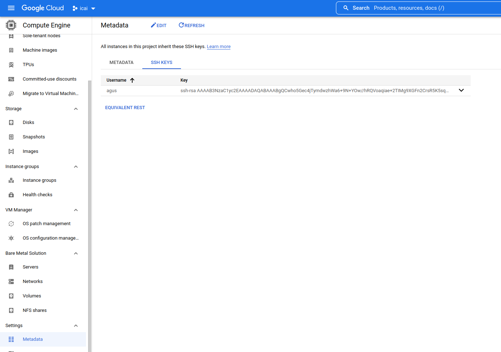

Ansible es una plataforma para automatización IT para hacer que el proceso de set-up y configuración sistemas sea industriazible a medida que el volumen de infraestructura crece.


## Instalación

```shell
sudo apt-get install ansible
```

## Inventario y primeras automatizaciones

Configurando el inventario de servidores en Ansible
Ansible trabaja con un inventario de servidores. Este inventario se configura por defecto en '/etc/ansible/hosts' y tiene la siguiente forma:
```bash
[desarrollo]
192.168.15.1
192.168.15.2

[preproduccion]
192.168.18.1
192.168.18.2

[produccion]
192.168.20.1
#Si se desea modificar la clave ssh por defecto, se indicaría de la siguiente forma
192.168.20.2 ansible_ssh_private_key_file=~/.ssh/ansible
```

** Para profundizar en como gestionar inventarios con mayor nivel de anidamiento, o incluso inventarios dinámicos integrando con GCP se puede revisar la siguiente documentación:
https://docs.ansible.com/ansible/latest/user_guide/intro_inventory.html **


Tal como se ve es un listado de IPs que se agrupan, por ejemplo, aquí el grupo de servidores 'desarrollo' tiene los servidores 192.168.15.1 y 192.168.15.2.

#### Máquinas - Configurando los certificados de seguridad

```shell
ssh-keygen -f ./ansible
# Después tendremos que copia el certificado de seguridad a los distintos servidores:
ssh-copy-id 192.168.15.1
#Esto nos pedirá el usuario SSH del servidor y copiará el certificado. Una vez todo instalado y configurado podemos probar de hacer un ping, a ver si funciona:
```

#### En el caso que trabajemos con un proveedor cloud, por defecto no existirá (ni debe existir) conectividad con la máquina. Es necesario:
1. Obtener acceso directo a la máquina. Puede ser desde un cloud shell o desde tu equipo.
2. En caso de hacerlo desde tu equipo será necesario abrir las reglas firewall que permitan este acceso.
3. Añadir la clave creada en el paso anterior en la consola del proveedor para poder acceder a la máquina. 

En el caso de GCP se haría desde la siguiente pantalla




Ahora que ya tenemos todo instalado y configurado ya podemos empezar a ejecutar comandos. La sintaxis de Ansible es la siguiente:
```shell
ansible all -m ping
```
```shell
ansible  <servidor/grupo/pattern> -m <módulo> -a <argumentos>
```

De esta manera podemos ejecutar cantidad de cosas:

#### Reiniciar el servicio httpd en los servidores de  preproduccion
```shell
ansible preproduccion -m service -a "name=httpd state=restarted"
```

#### Copiar el fichero 'hola.txt' a los servidores de 'preproduccion' y 'produccion'
```shell
ansible preproduccion:produccion -m copy -a "src=~/prueba/hola.txt dest=/opt/hola.txt"
```

#### Ejecutar '/bin/echo hello' en el servidor '192.168.15.1'. Si no ponemos módulo interpreta que el módulo es 'shell'
```shell
ansible 192.168.15.1 -m shell -a "/bin/echo hello"
ansible 192.168.15.1 -a "/bin/echo hello"
Así de fácil es montarte un sistema automatizado con Ansible, tenéis la documentación completa aquí http://docs.ansible.com/ .

